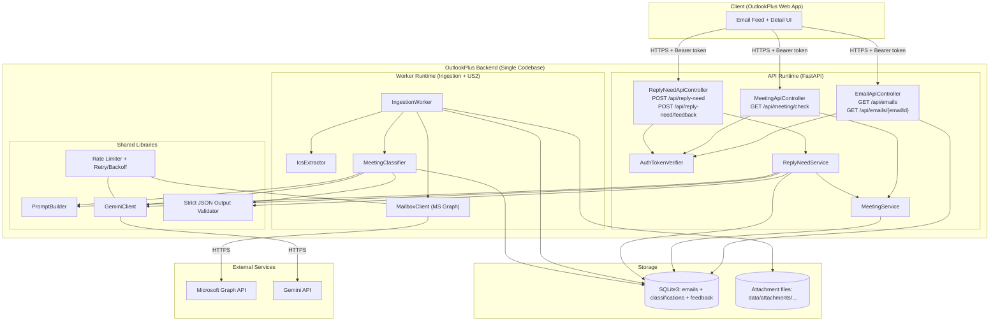

# OutlookPlus Backend Specification

## Architecture

### Objective
Deliver one backend system that:
- Ingests emails server-side from Microsoft Graph.
- Classifies meeting-related intent (US2) at ingestion time using Gemini.
- Classifies reply-needed intent (US3) on-demand using Gemini, reusing US2’s meeting signal.
- Persists all emails, classifications, and feedback in one SQLite3 database.
- Exposes a single REST surface to the web app.

### System Boundary
The backend is the only component that calls external services (Microsoft Graph and Gemini). The browser never calls Microsoft Graph or Gemini.

### Runtime Topology (Single Unified Backend)
The backend runs the same codebase in two concrete runtimes:

1. **API Runtime (FastAPI + Uvicorn)**
	 - Handles authenticated HTTP requests from the web app.
	 - Serves the email feed and email detail views.
	 - Serves meeting-status reads (`GET /api/meeting/check`).
	 - Serves reply-needed classification and feedback endpoints (`/api/reply-need/*`).
	 - Never blocks request threads on mailbox ingestion.

2. **Ingestion + Meeting-Classification Worker Runtime**
	 - Fetches new messages and relevant attachments from Microsoft Graph.
	 - Normalizes and persists `EmailMessage` rows and attachment metadata.
	 - Executes meeting-related classification exactly once per ingested email id.
	 - Persists meeting classification output (`meetingRelated`, `confidence`, `rationale`, `source="gemini"`).

Both runtimes share:
- The same SQLite3 database file (`data/outlookplus.db`) using WAL mode.
- The same attachment directory (`data/attachments/...`) for `text/calendar` bytes.
- The same Gemini client, prompt builder, strict JSON output validator, throttling, and retry policy.
- The same classification configuration (including `REPLY_NEED_MIN_CONFIDENCE`).

### Core Components and Responsibilities

**Auth Layer**
- `AuthTokenVerifier` verifies `Authorization: Bearer <token>` and returns `userId`.
- Every endpoint that returns email content or classifications requires authentication.

**Persistence Layer (SQLite3 + Attachment Files)**
- SQLite tables store:
	- Emails (normalized metadata + plain-text body)
	- Attachments (metadata + file paths; bytes stored on disk)
	- Meeting classifications (US2)
	- Reply-need classifications and user feedback (US3)
	- Ingestion state (per-user cursor/delta token)
- All writes run inside transactions.
- Attachment bytes are written under a file lock to prevent partial files.

**Ingestion Pipeline (Worker Runtime)**
- `MailboxClient` calls Microsoft Graph using per-user Graph tokens.
- `IngestionWorker` fetches new messages, persists each email, downloads attachments with `contentType == "text/calendar"`, and then triggers meeting classification.
- `IcsExtractor` parses the first `text/calendar` attachment and extracts `METHOD`, `SUMMARY`, `DTSTART`, `DTEND`, `ORGANIZER`, `LOCATION`.

**Meeting Detection (US2, Worker Runtime)**
- `MeetingClassifier` builds a structured Gemini request using:
	- subject, from, to, cc, sentAt
	- first 2,000 characters of plain-text body
	- extracted ICS fields when present
- `GeminiClient` calls Gemini and requires a strict JSON response schema with:
	- `meetingRelated: boolean`
	- `confidence: number (0.0–1.0)`
	- `rationale: string`
- `MeetingService` reads stored results for API responses and internal reuse.

**Reply-Needed Suggestion (US3, API Runtime)**
- `ReplyNeedApiController` exposes:
	- `POST /api/reply-need` to classify by `messageId`
	- `POST /api/reply-need/feedback` to store user feedback
- `ReplyNeedService` performs:
	1. Cache lookup in SQLite for `(userId, messageId)`.
	2. Read US2 meeting status through `MeetingService` (same database).
	3. Prompt build and Gemini call with strict JSON output validation.
	4. Persist the reply-need classification result in SQLite.
- Reply-need output schema is:
	- `label: "NEEDS_REPLY" | "NO_REPLY_NEEDED" | "UNSURE"`
	- `confidence: number (0.0–1.0)`
	- `reasons: string[1..3]`
- Failure behavior is deterministic: the service returns `UNSURE` when Gemini fails, output validation fails, or `confidence < REPLY_NEED_MIN_CONFIDENCE`.

### Mermaid Architecture Diagram (Unified Backend)

### Design Justification (Senior Architect View)

1. **Single security boundary for sensitive data**
	 - Email content and classifications traverse only one trust boundary (browser → backend). Microsoft Graph and Gemini remain strictly server-side, aligning with NFRs that prohibit frontend LLM calls and reduce credential exposure.

2. **Two runtimes, one codebase: isolates latency and failure domains**
	 - Ingestion and meeting classification execute outside the request path, so feed and detail endpoints remain stable under Graph slowness, Gemini slowness, or Gemini retries. This directly protects UX while preserving a unified architecture.

3. **US2 at ingestion time; US3 on-demand: performance and cost are explicit**
	 - Meeting detection runs once per new email id so the feed returns `meetingRelated` without triggering Gemini during browsing.
	 - Reply-needed classification runs when the user requests it and caches results by `(userId, messageId)`, preventing repeated Gemini calls when reopening the same email.

4. **Strict contracts keep LLM variability from leaking into product behavior**
	 - Prompt inputs are bounded (body prefix capped at 2,000 characters; structured ICS fields when present).
	 - Output validation enforces schema and safe fallback behavior (`UNSURE` for US3; missing meeting classification returns default values in the feed). These rules make failures predictable and testable.

5. **Shared persistence and services remove duplicated work**
	 - US3 depends on US2’s meeting signal; both features read/write the same SQLite store through service abstractions. This prevents re-classification and keeps cross-feature consistency (one stored truth per email).

6. **SQLite3 WAL mode matches the sprint scope while keeping correctness**
	 - WAL mode plus transactional writes provide reliable concurrent access between the API runtime and the worker runtime with minimal operational burden. This architecture remains cohesive while meeting the “one sprint” complexity constraint.

