# OutlookPlus Backend Specification

## Architecture

### Objective
Deliver one backend system that supports the UI contract implemented in the frontend folder (AI Email Manager UX):

- Serve an email feed and email detail view grouped by folder/label.
- Persist email state required by the UI (read/unread, folder, labels).
- Provide AI analysis shown in the reading pane sidebar:
  - category (Work/Personal/Finance/Social/Promotions/Urgent)
  - sentiment (positive/neutral/negative)
  - summary
  - suggestedActions (structured objects with kind, text, and optional draft)
- Support compose/send from the UI.
- Support “Suggested action” execution (UI triggers an action string; backend acknowledges and can optionally persist a log).
- Support “Custom Request” (UI sends a free-form prompt for one email and receives response text).

Additional capabilities implemented in the current backend codebase:

- Support AI-assisted compose polishing (`/api/ai/compose`) that returns a revised email body.
- Support meeting-related detection (`/api/meeting/check`) based on email content and optional ICS attachments.
- Support “needs reply” classification (`/api/reply-need`) and feedback logging (`/api/reply-need/feedback`).

Optional (implementation choice, not a UI requirement):
- Ingest emails server-side from IMAP4rev1 and send outbound mail via SMTP submission.
- Precompute AI analysis in a worker at ingestion time (instead of on-demand).

### System Boundary
The backend is the only component that calls external services (IMAP, SMTP, and Gemini). The browser never calls IMAP, SMTP, or Gemini.

### Runtime Topology (Single Unified Backend)
The backend runs the same codebase in two concrete runtimes:

1. **API Runtime (FastAPI + Uvicorn)**
	 - Handles HTTP requests from the web app.
	 - Serves the email feed and email detail views.
	 - Serves compose/send.
	 - Serves AI analysis and AI assistant requests.
	 - Never blocks request threads on mailbox ingestion (if a worker runtime is enabled).

	Minimum REST surface (matches the frontend mock service shapes):
	- `GET /api/emails?folder=<inbox|sent|drafts|trash|spam>&label=<optional>&limit=<1..200>&cursor=<receivedAtUtc>`
	- `GET /api/emails/{emailId}`
	- `PATCH /api/emails/{emailId}` (e.g., mark read)
	- `POST /api/send-email` with `{ to, cc?, bcc?, subject, body }`
	- `POST /api/email-actions` with `{ emailId, action }`
	- `POST /api/ai/request` with `{ emailId, prompt }`

	Additional REST surface implemented by the current codebase:
	- `POST /api/ai/compose` with `{ to?, cc?, subject?, body, instruction? }`
	- `GET /api/meeting/check?messageId=<emailId>`
	- `POST /api/reply-need` with `{ messageId }`
	- `POST /api/reply-need/feedback` with `{ messageId, userLabel, comment? }`

2. **Ingestion + Classification Worker Runtime (Optional)**
	 - Fetches new messages and relevant attachments from the mailbox via IMAP.
	 - Normalizes and persists email records.
	 - Executes meeting classification (best-effort; may be absent if Gemini fails) and email AI analysis (always stored once per email with deterministic fallback).
	 - Writes classification results to SQLite for fast browsing.

Both runtimes share:
- The same SQLite3 database file (`data/outlookplus.db`) using WAL mode.
- The same attachment directory (`data/attachments/...`) for `text/calendar` bytes.
- The same LLM client, prompt builder, strict output validator, throttling, and retry policy (when an LLM is enabled).

### Core Components and Responsibilities

**Auth Layer**
The frontend bundle does not implement a login flow, so the backend must choose one of the following modes:

- **Mode A (dev / demo):** no auth required (all requests treated as a single demo user).
- **Mode B (dev stub):** `Authorization: Bearer dev:<userId>` (matches existing backend README).
- **Mode C (production):** real token verification (JWT/opaque) returning a stable `userId` (**not implemented in the current codebase**).

Regardless of mode, downstream services should operate on a `userId`.

**Persistence Layer (SQLite3 + Attachment Files)**
- SQLite tables store:
	- Emails (UI fields: folder, read/unread, labels; plus metadata/body)
	- Attachments (metadata + file paths; bytes stored on disk) (optional)
	- AI analysis (category/sentiment/summary/suggestedActions)
	- Meeting classification and reply-need classification + feedback (implemented)
	- AI request/action logs (optional)
	- Ingestion state (per-user last-seen IMAP UID + UIDVALIDITY)
- All writes run inside transactions.
- Attachment bytes are written under a file lock to prevent partial files.

Implementation note (current code): schema is initialized on startup and includes a small best-effort migration step for older developer DB files.

**Ingestion Pipeline (Worker Runtime)**
- `MailboxClient` connects to the mailbox using IMAPS (TLS).
- Current code uses a single set of IMAP credentials from environment variables (not per-user credentials); `userId` is still threaded through for API shape and storage partitioning.
- `IngestionWorker` fetches new messages, persists each email, downloads attachments with `contentType == "text/calendar"` (optional), and then triggers AI analysis classification (optional).
- `IcsExtractor` parses the first `text/calendar` attachment and extracts `METHOD`, `SUMMARY`, `DTSTART`, `DTEND`, `ORGANIZER`, `LOCATION`.

**Outbound Mail Capability (Shared Backend)**
- `SmtpClient` connects to the SMTP submission endpoint and authenticates using environment variables (single credential set in the current codebase).
- SMTP is required to support the frontend compose flow and shared mailbox integration.

**AI Analysis (Worker or API Runtime)**
- `EmailAnalysisClassifier` builds a bounded prompt from:
	- subject/from/to/cc/sentAt
	- a bounded body prefix
- LLM client returns a strict JSON schema:
	- `category: "Work"|"Personal"|"Finance"|"Social"|"Promotions"|"Urgent"`
	- `sentiment: "positive"|"neutral"|"negative"`
	- `summary: string`
	- `suggestedActions`: array of objects `{ kind: "suggestion" | "reply_draft", text: string, draft: {to, subject, body} | null }`
- `EmailAnalysisService` reads stored results for API responses.

**AI Assistant Requests (API Runtime)**
- `AiAssistantService` accepts `{emailId, prompt}` and returns `responseText`.
- The service may call an LLM or a rules-based mock, but it must not require frontend-side LLM calls.

**Meeting + Reply-Need Classification (API + Worker)**

- Meeting classification is computed by the worker (`MeetingClassifier`) after ingestion when possible; it uses ICS fields when a `text/calendar` attachment exists.
- Reply-need classification is computed on-demand via `ReplyNeedService` and cached in SQLite; users can submit feedback which is stored for evaluation.

### Mermaid Architecture Diagram (Unified Backend)

```mermaid
flowchart TB
	subgraph Client["Client (OutlookPlus Web App)"]
		UI[Email Feed + Detail UI]
	end

	subgraph Backend["OutlookPlus Backend (Single Codebase)"]
		subgraph API["API Runtime (FastAPI)"]
			EmailAPI["EmailApiController<br/>GET /api/emails<br/>GET /api/emails/{emailId}<br/>PATCH /api/emails/{emailId}"]
			ComposeAPI["ComposeApiController<br/>POST /api/send-email"]
			ActionAPI["EmailActionApiController<br/>POST /api/email-actions"]
			AiAPI["AiAssistantApiController<br/>POST /api/ai/request<br/>POST /api/ai/compose"]
			MeetAPI["MeetingApiController<br/>GET /api/meeting/check"]
			ReplyAPI["ReplyNeedApiController<br/>POST /api/reply-need<br/>POST /api/reply-need/feedback"]
			Auth["Auth (Mode A/B/C)"]
			AiSvc[AiAssistantService]
			ActionSvc[EmailActionService]
			AnalysisSvc[EmailAnalysisService]
			MeetSvc[MeetingService]
			ReplySvc[ReplyNeedService]
		end

		subgraph Worker["Worker Runtime (Optional: Ingestion + Classification)"]
			Ingest[IngestionWorker]
			MailClient["MailboxClient (IMAP4rev1)"]
			Ics[IcsExtractor]
			MeetCls[MeetingClassifier]
			AnalysisCls[EmailAnalysisClassifier]
		end

		subgraph MailOut["Outbound Mail (SMTP Submission, optional)"]
			SmtpClient["SmtpClient (SMTP submission)"]
		end

		subgraph Shared[Shared Libraries]
			Prompt[PromptBuilder]
			LLM["LLM Client (Gemini)"]
			Validate["Strict Output Validator"]
			Throttle[Rate Limiter + Retry/Backoff]
		end
	end

	subgraph Storage[Storage]
		DB[(SQLite3: emails + classifications + feedback)]
		Files[(Attachment files: data/attachments/...)]
	end

	subgraph External[External Services]
		Imap["Mailbox Server (IMAP)"]
		Smtp["Mailbox Server (SMTP)"]
		GemAPI[Gemini API]
	end

	UI -->|HTTPS| EmailAPI
	UI -->|HTTPS| ComposeAPI
	UI -->|HTTPS| ActionAPI
	UI -->|HTTPS| AiAPI
	UI -->|HTTPS| MeetAPI
	UI -->|HTTPS| ReplyAPI

	EmailAPI --> Auth
	ComposeAPI --> Auth
	ActionAPI --> Auth
	AiAPI --> Auth
	MeetAPI --> Auth
	ReplyAPI --> Auth
	EmailAPI --> DB
	EmailAPI --> AnalysisSvc
	AnalysisSvc --> DB
	ActionAPI --> ActionSvc
	ActionSvc --> DB
	AiAPI --> AiSvc
	AiSvc --> Prompt
	AiSvc --> LLM
	AiSvc --> Validate
	MeetAPI --> MeetSvc
	MeetSvc --> DB
	ReplyAPI --> ReplySvc
	ReplySvc --> DB

	Ingest --> MailClient
	MailClient -->|IMAPS TLS| Imap
	SmtpClient -->|SMTP submission STARTTLS| Smtp
	Ingest --> DB
	Ingest --> Files
	Ingest --> Ics
	Ingest --> MeetCls
	Ingest --> AnalysisCls
	MeetCls --> Prompt
	MeetCls --> LLM
	MeetCls --> Validate
	MeetCls --> DB
	AnalysisCls --> Prompt
	AnalysisCls --> LLM
	AnalysisCls --> Validate
	LLM -->|HTTPS| GemAPI
	AnalysisCls --> DB
```

### Design Justification (Senior Architect View)

1. **Single security boundary for sensitive data**
	 - Email content and classifications traverse only one trust boundary (browser → backend). IMAP, SMTP, and Gemini remain strictly server-side, aligning with NFRs that prohibit frontend LLM calls and reduce credential exposure.

2. **Two runtimes, one codebase: isolates latency and failure domains**
	 - If enabled, ingestion and AI analysis execute outside the request path, so feed and detail endpoints remain stable under IMAP slowness, LLM slowness, or LLM retries.

3. **Precompute vs on-demand AI is an explicit choice**
	 - Precomputing analysis at ingestion time makes browsing fast and predictable.
	 - On-demand analysis keeps ingestion simple but may increase read-time latency and cost.

4. **Strict contracts keep LLM variability from leaking into product behavior**
	 - Prompt inputs are bounded (e.g., body prefix capped; structured fields when present).
	 - Output validation enforces schema so the UI always receives well-typed `aiAnalysis`.

5. **Shared persistence and services remove duplicated work**
	 - Analysis, actions, and AI requests share the same email store and user boundary, keeping UI state consistent.

6. **SQLite3 WAL mode matches the sprint scope while keeping correctness**
	 - WAL mode plus transactional writes provide reliable concurrent access between the API runtime and the worker runtime with minimal operational burden. This architecture remains cohesive while meeting the “one sprint” complexity constraint.

