# OutlookPlus Backend Specification

## Backend Modules

### Scope and Definitions

This document defines the backend **modules** implied by the unified backend architecture (API runtime + optional ingestion worker runtime) in [OutlookPlus/backend/backend_specification_Architecture.md](OutlookPlus/backend/backend_specification_Architecture.md).

The target product surface is the UI implemented in the frontend folder. The canonical frontend data contract is the `Email` type in [OutlookPlus/frontend/src/app/types.ts](../frontend/src/app/types.ts) and the mock backend shapes in [OutlookPlus/frontend/src/app/services/mockBackend.ts](../frontend/src/app/services/mockBackend.ts).

**Module granularity used here (grouped modules)**

- A “module” is a cohesive package boundary a backend team would implement and test independently.
- Each module may contain multiple components from the architecture diagram.
- A mapping of architecture components → modules appears at the end.

**Conventions**

- Language style: Python + FastAPI typing style (interfaces and method signatures).
- All external side effects (IMAP/SMTP/Gemini, filesystem writes, DB writes) are initiated server-side only.
- All DB access is via SQLite in WAL mode, with transactional writes.
- All attachment bytes (only `text/calendar` in MVP scope) are stored on disk; DB stores metadata + file path.

---

### Cross-Module Domain Types (Shared)

These are conceptual types used in APIs across modules. (In code they can be implemented as `NewType` wrappers or simple aliases.)

- `UserId`: stable identifier for the authenticated (or demo) user.
- `EmailId`: backend-generated primary key for persisted emails.
- `MailboxMessageId`: stable message identifier exposed to the frontend as `Email.id` (derived from IMAP UID + UIDVALIDITY or equivalent stable mailbox identity).
- `UtcTimestamp`: RFC3339 timestamp in UTC.

Implementation notes (current code):

- Ingested IMAP messages use `MailboxMessageId = "{uidvalidity}:{uid}"`.
- Sent messages created via `POST /api/send-email` use `MailboxMessageId = "sent_<epochMillis>"`.

Frontend-facing enums (must match the frontend bundle):

- `Folder`: `'inbox' | 'sent' | 'drafts' | 'trash' | 'spam'`
- `AiCategory`: `'Work' | 'Personal' | 'Finance' | 'Social' | 'Promotions' | 'Urgent'`
- `Sentiment`: `'positive' | 'neutral' | 'negative'`

**Failure and determinism rule (important for the frontend UI contract):**

- AI analysis is stored once per `EmailId`.
- The email list and detail endpoints must always return an `aiAnalysis` object with valid enum values. If the LLM is unavailable or output validation fails, the backend must return deterministic safe defaults (e.g., `category="Work"`, `sentiment="neutral"`, `summary` derived from subject/body prefix, and `suggestedActions` containing default structured suggestions).

---

## Module 1 — Auth Module

### Features

**Can do**

- Verify `Authorization: Bearer <token>` on incoming HTTP requests.
- Produce a `UserId` for downstream services.
- Fail closed: reject missing/invalid tokens.

Implementation notes (current code):

- Mode A (demo) bypasses auth and returns `user_id="demo"`.
- Mode B (dev stub) accepts:
	- `Authorization: Bearer dev:<userId>`
	- OR `Authorization: Bearer <OUTLOOKPLUS_DEV_TOKEN>` and returns `OUTLOOKPLUS_DEV_USER_ID`.
- Mode C is described in the architecture doc but is not implemented.

**Does not do**

- User registration, password storage, OAuth flows, token issuance/refresh.
- Any database reads/writes.

### Internal Architecture

**Text design**

- Implement as a FastAPI dependency (or middleware) that:
	1. Extracts bearer token.
	2. Validates it (signature / lookup / opaque validation, implementation-specific).
	3. Returns `UserId` to the route handler.

**Mermaid diagram**

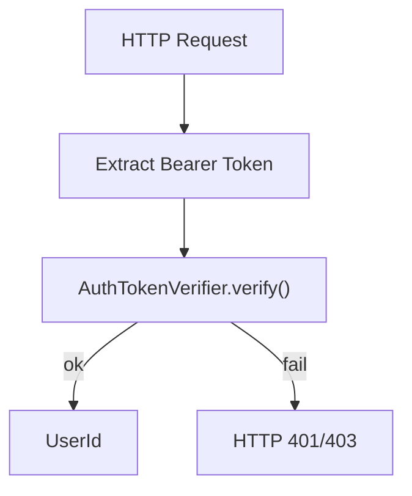

**Senior-architect justification**

- Keeps authentication logic centralized and consistent across controllers.
- Avoids leaking auth validation into business services, improving testability.
- Allows swapping verification strategy (JWT, opaque tokens, etc.) without changing API modules.

### Data Abstraction (6.005-style)

- **ADT**: `AuthTokenVerifier`
- **Abstract state**: a function `V: token -> UserId` (partial; undefined for invalid tokens).
- **Representation**: verifier configuration (e.g., signing keys, issuer/audience rules, or an introspection endpoint URL).
- **Rep invariant**: configuration is well-formed; key material present; verifier rejects tokens not satisfying policy.

### Stable Storage

- None required. (Verifier configuration is loaded from environment/config.)

### Storage Schemas

- None.

### External API

- Used internally by API controllers as a dependency.

```python
class AuthError(Exception):
		pass


class AuthTokenVerifier:
		def verify(self, authorization_header: str) -> "UserId":
				"""Return UserId if header contains a valid Bearer token; raise AuthError otherwise."""
				raise NotImplementedError


def require_user_id(...) -> "UserId":
		"""FastAPI dependency that returns the current user id based on auth mode."""
		...
```

### Declarations (Public vs Private)

- **Public**: `AuthTokenVerifier.verify`, `AuthError`
- **Private (module-internal)**: token parsing helpers, concrete verifier implementations

### Mermaid Class Hierarchy

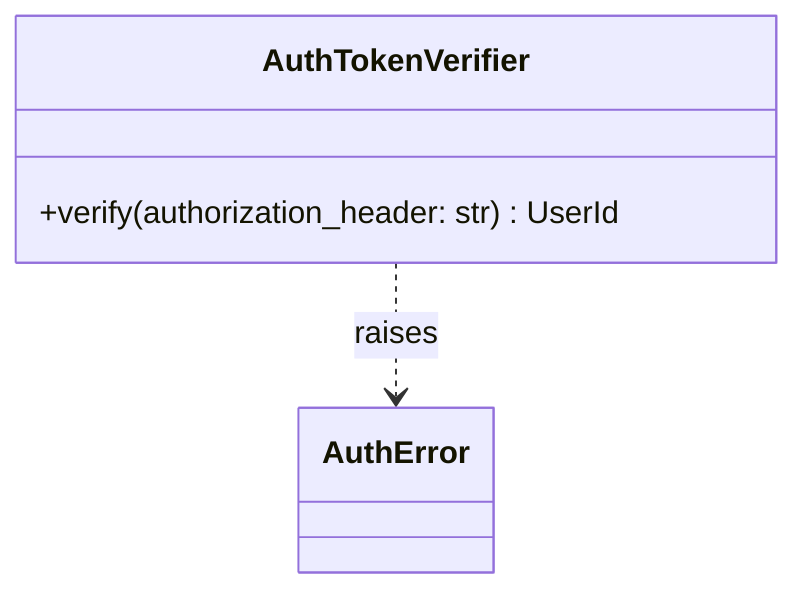

---

## Module 2 — Persistence Module (SQLite + Attachment Files)

### Features

**Can do**

- Provide transactional persistence for:
	- normalized emails + plain-text body (and optional HTML)
	- email UI state: folder, read/unread, labels
	- attachment metadata (optional)
	- AI analysis (category/sentiment/summary/suggestedActions)
	- meeting classification (optional; best-effort)
	- reply-need classification + user feedback (optional)
	- AI request logs and suggested-action logs (optional)
	- ingestion state (per user mailbox cursor)
- Write `text/calendar` attachment bytes to disk safely under a file lock.
- Support concurrent reads/writes across API runtime and worker runtime via WAL.

**Does not do**

- IMAP/SMTP network calls.
- LLM prompt construction or calling Gemini.
- Business decisions like AI category/sentiment/summary generation.

### Internal Architecture

**Text design**

- `Db` wraps a SQLite connection factory, enables WAL, enforces `foreign_keys=ON`.
- Repositories (DAOs) provide narrow, typed access methods per aggregate:
	- `EmailRepository`, `AttachmentRepository`, `EmailAnalysisRepository`, `AiRequestRepository`, `EmailActionRepository`, `IngestionStateRepository`
- `AttachmentFileStore` writes bytes to deterministic paths and returns file paths.
- All multi-row operations are performed through a `UnitOfWork` that scopes a transaction.

Implementation note (current code): schema initialization also applies small best-effort migrations to keep older developer DB files working (e.g., adding missing UI columns and indexes).

**Mermaid diagram**

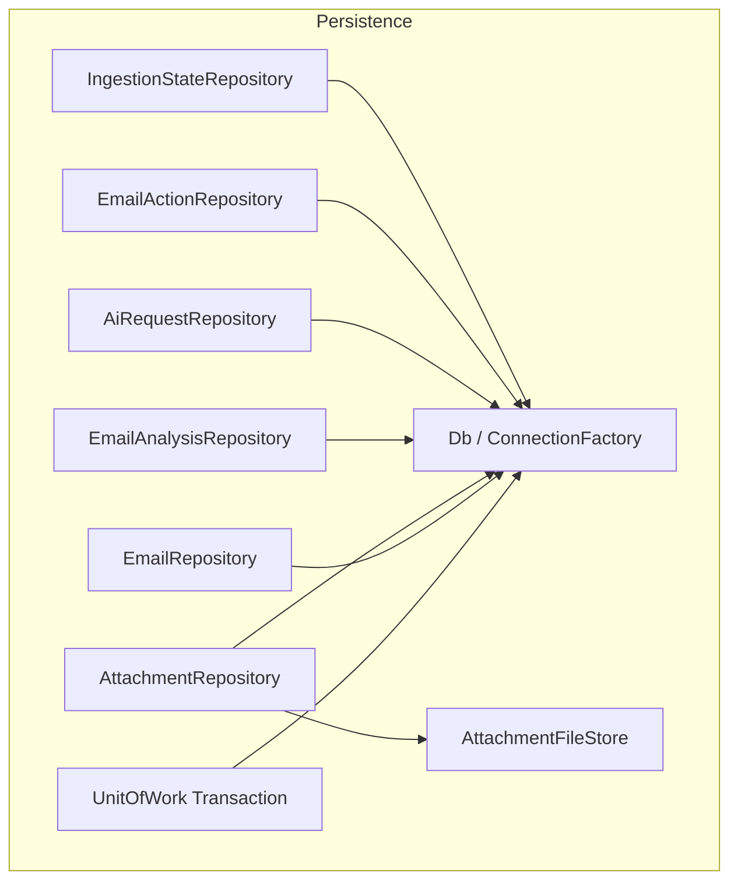

**Senior-architect justification**

- Repository boundaries prevent “SQL sprawl” and keep API/worker logic DB-agnostic.
- Unit-of-work ensures atomicity across related writes (email + attachments + classification rows).
- File store isolates the complexity of safe attachment writes, and prevents partial-file corruption.

### Data Abstraction (6.005-style)

- **ADT**: `EmailRepository`
	- **Abstract state**: set of persisted `EmailMessage` records keyed by `EmailId`, plus indexes by `(userId, mailboxMessageId)`.
	- **Rep**: SQLite rows in `emails` table.
	- **Rep invariant**: primary keys unique; `user_id` non-null; timestamps are RFC3339 UTC strings.

- **ADT**: `AttachmentFileStore`
	- **Abstract state**: mapping `attachmentId -> bytes` (on disk).
	- **Rep**: filesystem under `data/attachments/<userId>/<emailId>/<attachmentId>.bin` (exact layout is implementation-defined but must be deterministic).
	- **Rep invariant**: file writes are atomic (write temp + rename) and guarded by a lock.

### Stable Storage

- SQLite DB file: `data/outlookplus.db` (WAL enabled).
- Attachment directory: `data/attachments/...`.

### Storage Schema (SQLite DDL)

This schema is designed to be directly usable in code (execute once at startup or via migrations).

```sql
PRAGMA journal_mode = WAL;
PRAGMA foreign_keys = ON;

CREATE TABLE IF NOT EXISTS emails (
	id                 INTEGER PRIMARY KEY AUTOINCREMENT,
	user_id            TEXT NOT NULL,
	mailbox_message_id TEXT NOT NULL,

	folder             TEXT NOT NULL DEFAULT 'inbox',
	is_read            INTEGER NOT NULL DEFAULT 0,
	labels_json        TEXT NOT NULL DEFAULT '[]',

	subject            TEXT,
	from_addr          TEXT,
	to_addrs           TEXT,
	cc_addrs           TEXT,
	sent_at_utc        TEXT,
	received_at_utc    TEXT NOT NULL,

	preview_text       TEXT,
	body_text          TEXT,
	body_html          TEXT,

	created_at_utc     TEXT NOT NULL,

	UNIQUE(user_id, mailbox_message_id)
);

CREATE INDEX IF NOT EXISTS idx_emails_user_received ON emails(user_id, received_at_utc);

CREATE TABLE IF NOT EXISTS email_ai_analysis (
	id                     INTEGER PRIMARY KEY AUTOINCREMENT,
	user_id                TEXT NOT NULL,
	email_id               INTEGER NOT NULL,

	category               TEXT NOT NULL,
	sentiment              TEXT NOT NULL,
	summary                TEXT NOT NULL,
	suggested_actions_json TEXT NOT NULL,
	source                 TEXT NOT NULL,
	created_at_utc         TEXT NOT NULL,

	UNIQUE(user_id, email_id),
	FOREIGN KEY(email_id) REFERENCES emails(id) ON DELETE CASCADE
);

CREATE INDEX IF NOT EXISTS idx_email_ai_analysis_email ON email_ai_analysis(email_id);

CREATE TABLE IF NOT EXISTS ai_requests (
	id             INTEGER PRIMARY KEY AUTOINCREMENT,
	user_id        TEXT NOT NULL,
	email_id       INTEGER NOT NULL,
	prompt_text    TEXT NOT NULL,
	response_text  TEXT NOT NULL,
	source         TEXT NOT NULL,
	created_at_utc TEXT NOT NULL,

	FOREIGN KEY(email_id) REFERENCES emails(id) ON DELETE CASCADE
);

CREATE INDEX IF NOT EXISTS idx_ai_requests_email ON ai_requests(email_id);

CREATE TABLE IF NOT EXISTS email_action_logs (
	id             INTEGER PRIMARY KEY AUTOINCREMENT,
	user_id        TEXT NOT NULL,
	email_id       INTEGER NOT NULL,
	action         TEXT NOT NULL,
	status         TEXT NOT NULL,
	created_at_utc TEXT NOT NULL,

	FOREIGN KEY(email_id) REFERENCES emails(id) ON DELETE CASCADE
);

CREATE INDEX IF NOT EXISTS idx_email_action_logs_email ON email_action_logs(email_id);

CREATE TABLE IF NOT EXISTS attachments (
	id             INTEGER PRIMARY KEY AUTOINCREMENT,
	user_id        TEXT NOT NULL,
	email_id       INTEGER NOT NULL,
	filename       TEXT,
	content_type   TEXT NOT NULL,
	size_bytes     INTEGER,
	storage_path   TEXT NOT NULL,
	created_at_utc TEXT NOT NULL,

	FOREIGN KEY(email_id) REFERENCES emails(id) ON DELETE CASCADE
);

CREATE INDEX IF NOT EXISTS idx_attachments_email ON attachments(email_id);

CREATE TABLE IF NOT EXISTS meeting_classifications (
	id              INTEGER PRIMARY KEY AUTOINCREMENT,
	user_id         TEXT NOT NULL,
	email_id        INTEGER NOT NULL,

	meeting_related INTEGER NOT NULL CHECK(meeting_related IN (0, 1)),
	confidence      REAL NOT NULL CHECK(confidence >= 0.0 AND confidence <= 1.0),
	rationale       TEXT,
	source          TEXT NOT NULL,
	created_at_utc  TEXT NOT NULL,

	UNIQUE(user_id, email_id),
	FOREIGN KEY(email_id) REFERENCES emails(id) ON DELETE CASCADE
);

CREATE INDEX IF NOT EXISTS idx_meeting_email ON meeting_classifications(email_id);

CREATE TABLE IF NOT EXISTS reply_need_classifications (
	id             INTEGER PRIMARY KEY AUTOINCREMENT,
	user_id        TEXT NOT NULL,
	email_id       INTEGER NOT NULL,

	label          TEXT NOT NULL CHECK(label IN ('NEEDS_REPLY', 'NO_REPLY_NEEDED', 'UNSURE')),
	confidence     REAL NOT NULL CHECK(confidence >= 0.0 AND confidence <= 1.0),
	reasons_json   TEXT NOT NULL,
	source         TEXT NOT NULL,
	created_at_utc TEXT NOT NULL,

	UNIQUE(user_id, email_id),
	FOREIGN KEY(email_id) REFERENCES emails(id) ON DELETE CASCADE
);

CREATE INDEX IF NOT EXISTS idx_reply_need_email ON reply_need_classifications(email_id);

CREATE TABLE IF NOT EXISTS reply_need_feedback (
	id                INTEGER PRIMARY KEY AUTOINCREMENT,
	user_id           TEXT NOT NULL,
	email_id          INTEGER NOT NULL,
	classification_id INTEGER,

	user_label        TEXT NOT NULL CHECK(user_label IN ('NEEDS_REPLY', 'NO_REPLY_NEEDED')),
	comment           TEXT,
	created_at_utc    TEXT NOT NULL,

	FOREIGN KEY(email_id) REFERENCES emails(id) ON DELETE CASCADE,
	FOREIGN KEY(classification_id) REFERENCES reply_need_classifications(id) ON DELETE SET NULL
);

CREATE INDEX IF NOT EXISTS idx_feedback_email ON reply_need_feedback(email_id);

CREATE TABLE IF NOT EXISTS ingestion_state (
	user_id          TEXT PRIMARY KEY,
	imap_uidvalidity INTEGER NOT NULL,
	last_seen_uid    INTEGER NOT NULL,
	updated_at_utc   TEXT NOT NULL
);
```

### External API

```python
from dataclasses import dataclass
from typing import Iterable, Optional, Protocol


@dataclass(frozen=True)
class ParsedEmail:
	"""Normalized email produced by the MIME parsing step (worker-only input)."""

	subject: Optional[str]
	from_addr: Optional[str]
	to_addrs: Optional[str]
	cc_addrs: Optional[str]
	sent_at_utc: Optional[str]
	received_at_utc: str
	body_text: Optional[str]


@dataclass(frozen=True)
class ParsedAttachment:
	"""Attachment metadata produced by MIME parsing (bytes are stored by AttachmentFileStore)."""

	filename: Optional[str]
	content_type: str
	size_bytes: Optional[int]


@dataclass(frozen=True)
class EmailMessage:
		id: int
		user_id: str
		mailbox_message_id: str
		folder: str
		is_read: bool
		labels: list[str]
		subject: Optional[str]
		from_addr: Optional[str]
		to_addrs: Optional[str]
		cc_addrs: Optional[str]
		sent_at_utc: Optional[str]
		received_at_utc: str
		preview_text: Optional[str]
		body_text: Optional[str]
		body_html: Optional[str]


@dataclass(frozen=True)
class EmailAiAnalysis:
		user_id: str
		email_id: int
		category: str
		sentiment: str
		summary: str
		suggested_actions: list[str]
		source: str


@dataclass(frozen=True)
class AttachmentMeta:
		id: int
		user_id: str
		email_id: int
		filename: Optional[str]
		content_type: str
		size_bytes: Optional[int]
		storage_path: str


class UnitOfWork(Protocol):
		def __enter__(self) -> "UnitOfWork":
				...

		def __exit__(self, exc_type, exc, tb) -> None:
				...


class EmailRepository(Protocol):
		def upsert_email(
				self,
				*,
				user_id: str,
				mailbox_message_id: str,
				email: "ParsedEmail",
				folder: str = "inbox",
				is_read: bool = False,
				labels: list[str] | None = None,
				preview_text: str | None = None,
				body_html: str | None = None,
		) -> int:
				"""Insert or update; return EmailId. Idempotent on (user_id, mailbox_message_id)."""
				...

		def list_emails(self, *, user_id: str, folder: str, limit: int, cursor_received_at_utc: Optional[str]) -> list[EmailMessage]:
				...

		def get_email(self, *, user_id: str, email_id: int) -> Optional[EmailMessage]:
				...

		def get_email_by_message_id(self, *, user_id: str, mailbox_message_id: str) -> Optional[EmailMessage]:
				"""Resolve UI-facing Email.id (MailboxMessageId) to a stored email row."""
				...

		def set_read(self, *, user_id: str, mailbox_message_id: str, is_read: bool) -> None:
				...


class EmailAnalysisRepository(Protocol):
		def get_analysis(self, *, user_id: str, email_id: int) -> Optional[EmailAiAnalysis]:
				...

		def upsert_analysis(self, *, user_id: str, email_id: int, category: str, sentiment: str, summary: str, suggested_actions: list[str], source: str) -> None:
				...


class AiRequestRepository(Protocol):
		def add_request(self, *, user_id: str, email_id: int, prompt_text: str, response_text: str, source: str) -> int:
				...


class EmailActionRepository(Protocol):
		def add_action_log(self, *, user_id: str, email_id: int, action: str, status: str) -> int:
				...


class AttachmentRepository(Protocol):
		def add_attachment(self, *, user_id: str, email_id: int, meta: "ParsedAttachment", storage_path: str) -> int:
				...

		def list_attachments(self, *, user_id: str, email_id: int) -> list[AttachmentMeta]:
				...


class IngestionStateRepository(Protocol):
		def get_state(self, *, user_id: str) -> Optional[tuple[int, int]]:
				"""Return (uidvalidity, last_seen_uid) or None."""
				...

		def set_state(self, *, user_id: str, uidvalidity: int, last_seen_uid: int) -> None:
				...
```

### Declarations (Public vs Private)

- **Public**: repository protocols, `UnitOfWork`, domain dataclasses, `AttachmentFileStore` interface
- **Private**: concrete SQLite implementations, SQL strings, connection pooling details, filesystem locking implementation

### Mermaid Class Hierarchy

```mermaid
classDiagram
	class UnitOfWork {
		+__enter__() UnitOfWork
		+__exit__(exc_type, exc, tb) None
	}
	class EmailRepository {
		+upsert_email(user_id: str, mailbox_message_id: str, email: ParsedEmail) EmailId
		+list_emails(user_id: str, limit: int, cursor_received_at_utc: str?) list~EmailMessage~
		+get_email(user_id: str, email_id: EmailId) EmailMessage?
	}
	class AttachmentRepository {
		+add_attachment(user_id: str, email_id: EmailId, meta: ParsedAttachment, storage_path: str) AttachmentId
		+list_attachments(user_id: str, email_id: EmailId) list~AttachmentMeta~
	}
	class IngestionStateRepository {
		+get_state(user_id: str) tuple~int,int~?
		+set_state(user_id: str, uidvalidity: int, last_seen_uid: int) None
	}
```

---

## Module 3 — IMAP Mailbox Access Module (`MailboxClient`)

### Features

**Can do**

- Connect to IMAP4rev1 over TLS (IMAPS).
- Authenticate using per-user app password.
- Select mailbox/folder and enumerate new messages since a cursor (UID + UIDVALIDITY).
- Fetch full RFC822 message bytes and attachment parts needed by ingestion.

**Does not do**

- Persist anything to storage (that is Persistence / Worker).
- Classify content (that is Email AI Analysis / AI Assistant modules).
- Serve HTTP.

### Internal Architecture

**Text design**

- `MailboxClient` is a thin adapter around Python stdlib `imaplib`.
- All network calls are wrapped by a retry/backoff policy and a rate limiter (shared utility).
- Returns parsed results as `RawMailboxMessage` / `MailboxAttachmentPart` structs.

Implementation note (current code): IMAP credentials are read from environment variables (single shared credential set); per-user credentials are not implemented.

**Mermaid diagram**

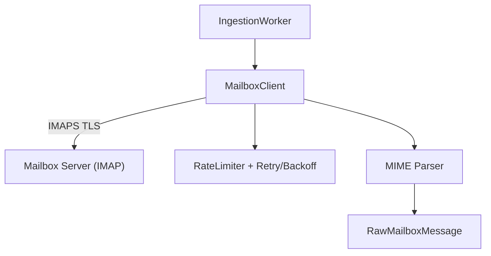

**Senior-architect justification**

- Keeps IMAP protocol complexity isolated.
- Makes ingestion deterministic and testable with mocked client output.
- Central retry/throttle prevents “stampedes” and respects mailbox limits.

### Data Abstraction

- **ADT**: `MailboxClient`
- **Abstract state**: a remote mailbox containing messages indexed by UID, with a stable epoch identified by UIDVALIDITY.
- **Rep**: IMAP connection/session object and folder selection.
- **Rep invariant**: connection uses TLS; authenticated as intended user; selected folder is valid.

### Stable Storage

- None (remote mailbox is the durable store). Cursor state is stored by the Persistence module in `ingestion_state`.

### Storage Schemas

- Uses `ingestion_state` table via `IngestionStateRepository`.

### External API

```python
from dataclasses import dataclass
from typing import Optional


@dataclass(frozen=True)
class MailboxCursor:
		uidvalidity: int
		last_seen_uid: int


@dataclass(frozen=True)
class RawMailboxMessage:
		uidvalidity: int
		uid: int
		rfc822_bytes: bytes


class MailboxClient:
		def list_new_messages(self, *, user_id: str, cursor: Optional[MailboxCursor]) -> list[RawMailboxMessage]:
				...
```

### Declarations (Public vs Private)

- **Public**: `MailboxClient`, `MailboxCursor`, `RawMailboxMessage`
- **Private**: connection management, IMAP search/fetch commands, MIME walking logic

### Mermaid Class Hierarchy

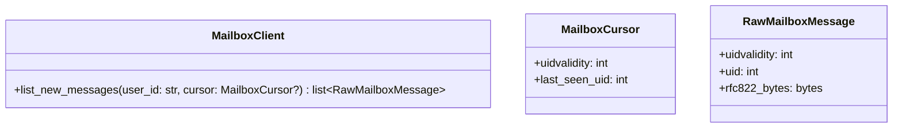

---

## Module 4 — Ingestion Worker Module (`IngestionWorker`)

### Features

**Can do**

- Poll mailbox for new messages and ingest them.
- Normalize and persist `emails` rows with plain-text body.
- Download and persist metadata for attachments; write `text/calendar` bytes to disk.
- Trigger email AI analysis exactly once per ingested `EmailId`.
- Trigger meeting classification (best-effort) once per ingested `EmailId`.
- Maintain per-user ingestion cursor (`ingestion_state`).

**Does not do**

- Serve HTTP requests.
- Block API request threads.
- Perform AI assistant “custom request” calls (API-only).

### Internal Architecture

**Text design**

- A loop (`run_forever`) periodically calls `run_once(user_id)`.
- `run_once`:
	1. Reads `ingestion_state`.
	2. Uses `MailboxClient` to list + fetch new messages.
	3. Parses RFC822 into `ParsedEmail` (subject/addresses/body + attachment parts).
	4. Writes email + attachments using `UnitOfWork`.
	5. Invokes `MeetingClassifier.classify_if_needed(email_id)` if meeting status is missing (best-effort).
	6. Invokes `EmailAnalysisClassifier.classify_if_needed(email_id)` if analysis is missing.
	7. Advances ingestion cursor only after persistence succeeds.

**Mermaid diagram**

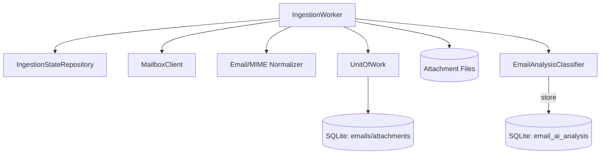

**Senior-architect justification**

- Cursor advancement after commit guarantees at-least-once ingestion without losing messages.
- Idempotent upserts by `(user_id, mailbox_message_id)` prevent duplicates.
- AI analysis is executed off the request path, protecting API latency and UX.

### Data Abstraction

- **ADT**: `IngestionWorker`
- **Abstract state**: for each user, a cursor indicating “all messages up to UID N are ingested”.
- **Rep**: `ingestion_state` row per user plus persisted `emails`/`attachments` rows.
- **Rep invariant**: `last_seen_uid` monotonically increases per `(user_id, uidvalidity)`.

### Stable Storage

- SQLite and attachment filesystem via Persistence module.

### Storage Schemas

- Uses: `emails`, `attachments`, `email_ai_analysis`, `ingestion_state`.

### External API

```python
class IngestionWorker:
		def run_forever(self) -> None:
				...

		def run_once(self, *, user_id: str) -> int:
				"""Ingest new messages for user_id. Returns number of emails ingested."""
				...
```

### Declarations (Public vs Private)

- **Public**: `IngestionWorker.run_forever`, `IngestionWorker.run_once`
- **Private**: parsing helpers, attachment filtering (`content_type == "text/calendar"`), cursor update strategy

### Mermaid Class Hierarchy

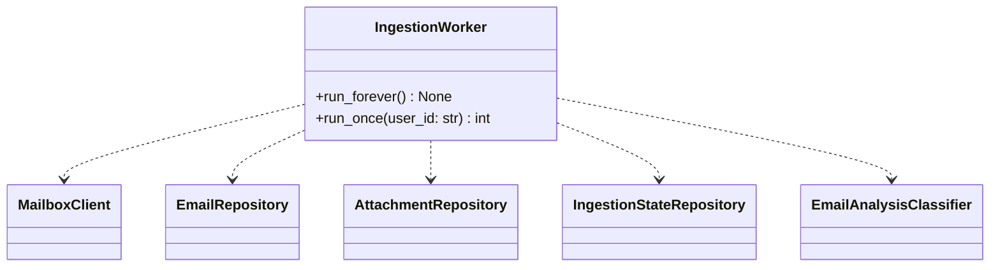

---

## Module 5 — ICS Extraction Module (`IcsExtractor`)

### Features

**Can do**

- Parse the first `text/calendar` attachment for an email.
- Extract a limited, explicit set of fields: `METHOD`, `SUMMARY`, `DTSTART`, `DTEND`, `ORGANIZER`, `LOCATION`.

**Does not do**

- Full RFC5545 compliance (recurrence rules, time zone expansion, cancellations beyond extracted fields).
- Persist extracted results by itself (caller decides).

### Internal Architecture

**Text design**

- `IcsExtractor.extract(bytes)` parses text/calendar content and returns `IcsFields`.
- Parsing is strict enough to be deterministic; failures return `None` or raise a typed `IcsParseError`.

**Mermaid diagram**

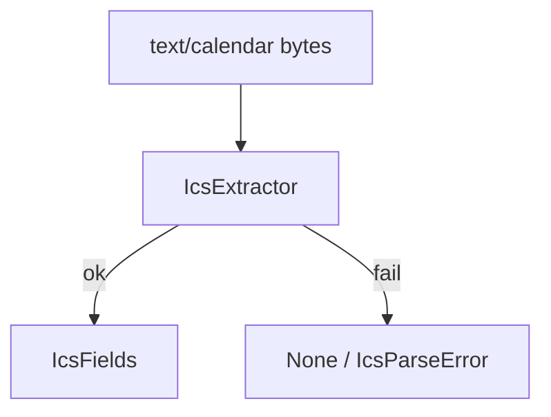

**Senior-architect justification**

- Keeps AI prompts structured without relying on brittle free-text body parsing.
- Bounded scope matches sprint constraints and avoids calendar edge-case explosion.

### Data Abstraction

- **ADT**: `IcsExtractor`
- **Abstract state**: pure function from ICS bytes to an `IcsFields` record.
- **Rep**: parser implementation.
- **Rep invariant**: returned fields are normalized (trimmed strings, timestamps in a consistent representation).

### Stable Storage

- None.

### Storage Schemas

- None.

### External API

```python
from dataclasses import dataclass
from typing import Optional


@dataclass(frozen=True)
class IcsFields:
		method: Optional[str]
		summary: Optional[str]
		dtstart: Optional[str]
		dtend: Optional[str]
		organizer: Optional[str]
		location: Optional[str]


class IcsParseError(Exception):
		pass


class IcsExtractor:
		def extract(self, ics_bytes: bytes) -> Optional[IcsFields]:
				...
```

### Declarations (Public vs Private)

- **Public**: `IcsExtractor.extract`, `IcsFields`, `IcsParseError`
- **Private**: line unfolding, property parsing helpers

### Mermaid Class Hierarchy

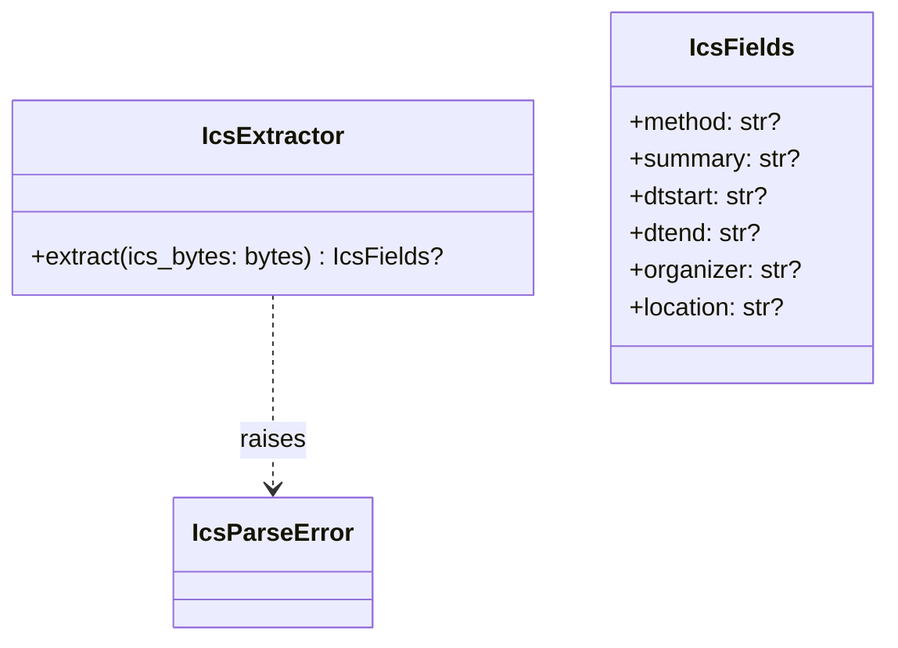

---

## Module 6 — Shared LLM Utilities Module (`PromptBuilder`, `GeminiClient`, Validator, Throttle)

Implementation note (current code): the concrete provider client is `GeminiClient` (Google Generative Language API) implemented using stdlib `urllib` to avoid third-party dependencies.

### Features

**Can do**

- Build bounded prompts for:
	- email AI analysis (category/sentiment/summary/suggestedActions)
	- AI assistant “custom request” for a specific email
	- meeting classification
	- reply-need classification
	- compose polishing
- Call an LLM provider with retry/backoff and rate limiting.
- Enforce strict JSON output schemas for email AI analysis (reject invalid JSON, missing keys, wrong types, invalid enum values).

**Does not do**

- Persist classification results.
- Decide business fallbacks—services decide policy using validator outcomes.

### Internal Architecture

**Text design**

- `PromptBuilder` is a pure component that returns prompt text + schema contract.
- `GeminiClient` wraps HTTP calls (stdlib `urllib`) and returns raw model text.
- `StrictJsonValidator` validates and parses model text into typed dicts.
- `RateLimiter` + `RetryPolicy` wrap both Gemini and mailbox calls (cross-cutting utilities).

**Mermaid diagram**

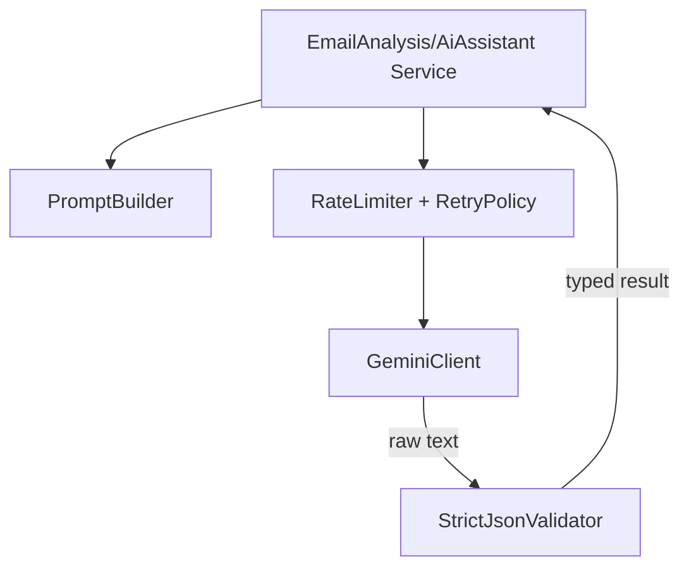

**Senior-architect justification**

- Centralizing LLM contracts prevents “prompt drift” across services.
- Strict validation prevents LLM variability from leaking into product behavior.
- Shared throttle/retry reduces operational risk and cost volatility.

### Data Abstraction

- **ADT**: `StrictJsonValidator`
- **Abstract state**: a predicate `valid(schema, text) -> parsed_value`.
- **Rep**: JSON parser + schema checks.
- **Rep invariant**: never returns a value that violates the declared schema.

### Stable Storage

- None required.

### Storage Schemas

- None.

### External API

```python
from dataclasses import dataclass
from typing import Any


@dataclass(frozen=True)
class MeetingPromptInput:
	subject: str | None
	from_addr: str | None
	to_addrs: str | None
	cc_addrs: str | None
	sent_at_utc: str | None
	body_prefix: str
	ics_method: str | None
	ics_summary: str | None
	ics_dtstart: str | None
	ics_dtend: str | None
	ics_organizer: str | None
	ics_location: str | None


@dataclass(frozen=True)
class ReplyNeedPromptInput:
	subject: str | None
	from_addr: str | None
	to_addrs: str | None
	cc_addrs: str | None
	sent_at_utc: str | None
	body_prefix: str
	meeting_related: bool
	meeting_confidence: float


class PromptBuilder:
	def build_email_analysis_prompt(
		self,
		*,
		subject: str | None,
		from_addr: str | None,
		to_addrs: str | None,
		cc_addrs: str | None,
		sent_at_utc: str | None,
		body_prefix: str,
	) -> str:
		...

	def build_ai_assistant_prompt(
		self,
		*,
		subject: str | None,
		from_addr: str | None,
		to_addrs: str | None,
		cc_addrs: str | None,
		sent_at_utc: str | None,
		body_prefix: str,
		user_prompt: str,
	) -> str:
		...

	def build_meeting_prompt(self, *, input: MeetingPromptInput) -> str:
		...

	def build_reply_need_prompt(self, *, input: ReplyNeedPromptInput) -> str:
		...

	def build_compose_suggestion_prompt(
		self,
		*,
		to_addrs: str | None,
		cc_addrs: str | None,
		subject: str | None,
		draft_body: str,
		instruction: str | None,
	) -> str:
		...


@dataclass(frozen=True)
class GeminiResponse:
	raw_text: str


class GeminiError(Exception):
	pass


class GeminiClient:
	def generate_json(self, *, prompt: str) -> "GeminiResponse":
		"""Call Gemini and return model text (expected to be strict JSON). Raises GeminiError on transport/auth errors."""
		...


class JsonValidationError(Exception):
    pass


class StrictJsonValidator:
	def validate_email_analysis(self, *, raw_text: str) -> dict[str, Any]:
        ...

	def validate_ai_request(self, *, raw_text: str) -> dict[str, Any]:
		...

	def validate_meeting(self, *, raw_text: str) -> dict[str, Any]:
		...

	def validate_reply_need(self, *, raw_text: str) -> dict[str, Any]:
		...
```

### Declarations (Public vs Private)

- **Public**: `PromptBuilder` methods, `GeminiClient.generate_json`, validator methods, error types
- **Private**: HTTP transport details, backoff jitter strategy, schema-check helpers

### Mermaid Class Hierarchy

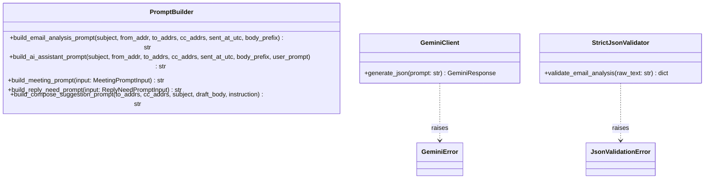

---

## Module 7 — Email AI Analysis Module (Frontend `aiAnalysis`)

### Features

**Can do**

- Classify an email into the UI-required AI analysis fields exactly once per stored email.
- Persist:
	- `category`
	- `sentiment`
	- `summary`
	- `suggestedActions`
	- `source`
- Provide read access to stored analysis for inclusion in email list/detail API responses.

**Does not do**

- Trigger mailbox ingestion (worker does that).
- Serve HTTP routes directly (controllers own REST).
- Execute AI assistant “custom requests” (Module 8).

### Internal Architecture

**Text design**


Implementation note (current code): email analysis does not include ICS fields in its prompt; ICS extraction is used by meeting classification.

- `EmailAnalysisClassifier` builds a structured prompt using:
	- subject/from/to/cc/sentAt
	- a bounded body prefix
- Calls `GeminiClient`, validates with `StrictJsonValidator.validate_email_analysis`, and writes to `email_ai_analysis`.
- `EmailAnalysisService` reads analysis by `EmailId` and provides deterministic defaults when absent.

**Mermaid diagram**

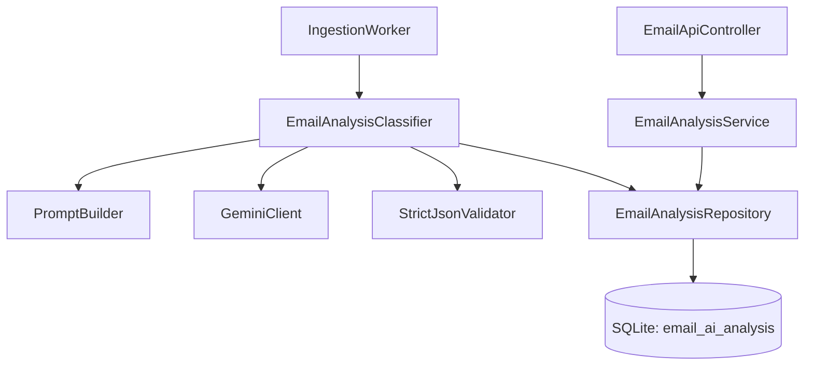

**Senior-architect justification**

- AI analysis is computed once per email to reduce LLM cost and keep the feed fast.
- Separating `Classifier` (write path) from `Service` (read path) makes caching and deterministic default semantics explicit.
- Prompt inputs are bounded to keep latency/cost predictable.

### Data Abstraction

- **ADT**: `EmailAnalysisService`
- **Abstract state**: mapping `(user_id, email_id) -> EmailAiAnalysis`.
- **Rep**: `email_ai_analysis` row keyed by `(user_id, email_id)`.
- **Rep invariant**: at most one analysis per `(user_id, email_id)`; enums always in the frontend-defined sets.

### Stable Storage

- SQLite `email_ai_analysis` (plus `emails`/`attachments` to construct prompts).

### Storage Schemas

- Uses: `email_ai_analysis` (defined in Module 2 DDL).

### External API

**Internal (service) API**

```python
from dataclasses import dataclass
from typing import Optional


@dataclass(frozen=True)
class EmailAiAnalysisResult:
	category: str
	sentiment: str
	summary: str
	suggested_actions: list[str]
	source: str


class EmailAnalysisService:
	def get_analysis(self, *, user_id: str, email_id: int) -> EmailAiAnalysisResult:
		"""Return stored analysis or deterministic defaults when absent."""
		...

	def get_analysis_by_message_id(self, *, user_id: str, mailbox_message_id: str) -> EmailAiAnalysisResult:
		"""Resolve UI Email.id (MailboxMessageId) -> EmailId, then return analysis."""
		...
```

**REST API (external callers: web app)**

The frontend UI expects `aiAnalysis` to be included inline in the email list/detail endpoints (Module 9). No dedicated `/api/ai-analysis/*` endpoint is required.

### Declarations (Public vs Private)

- **Public**: `EmailAnalysisClassifier.classify_if_needed`, `EmailAnalysisService.get_analysis`, `EmailAnalysisService.get_analysis_by_message_id`, `EmailAiAnalysisResult`
- **Private**: prompt-input extraction helpers, truncation logic, DB upsert SQL

### Mermaid Class Hierarchy

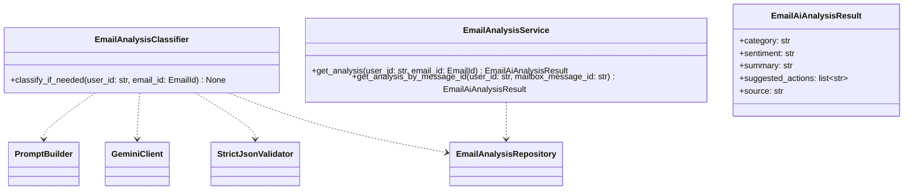

---

## Module 8 — AI Assistant + Email Actions Module (Frontend interactions)

### Features

**Can do**

- Handle the frontend “Custom Request” interaction for a specific email.
	- Input: `{ emailId, prompt }`
	- Output: `{ emailId, responseText }`
- Handle AI-assisted compose polishing.
	- Input: `{ to?, cc?, subject?, body, instruction? }`
	- Output: `{ revisedText, source }`
- Handle the frontend “Suggested Actions” click interaction.
	- Input: `{ emailId, action }`
	- Output: `{ emailId, action, status: "ok" }`
- Optionally store request/action logs for evaluation and debugging.

**Does not do**

- Run automatically during ingestion.
- Modify frontend state directly (it only returns responses).
- Require frontend-side LLM calls.

### Internal Architecture

**Text design**

- `AiAssistantService.run_request(user_id, mailbox_message_id, prompt)`:
	1. Resolves `mailbox_message_id` → `EmailId` via `EmailRepository`.
	2. Builds a bounded prompt via `PromptBuilder.build_ai_assistant_prompt`.
	3. Calls `GeminiClient.generate_json`.
	4. Stores `{prompt_text, response_text}` in `ai_requests` (optional but recommended).
	5. Returns `responseText`.

- `EmailActionService.execute(user_id, mailbox_message_id, action)`:
	1. Resolves `mailbox_message_id` → `EmailId`.
	2. Optionally performs a server-side operation (MVP: log + ack).
	3. Stores an action log row in `email_action_logs` (optional but recommended).
	4. Returns `{status: "ok"}`.

**Mermaid diagram**

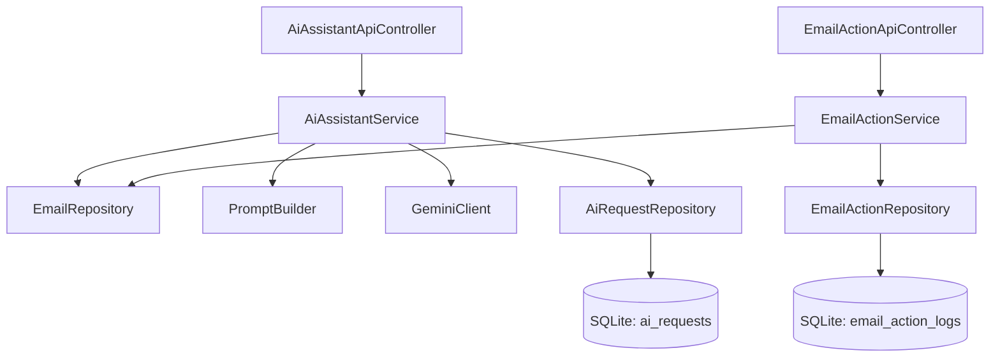

**Senior-architect justification**

- Custom requests are on-demand and bounded, keeping latency/cost explicit.
- Logging requests/actions enables evaluation without changing the UI.
- Deterministic fallback behavior (“best-effort responseText”) keeps the UI responsive under LLM failures.

### Data Abstraction

- **ADT**: `AiAssistantService`
	- **Abstract state**: pure function of `(email context, user prompt) -> responseText`, with optional persisted request logs.
	- **Rep**: rows in `ai_requests` (optional).

- **ADT**: `EmailActionService`
	- **Abstract state**: acknowledgements for actions applied (or logged) against an email.
	- **Rep**: rows in `email_action_logs` (optional).

### Stable Storage

- SQLite tables: `ai_requests` (optional), `email_action_logs` (optional).

### Storage Schemas

- Defined in Module 2 DDL.

### External API

**REST API (external callers: web app)**

- `POST /api/ai/request`
	- Auth: depends on Module 1 mode
	- Request: `{ "emailId": "<MailboxMessageId>", "prompt": "..." }`
	- Response 200:
		- `{ "emailId": "...", "responseText": "..." }`

- `POST /api/email-actions`
	- Auth: depends on Module 1 mode
	- Request: `{ "emailId": "<MailboxMessageId>", "action": "..." }`
	- Response 200:
		- `{ "emailId": "...", "action": "...", "status": "ok" }`

**Internal (service) API**

```python
from dataclasses import dataclass


@dataclass(frozen=True)
class AiRequestResult:
	response_text: str
	source: str


class AiAssistantService:
	def run_request(self, *, user_id: str, mailbox_message_id: str, prompt: str) -> AiRequestResult:
		...


class EmailActionService:
	def execute(self, *, user_id: str, mailbox_message_id: str, action: str) -> None:
		...
```

### Declarations (Public vs Private)

- **Public**: `AiAssistantService.run_request`, `EmailActionService.execute`, `AiRequestResult`
- **Private**: prompt-context extraction helpers, request/action logging details

### Mermaid Class Hierarchy

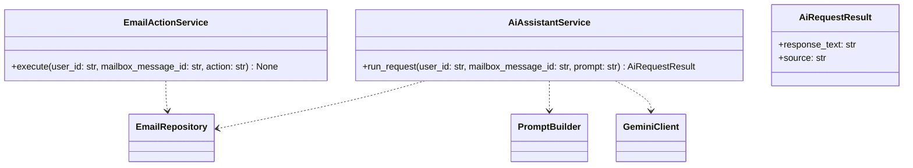

---

## Module 9 — Email Feed & Detail API Module (`EmailApiController`)

### Features

**Can do**

- Serve email list (feed) and email detail views.
- Apply the selected auth mode (Module 1) for all content.
- Read stored AI analysis (Module 7) and include it inline in responses.
- Update email read/unread state.

**Does not do**

- Trigger mailbox ingestion.
- Perform LLM calls on browse paths (analysis is precomputed or provided via deterministic defaults).

### Internal Architecture

**Text design**

- Controllers are thin: auth → service/repo calls → response DTO.
- Email list queries are indexed by `(user_id, received_at_utc)`.
- Email detail includes attachments metadata (optional) and AI analysis.

**Mermaid diagram**

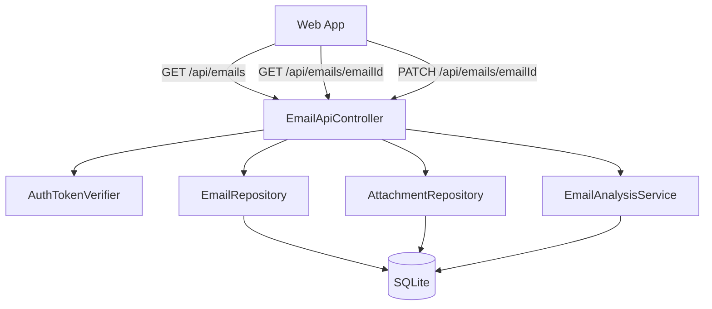

**Senior-architect justification**

- Keeping controllers thin reduces coupling and makes business logic testable outside HTTP.
- Explicitly not calling Gemini in browse paths prevents latency spikes and unpredictable costs.

### Data Abstraction

- **ADT**: `EmailQueryService` (optional: can be implemented directly via repos)
- **Abstract state**: a view over persisted emails/attachments, filtered by `user_id`.
- **Rep**: database rows.
- **Rep invariant**: callers can only see their own `user_id` rows.

### Stable Storage

- SQLite tables: `emails`, `attachments` (optional), `email_ai_analysis`.

### Storage Schemas

- Defined in Module 2 DDL.

### External API (REST)

- `GET /api/emails?folder=<inbox|sent|drafts|trash|spam>&label=<optional>&limit=50&cursor=<receivedAtUtc>`
	- Auth: depends on Module 1 mode
	- Response 200:
		- `{ "items": [Email...], "nextCursor": "..." | null }`
		- Each `Email` must match the frontend `Email` interface, including `aiAnalysis`.

- `GET /api/emails/{emailId}`
	- `emailId` is the UI-facing `MailboxMessageId` (same as `Email.id` in the frontend)
	- Auth: depends on Module 1 mode
	- Response 200: `Email`
	- Response 404: not found

- `PATCH /api/emails/{emailId}`
	- Auth: depends on Module 1 mode
	- Request body (MVP): `{ "read": true }`
	- Response 204: updated

**Email DTO (must match frontend `Email` interface)**

```json
{
	"id": "<MailboxMessageId>",
	"sender": { "name": "...", "email": "...", "avatar": "..." },
	"subject": "...",
	"preview": "...",
	"body": "<html string or plaintext rendered as html>",
	"date": "<ISO string>",
	"read": false,
	"folder": "inbox",
	"labels": ["Work"],
	"aiAnalysis": {
		"category": "Work",
		"sentiment": "neutral",
		"summary": "...",
		"suggestedActions": [
			{
				"kind": "suggestion",
				"text": "..."
			}
		]
	}
}
```

Implementation note: to keep list payloads smaller, `GET /api/emails` may return `body=""` (empty string) while still returning `aiAnalysis.summary`.

### Declarations (Public vs Private)

- **Public**: `EmailApiController` route handlers + response DTOs
- **Private**: pagination helper functions, DTO mappers

### Mermaid Class Hierarchy

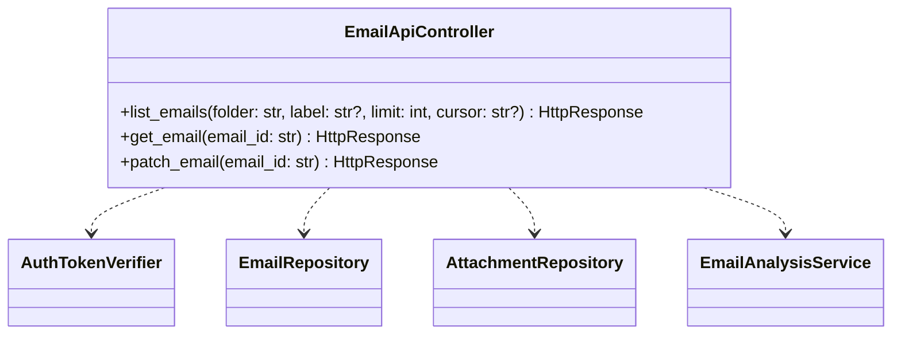

---

Additional REST API (implemented):

- `POST /api/ai/compose`
	- Request: `{ "to": "..."?, "cc": "..."?, "subject": "..."?, "body": "...", "instruction": "..."? }`
	- Response 200: `{ "revisedText": "...", "source": "gemini" | "default" }`

## Module 10 — Compose + SMTP Outbound Mail Module (`SmtpClient`)

### Features

**Can do**

- Connect to SMTP submission endpoint (STARTTLS/TLS as appropriate).
- Authenticate using per-user app password.
- Send outbound email messages (capability required by shared mailbox integration).
- Support the frontend compose flow via a REST endpoint.

**Does not do**

- Automatically send emails based on AI analysis.

### Internal Architecture

**Text design**

- `SmtpClient.send()` accepts a pre-built MIME message.
- Network calls are wrapped with retry/backoff + rate limiting.

- `ComposeApiController` (or a handler in `EmailApiController`) accepts the frontend payload and calls `SmtpClient`.
	- Request: `{ "to": "...", "subject": "...", "body": "..." }`
	- Response: `{ "id": "sent_<timestamp>", "to": "...", "subject": "..." }`

**Mermaid diagram**

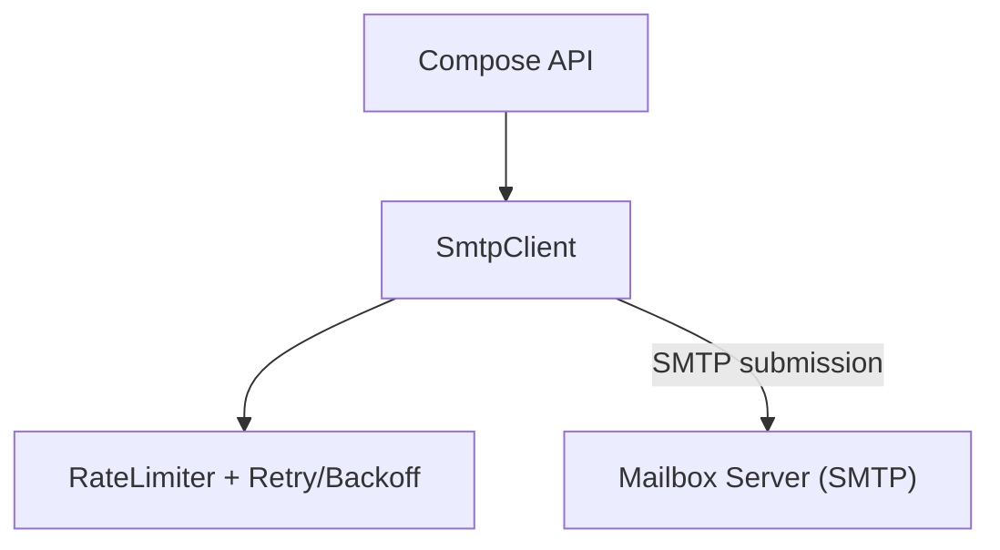

**Senior-architect justification**

- Isolates SMTP protocol details, keeping business services clean.
- Rate limiting prevents account throttling and improves reliability.

### Data Abstraction

- **ADT**: `SmtpClient`
- **Abstract state**: ability to submit RFC5322 messages on behalf of a user.
- **Rep**: SMTP connection/session.
- **Rep invariant**: TLS enabled; authenticated; sender policy enforced by server.

### Stable Storage

- None.

### Storage Schemas

- None.

### External API

```python
class SmtpError(Exception):
		pass


class SmtpClient:
		def send(self, *, user_id: str, from_addr: str, to_addrs: list[str], mime_message_bytes: bytes) -> None:
				"""Submit an email message via SMTP. Raises SmtpError on failure."""
				...

---

## Module 11 — Meeting Classification Module (`MeetingClassifier`, `MeetingService`)

### Features

**Can do**

- Classify whether an email is meeting-related, returning `{meetingRelated, confidence, rationale, source}`.
- Use the first stored `text/calendar` attachment (if present) and extract a limited set of ICS fields.
- Cache results in SQLite (`meeting_classifications`) for fast subsequent reads.

**Does not do**

- Guarantee a stored result when Gemini is unavailable (current implementation is best-effort; absence implies defaults).

### External API (REST)

- `GET /api/meeting/check?messageId=<MailboxMessageId>`
	- Response 200: `{ messageId, meetingRelated, confidence, rationale?, source }`
	- Response 404: email not found

### Internal Architecture

**Text design**

- `MeetingClassifier.classify_if_needed(user_id, email_id)`:
  1. Checks `meeting_classifications` for an existing row; skips if already classified.
  2. Loads the stored `EmailMessage` from `EmailRepository`.
  3. Calls `AttachmentRepository.list_attachments` and filters for `content_type == "text/calendar"`.
  4. If a calendar attachment exists, reads the bytes from disk and calls `IcsExtractor.extract`.
  5. Builds a `MeetingPromptInput` via `PromptBuilder.build_meeting_prompt`.
  6. Calls `GeminiClient.generate_json` (wrapped in retry/backoff).
  7. Validates the raw response via `StrictJsonValidator.validate_meeting`.
  8. Persists a `meeting_classifications` row via `UnitOfWork`.
  9. On Gemini failure after retries: logs the error and returns without writing a row (best-effort).

- `MeetingService.get_meeting_status(user_id, mailbox_message_id)`:
  1. Resolves `mailbox_message_id` → `email_id` via `EmailRepository.get_email_by_message_id`.
  2. Reads `meeting_classifications` row.
  3. Returns the stored result, or a safe default (`meetingRelated=False`, `confidence=0.0`) if absent.

**Mermaid diagram**
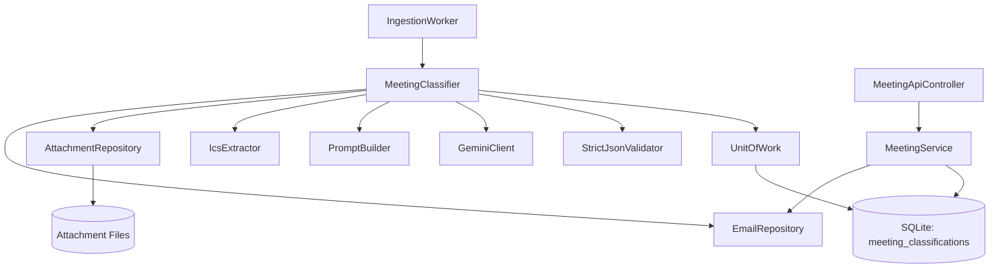

**Senior-architect justification**

- Best-effort classification (no stored row = safe default) prevents ingestion failures from blocking the feed.
- Reusing `IcsExtractor` keeps calendar-parsing logic in one place and avoids prompt injection from raw ICS text.
- Separating `MeetingClassifier` (write path, worker) from `MeetingService` (read path, API) mirrors the pattern in Module 7 and keeps API latency independent of LLM availability.

### Data Abstraction (6.005-style)

- **ADT**: `MeetingService`
  - **Abstract state**: partial mapping `(user_id, mailbox_message_id) -> MeetingStatusResult`; undefined entries return safe defaults.
  - **Rep**: rows in `meeting_classifications` keyed by `(user_id, email_id)`.
  - **Rep invariant**: `confidence` ∈ [0.0, 1.0]; `source` is always `"gemini"`; at most one row per `(user_id, email_id)`.

- **ADT**: `MeetingClassifier`
  - **Abstract state**: a write-once classifier; idempotent (skips if row already exists).
  - **Rep**: `meeting_classifications` row + underlying `GeminiClient` + `IcsExtractor`.
  - **Rep invariant**: classify_if_needed never overwrites an existing row.

### Stable Storage

- SQLite table: `meeting_classifications` (defined in Module 2 DDL).
- Attachment bytes on disk (read-only by this module; written by Module 4).

### Storage Schemas

- Uses: `meeting_classifications`, `emails`, `attachments` (all defined in Module 2 DDL).

### External API

**Internal (service) API**
```python
from dataclasses import dataclass
from typing import Optional


@dataclass(frozen=True)
class MeetingStatusResult:
    message_id: str
    meeting_related: bool
    confidence: float
    rationale: Optional[str]
    source: str


class MeetingClassifier:
    def classify_if_needed(self, *, user_id: str, email_id: int) -> None:
        """
        Classify meeting-relatedness for the given email if not already stored.
        Best-effort: logs and returns silently on Gemini failure.
        """
        ...


class MeetingService:
    def get_meeting_status(
        self, *, user_id: str, mailbox_message_id: str
    ) -> MeetingStatusResult:
        """
        Return stored meeting classification, or safe defaults if absent.
        Raises EmailNotFoundError if the email does not exist for this user.
        """
        ...
```

### Declarations (Public vs Private)

- **Public**: `MeetingClassifier.classify_if_needed`, `MeetingService.get_meeting_status`, `MeetingStatusResult`
- **Private**: prompt-input extraction helpers, ICS bytes retrieval, DB upsert SQL, retry logic

### Mermaid Class Hierarchy
```mermaid
classDiagram
    class MeetingClassifier {
        +classify_if_needed(user_id: str, email_id: int) None
    }
    class MeetingService {
        +get_meeting_status(user_id: str, mailbox_message_id: str) MeetingStatusResult
    }
    class MeetingStatusResult {
        +message_id: str
        +meeting_related: bool
        +confidence: float
        +rationale: str?
        +source: str
    }
    MeetingClassifier ..> PromptBuilder
    MeetingClassifier ..> GeminiClient
    MeetingClassifier ..> StrictJsonValidator
    MeetingClassifier ..> IcsExtractor
    MeetingClassifier ..> AttachmentRepository
    MeetingClassifier ..> EmailRepository
    MeetingService ..> EmailRepository
```
---

## Module 12 — Reply-Need Classification + Feedback Module (`ReplyNeedService`)

### Features

**Can do**

- Classify whether an email needs a reply, returning `{label, confidence, reasons, source}`.
- Cache classification in SQLite (`reply_need_classifications`).
- Record user feedback in SQLite (`reply_need_feedback`).

### External API (REST)

- `POST /api/reply-need` with `{ messageId }`
- `POST /api/reply-need/feedback` with `{ messageId, userLabel, comment? }` (returns 204)
```

### Declarations (Public vs Private)

- **Public**: `SmtpClient.send`, `SmtpError`
- **Private**: connection/auth negotiation, STARTTLS logic

### Mermaid Class Hierarchy

```mermaid
classDiagram
	class SmtpClient {
		+send(user_id: str, mime_message_bytes: bytes) None
	}
	class SmtpError
	SmtpClient ..> SmtpError : raises
```

---

## Component-to-Module Mapping (Coverage Checklist)

This section ensures every named architecture component is covered by exactly one module in this spec.

- `AuthTokenVerifier` → Module 1 (Auth)
- SQLite tables + transactions + attachment file locking → Module 2 (Persistence)
- `MailboxClient` → Module 3 (IMAP)
- `IngestionWorker` → Module 4 (Worker)
- `IcsExtractor` → Module 5 (ICS)
- `PromptBuilder`, `GeminiClient`, `Strict JSON Output Validator`, `Rate Limiter + Retry/Backoff` → Module 6 (LLM Utilities)
- `EmailAnalysisClassifier`, `EmailAnalysisService` → Module 7 (Email AI Analysis)
- `AiAssistantService`, `EmailActionService`, `AiAssistantApiController`, `EmailActionApiController` → Module 8 (AI Assistant + Actions)
- `EmailApiController` → Module 9 (Email APIs)
- `SmtpClient`, `ComposeApiController` → Module 10 (Compose + SMTP)
- `MeetingClassifier`, `MeetingService`, `MeetingApiController` → Module 11 (Meeting)
- `ReplyNeedService`, `ReplyNeedApiController` → Module 12 (Reply Need + Feedback)

