# OutlookPlus Backend Specification

## Backend Modules

### Scope and Definitions

This document defines the backend **modules** implied by the unified backend architecture (API runtime + ingestion worker runtime) in [OutlookPlus/backend/backend_specification_Architecture.md](OutlookPlus/backend/backend_specification_Architecture.md).

**Module granularity used here (grouped modules)**

- A “module” is a cohesive package boundary a backend team would implement and test independently.
- Each module may contain multiple components from the architecture diagram.
- A mapping of architecture components → modules appears at the end.

**Conventions**

- Language style: Python + FastAPI typing style (interfaces and method signatures).
- All external side effects (IMAP/SMTP/Gemini, filesystem writes, DB writes) are initiated server-side only.
- All DB access is via SQLite in WAL mode, with transactional writes.
- All attachment bytes (only `text/calendar` in MVP scope) are stored on disk; DB stores metadata + file path.

---

### Cross-Module Domain Types (Shared)

These are conceptual types used in APIs across modules. (In code they can be implemented as `NewType` wrappers or simple aliases.)

- `UserId`: stable identifier for the authenticated user.
- `EmailId`: backend-generated primary key for persisted emails.
- `MailboxMessageId`: message identifier derived from IMAP UID + UIDVALIDITY (or equivalent stable mailbox identity).
- `UtcTimestamp`: RFC3339 timestamp in UTC.

**Failure and determinism rule (important for US2/US3):**

- Meeting classification (US2) is stored once per `EmailId`.
- Reply-needed classification (US3) returns deterministic output under failure: `label="UNSURE"` whenever Gemini fails, output validation fails, or `confidence < REPLY_NEED_MIN_CONFIDENCE`.

---

## Module 1 — Auth Module

### Features

**Can do**

- Verify `Authorization: Bearer <token>` on incoming HTTP requests.
- Produce a `UserId` for downstream services.
- Fail closed: reject missing/invalid tokens.

**Does not do**

- User registration, password storage, OAuth flows, token issuance/refresh.
- Any database reads/writes.

### Internal Architecture

**Text design**

- Implement as a FastAPI dependency (or middleware) that:
	1. Extracts bearer token.
	2. Validates it (signature / lookup / opaque validation, implementation-specific).
	3. Returns `UserId` to the route handler.

**Mermaid diagram**

```mermaid
flowchart TB
	Req[HTTP Request] --> Extract[Extract Bearer Token]
	Extract --> Verify[AuthTokenVerifier.verify()]
	Verify -->|ok| UID[UserId]
	Verify -->|fail| Err[HTTP 401/403]
```

**Senior-architect justification**

- Keeps authentication logic centralized and consistent across controllers.
- Avoids leaking auth validation into business services, improving testability.
- Allows swapping verification strategy (JWT, opaque tokens, etc.) without changing API modules.

### Data Abstraction (6.005-style)

- **ADT**: `AuthTokenVerifier`
- **Abstract state**: a function `V: token -> UserId` (partial; undefined for invalid tokens).
- **Representation**: verifier configuration (e.g., signing keys, issuer/audience rules, or an introspection endpoint URL).
- **Rep invariant**: configuration is well-formed; key material present; verifier rejects tokens not satisfying policy.

### Stable Storage

- None required. (Verifier configuration is loaded from environment/config.)

### Storage Schemas

- None.

### External API

- Used internally by API controllers as a dependency.

```python
class AuthError(Exception):
		pass


class AuthTokenVerifier:
		def verify(self, authorization_header: str) -> "UserId":
				"""Return UserId if header contains a valid Bearer token; raise AuthError otherwise."""
				raise NotImplementedError
```

### Declarations (Public vs Private)

- **Public**: `AuthTokenVerifier.verify`, `AuthError`
- **Private (module-internal)**: token parsing helpers, concrete verifier implementations

### Mermaid Class Hierarchy

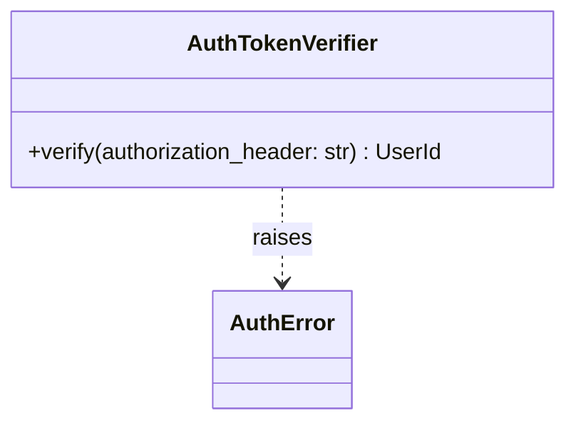

---

## Module 2 — Persistence Module (SQLite + Attachment Files)

### Features

**Can do**

- Provide transactional persistence for:
	- normalized emails + plain-text body
	- attachment metadata
	- meeting classifications (US2)
	- reply-need classifications + user feedback (US3)
	- ingestion state (per user mailbox cursor)
- Write `text/calendar` attachment bytes to disk safely under a file lock.
- Support concurrent reads/writes across API runtime and worker runtime via WAL.

**Does not do**

- IMAP/SMTP network calls.
- LLM prompt construction or calling Gemini.
- Business decisions like “meetingRelated” or “needs reply”.

### Internal Architecture

**Text design**

- `Db` wraps a SQLite connection factory, enables WAL, enforces `foreign_keys=ON`.
- Repositories (DAOs) provide narrow, typed access methods per aggregate:
	- `EmailRepository`, `AttachmentRepository`, `MeetingRepository`, `ReplyNeedRepository`, `IngestionStateRepository`
- `AttachmentFileStore` writes bytes to deterministic paths and returns file paths.
- All multi-row operations are performed through a `UnitOfWork` that scopes a transaction.

**Mermaid diagram**

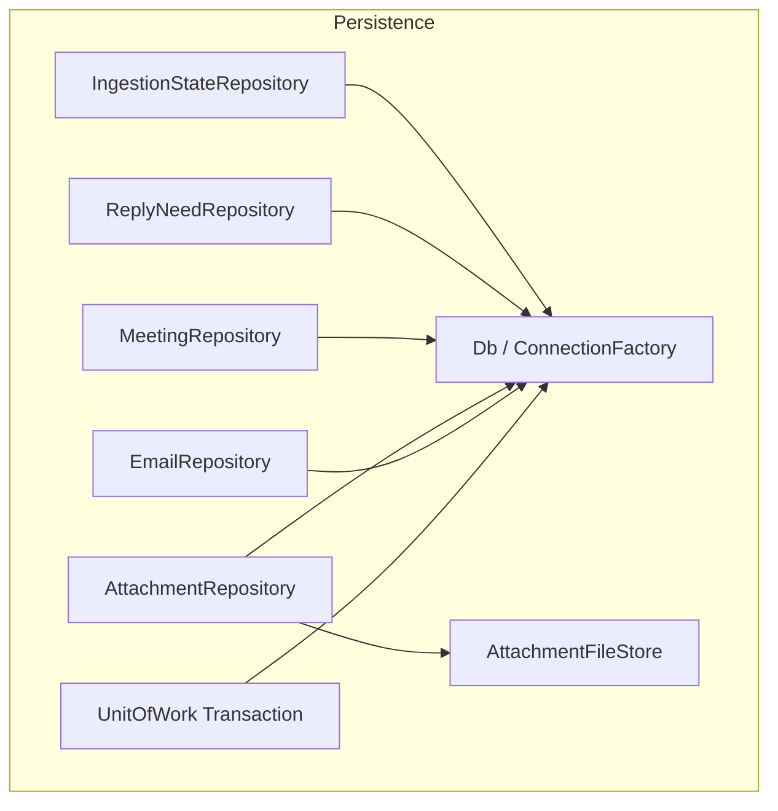

**Senior-architect justification**

- Repository boundaries prevent “SQL sprawl” and keep API/worker logic DB-agnostic.
- Unit-of-work ensures atomicity across related writes (email + attachments + classification rows).
- File store isolates the complexity of safe attachment writes, and prevents partial-file corruption.

### Data Abstraction (6.005-style)

- **ADT**: `EmailRepository`
	- **Abstract state**: set of persisted `EmailMessage` records keyed by `EmailId`, plus indexes by `(userId, mailboxMessageId)`.
	- **Rep**: SQLite rows in `emails` table.
	- **Rep invariant**: primary keys unique; `user_id` non-null; timestamps are RFC3339 UTC strings.

- **ADT**: `AttachmentFileStore`
	- **Abstract state**: mapping `attachmentId -> bytes` (on disk).
	- **Rep**: filesystem under `data/attachments/<userId>/<emailId>/<attachmentId>.bin` (exact layout is implementation-defined but must be deterministic).
	- **Rep invariant**: file writes are atomic (write temp + rename) and guarded by a lock.

### Stable Storage

- SQLite DB file: `data/outlookplus.db` (WAL enabled).
- Attachment directory: `data/attachments/...`.

### Storage Schema (SQLite DDL)

This schema is designed to be directly usable in code (execute once at startup or via migrations).

```sql
PRAGMA journal_mode = WAL;
PRAGMA foreign_keys = ON;

CREATE TABLE IF NOT EXISTS emails (
	id                INTEGER PRIMARY KEY AUTOINCREMENT,
	user_id           TEXT NOT NULL,
	mailbox_message_id TEXT NOT NULL,

	subject           TEXT,
	from_addr         TEXT,
	to_addrs          TEXT,
	cc_addrs          TEXT,
	sent_at_utc       TEXT,
	received_at_utc   TEXT NOT NULL,

	body_text         TEXT,

	created_at_utc    TEXT NOT NULL,

	UNIQUE(user_id, mailbox_message_id)
);

CREATE INDEX IF NOT EXISTS idx_emails_user_received ON emails(user_id, received_at_utc);

CREATE TABLE IF NOT EXISTS attachments (
	id              INTEGER PRIMARY KEY AUTOINCREMENT,
	user_id         TEXT NOT NULL,
	email_id        INTEGER NOT NULL,
	filename        TEXT,
	content_type    TEXT NOT NULL,
	size_bytes      INTEGER,
	storage_path    TEXT NOT NULL,
	created_at_utc  TEXT NOT NULL,

	FOREIGN KEY(email_id) REFERENCES emails(id) ON DELETE CASCADE
);

CREATE INDEX IF NOT EXISTS idx_attachments_email ON attachments(email_id);

CREATE TABLE IF NOT EXISTS meeting_classifications (
	id              INTEGER PRIMARY KEY AUTOINCREMENT,
	user_id         TEXT NOT NULL,
	email_id        INTEGER NOT NULL,

	meeting_related INTEGER NOT NULL CHECK(meeting_related IN (0, 1)),
	confidence      REAL NOT NULL CHECK(confidence >= 0.0 AND confidence <= 1.0),
	rationale       TEXT,
	source          TEXT NOT NULL,
	created_at_utc  TEXT NOT NULL,

	UNIQUE(user_id, email_id),
	FOREIGN KEY(email_id) REFERENCES emails(id) ON DELETE CASCADE
);

CREATE INDEX IF NOT EXISTS idx_meeting_email ON meeting_classifications(email_id);

CREATE TABLE IF NOT EXISTS reply_need_classifications (
	id              INTEGER PRIMARY KEY AUTOINCREMENT,
	user_id         TEXT NOT NULL,
	email_id        INTEGER NOT NULL,

	label           TEXT NOT NULL CHECK(label IN ('NEEDS_REPLY', 'NO_REPLY_NEEDED', 'UNSURE')),
	confidence      REAL NOT NULL CHECK(confidence >= 0.0 AND confidence <= 1.0),
	reasons_json    TEXT NOT NULL,
	source          TEXT NOT NULL,
	created_at_utc  TEXT NOT NULL,

	UNIQUE(user_id, email_id),
	FOREIGN KEY(email_id) REFERENCES emails(id) ON DELETE CASCADE
);

CREATE INDEX IF NOT EXISTS idx_reply_need_email ON reply_need_classifications(email_id);

CREATE TABLE IF NOT EXISTS reply_need_feedback (
	id                 INTEGER PRIMARY KEY AUTOINCREMENT,
	user_id            TEXT NOT NULL,
	email_id           INTEGER NOT NULL,
	classification_id  INTEGER,

	user_label         TEXT NOT NULL CHECK(user_label IN ('NEEDS_REPLY', 'NO_REPLY_NEEDED')),
	comment            TEXT,
	created_at_utc     TEXT NOT NULL,

	FOREIGN KEY(email_id) REFERENCES emails(id) ON DELETE CASCADE,
	FOREIGN KEY(classification_id) REFERENCES reply_need_classifications(id) ON DELETE SET NULL
);

CREATE INDEX IF NOT EXISTS idx_feedback_email ON reply_need_feedback(email_id);

CREATE TABLE IF NOT EXISTS ingestion_state (
	user_id           TEXT PRIMARY KEY,
	imap_uidvalidity  INTEGER NOT NULL,
	last_seen_uid     INTEGER NOT NULL,
	updated_at_utc    TEXT NOT NULL
);
```

### External API

```python
from dataclasses import dataclass
from typing import Iterable, Optional, Protocol


@dataclass(frozen=True)
class EmailMessage:
		id: int
		user_id: str
		mailbox_message_id: str
		subject: Optional[str]
		from_addr: Optional[str]
		to_addrs: Optional[str]
		cc_addrs: Optional[str]
		sent_at_utc: Optional[str]
		received_at_utc: str
		body_text: Optional[str]


@dataclass(frozen=True)
class AttachmentMeta:
		id: int
		user_id: str
		email_id: int
		filename: Optional[str]
		content_type: str
		size_bytes: Optional[int]
		storage_path: str


class UnitOfWork(Protocol):
		def __enter__(self) -> "UnitOfWork":
				...

		def __exit__(self, exc_type, exc, tb) -> None:
				...


class EmailRepository(Protocol):
		def upsert_email(self, *, user_id: str, mailbox_message_id: str, email: "ParsedEmail") -> int:
				"""Insert email if new; return EmailId. Must be idempotent on (user_id, mailbox_message_id)."""
				...

		def list_emails(self, *, user_id: str, limit: int, cursor_received_at_utc: Optional[str]) -> list[EmailMessage]:
				...

		def get_email(self, *, user_id: str, email_id: int) -> Optional[EmailMessage]:
				...


class AttachmentRepository(Protocol):
		def add_attachment(self, *, user_id: str, email_id: int, meta: "ParsedAttachment", storage_path: str) -> int:
				...

		def list_attachments(self, *, user_id: str, email_id: int) -> list[AttachmentMeta]:
				...


class IngestionStateRepository(Protocol):
		def get_state(self, *, user_id: str) -> Optional[tuple[int, int]]:
				"""Return (uidvalidity, last_seen_uid) or None."""
				...

		def set_state(self, *, user_id: str, uidvalidity: int, last_seen_uid: int) -> None:
				...
```

### Declarations (Public vs Private)

- **Public**: repository protocols, `UnitOfWork`, domain dataclasses, `AttachmentFileStore` interface
- **Private**: concrete SQLite implementations, SQL strings, connection pooling details, filesystem locking implementation

### Mermaid Class Hierarchy


---

## Module 3 — IMAP Mailbox Access Module (`MailboxClient`)

### Features

**Can do**

- Connect to IMAP4rev1 over TLS (IMAPS).
- Authenticate using per-user app password.
- Select mailbox/folder and enumerate new messages since a cursor (UID + UIDVALIDITY).
- Fetch full RFC822 message bytes and attachment parts needed by ingestion.

**Does not do**

- Persist anything to storage (that is Persistence / Worker).
- Classify content (that is Meeting/ReplyNeed modules).
- Serve HTTP.

### Internal Architecture

**Text design**

- `MailboxClient` is a thin, testable adapter around an IMAP library.
- All network calls are wrapped by a retry/backoff policy and a rate limiter (shared utility).
- Returns parsed results as `RawMailboxMessage` / `MailboxAttachmentPart` structs.

**Mermaid diagram**

```mermaid
flowchart TB
	Caller[IngestionWorker] --> Client[MailboxClient]
	Client -->|IMAPS| Server[Mailbox Server (IMAP)]
	Client --> Throttle[RateLimiter + Retry/Backoff]
	Client --> Parse[MIME Parser]
	Parse --> Raw[RawMailboxMessage]
```

**Senior-architect justification**

- Keeps IMAP protocol complexity isolated.
- Makes ingestion deterministic and testable with mocked client output.
- Central retry/throttle prevents “stampedes” and respects mailbox limits.

### Data Abstraction

- **ADT**: `MailboxClient`
- **Abstract state**: a remote mailbox containing messages indexed by UID, with a stable epoch identified by UIDVALIDITY.
- **Rep**: IMAP connection/session object and folder selection.
- **Rep invariant**: connection uses TLS; authenticated as intended user; selected folder is valid.

### Stable Storage

- None (remote mailbox is the durable store). Cursor state is stored by the Persistence module in `ingestion_state`.

### Storage Schemas

- Uses `ingestion_state` table via `IngestionStateRepository`.

### External API

```python
from dataclasses import dataclass
from typing import Optional


@dataclass(frozen=True)
class MailboxCursor:
		uidvalidity: int
		last_seen_uid: int


@dataclass(frozen=True)
class RawMailboxMessage:
		uidvalidity: int
		uid: int
		rfc822_bytes: bytes


class MailboxClient:
		def list_new_messages(self, *, user_id: str, cursor: Optional[MailboxCursor]) -> list[RawMailboxMessage]:
				...
```

### Declarations (Public vs Private)

- **Public**: `MailboxClient`, `MailboxCursor`, `RawMailboxMessage`
- **Private**: connection management, IMAP search/fetch commands, MIME walking logic

### Mermaid Class Hierarchy

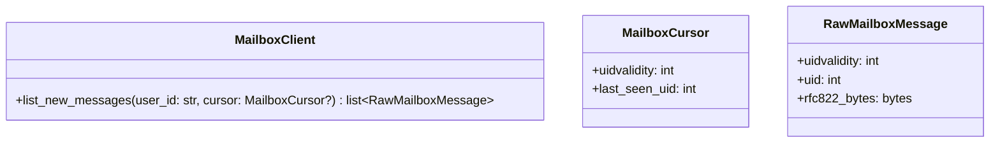

---

## Module 4 — Ingestion Worker Module (`IngestionWorker`)

### Features

**Can do**

- Poll mailbox for new messages and ingest them.
- Normalize and persist `emails` rows with plain-text body.
- Download and persist metadata for attachments; write `text/calendar` bytes to disk.
- Trigger meeting classification exactly once per ingested `EmailId`.
- Maintain per-user ingestion cursor (`ingestion_state`).

**Does not do**

- Serve HTTP requests.
- Block API request threads.
- Perform reply-need classification (on-demand only).

### Internal Architecture

**Text design**

- A loop (`run_forever`) periodically calls `run_once(user_id)`.
- `run_once`:
	1. Reads `ingestion_state`.
	2. Uses `MailboxClient` to list + fetch new messages.
	3. Parses RFC822 into `ParsedEmail` (subject/addresses/body + attachment parts).
	4. Writes email + attachments using `UnitOfWork`.
	5. Invokes `MeetingClassifier.classify(email_id)` if classification is missing.
	6. Advances ingestion cursor only after persistence succeeds.

**Mermaid diagram**

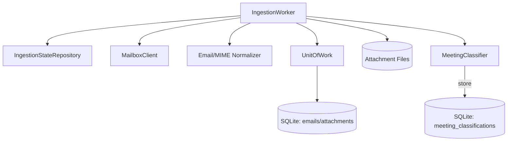

**Senior-architect justification**

- Cursor advancement after commit guarantees at-least-once ingestion without losing messages.
- Idempotent upserts by `(user_id, mailbox_message_id)` prevent duplicates.
- Meeting classification is executed off the request path, protecting API latency and UX.

### Data Abstraction

- **ADT**: `IngestionWorker`
- **Abstract state**: for each user, a cursor indicating “all messages up to UID N are ingested”.
- **Rep**: `ingestion_state` row per user plus persisted `emails`/`attachments` rows.
- **Rep invariant**: `last_seen_uid` monotonically increases per `(user_id, uidvalidity)`.

### Stable Storage

- SQLite and attachment filesystem via Persistence module.

### Storage Schemas

- Uses: `emails`, `attachments`, `meeting_classifications`, `ingestion_state`.

### External API

```python
class IngestionWorker:
		def run_forever(self) -> None:
				...

		def run_once(self, *, user_id: str) -> int:
				"""Ingest new messages for user_id. Returns number of emails ingested."""
				...
```

### Declarations (Public vs Private)

- **Public**: `IngestionWorker.run_forever`, `IngestionWorker.run_once`
- **Private**: parsing helpers, attachment filtering (`content_type == "text/calendar"`), cursor update strategy

### Mermaid Class Hierarchy

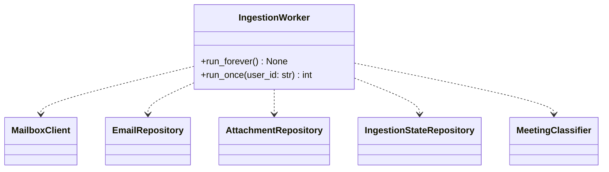

---

## Module 5 — ICS Extraction Module (`IcsExtractor`)

### Features

**Can do**

- Parse the first `text/calendar` attachment for an email.
- Extract a limited, explicit set of fields: `METHOD`, `SUMMARY`, `DTSTART`, `DTEND`, `ORGANIZER`, `LOCATION`.

**Does not do**

- Full RFC5545 compliance (recurrence rules, time zone expansion, cancellations beyond extracted fields).
- Persist extracted results by itself (caller decides).

### Internal Architecture

**Text design**

- `IcsExtractor.extract(bytes)` parses text/calendar content and returns `IcsFields`.
- Parsing is strict enough to be deterministic; failures return `None` or raise a typed `IcsParseError`.

**Mermaid diagram**

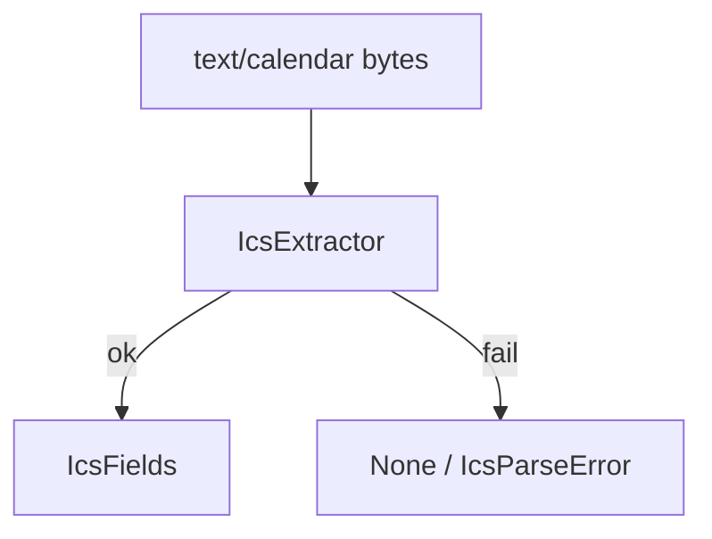

**Senior-architect justification**

- Keeps meeting prompts structured without relying on brittle free-text body parsing.
- Bounded scope matches sprint constraints and avoids calendar edge-case explosion.

### Data Abstraction

- **ADT**: `IcsExtractor`
- **Abstract state**: pure function from ICS bytes to an `IcsFields` record.
- **Rep**: parser implementation.
- **Rep invariant**: returned fields are normalized (trimmed strings, timestamps in a consistent representation).

### Stable Storage

- None.

### Storage Schemas

- None.

### External API

```python
from dataclasses import dataclass
from typing import Optional


@dataclass(frozen=True)
class IcsFields:
		method: Optional[str]
		summary: Optional[str]
		dtstart: Optional[str]
		dtend: Optional[str]
		organizer: Optional[str]
		location: Optional[str]


class IcsParseError(Exception):
		pass


class IcsExtractor:
		def extract(self, ics_bytes: bytes) -> Optional[IcsFields]:
				...
```

### Declarations (Public vs Private)

- **Public**: `IcsExtractor.extract`, `IcsFields`, `IcsParseError`
- **Private**: line unfolding, property parsing helpers

### Mermaid Class Hierarchy

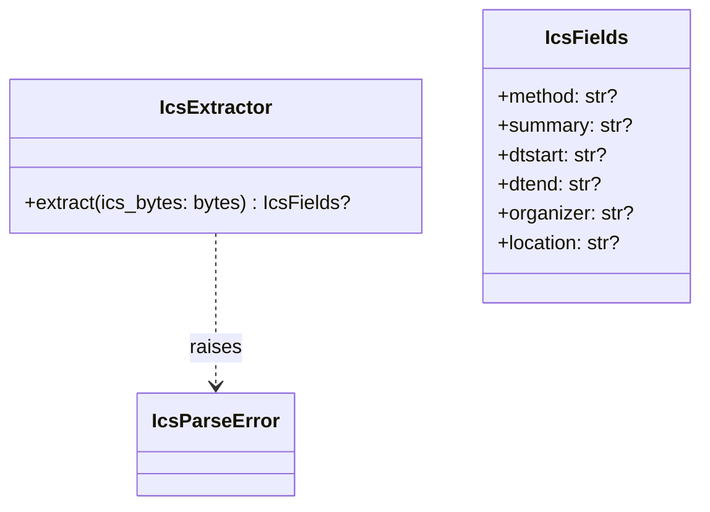

---

## Module 6 — Shared LLM Utilities Module (`PromptBuilder`, `GeminiClient`, Validator, Throttle)

### Features

**Can do**

- Build bounded prompts for:
	- meeting-related classification (US2)
	- reply-need classification (US3)
- Call Gemini with retry/backoff and rate limiting.
- Enforce strict JSON output schemas (reject invalid JSON, missing keys, wrong types, out-of-range confidence).

**Does not do**

- Persist classification results.
- Decide business fallbacks (e.g., returning `UNSURE`)—services decide policy using validator outcomes.

### Internal Architecture

**Text design**

- `PromptBuilder` is a pure component that returns prompt text + schema contract.
- `GeminiClient` wraps HTTP calls and returns raw model text.
- `StrictJsonValidator` validates and parses model text into typed dicts.
- `RateLimiter` + `RetryPolicy` wrap both Gemini and mailbox calls (cross-cutting utilities).

**Mermaid diagram**

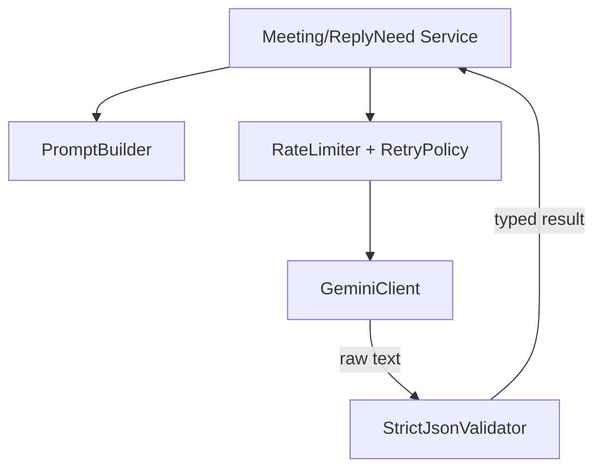

**Senior-architect justification**

- Centralizing LLM contracts prevents “prompt drift” across services.
- Strict validation prevents LLM variability from leaking into product behavior.
- Shared throttle/retry reduces operational risk and cost volatility.

### Data Abstraction

- **ADT**: `StrictJsonValidator`
- **Abstract state**: a predicate `valid(schema, text) -> parsed_value`.
- **Rep**: JSON parser + schema checks.
- **Rep invariant**: never returns a value that violates the declared schema.

### Stable Storage

- None required.

### Storage Schemas

- None.

### External API

```python
from dataclasses import dataclass
from typing import Any, Optional


@dataclass(frozen=True)
class GeminiResponse:
		raw_text: str


class GeminiError(Exception):
		pass


class GeminiClient:
		def generate_json(self, *, prompt: str) -> GeminiResponse:
				"""Call Gemini and return raw text. Raises GeminiError on transport/auth errors."""
				...


class JsonValidationError(Exception):
		pass


class StrictJsonValidator:
		def validate_meeting(self, *, raw_text: str) -> dict[str, Any]:
				...

		def validate_reply_need(self, *, raw_text: str) -> dict[str, Any]:
				...
```

### Declarations (Public vs Private)

- **Public**: `PromptBuilder` methods, `GeminiClient.generate_json`, validator methods, error types
- **Private**: HTTP transport details, backoff jitter strategy, schema-check helpers

### Mermaid Class Hierarchy

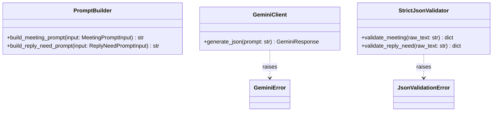

---

## Module 7 — Meeting Classification Module (US2)

### Features

**Can do**

- Classify meeting-related intent for an email exactly once at ingestion time.
- Persist `meetingRelated`, `confidence`, `rationale`, `source="gemini"`.
- Provide read access to stored meeting status for API responses and reuse by US3.

**Does not do**

- Trigger mailbox ingestion (worker does that).
- Run reply-needed classification.

### Internal Architecture

**Text design**

- `MeetingClassifier` builds a structured prompt using:
	- subject/from/to/cc/sentAt
	- first 2,000 chars of body
	- extracted ICS fields when present
- Calls `GeminiClient`, validates with `StrictJsonValidator`, and writes to `meeting_classifications`.
- `MeetingService` reads meeting status by `EmailId` and provides default values when absent.

**Mermaid diagram**

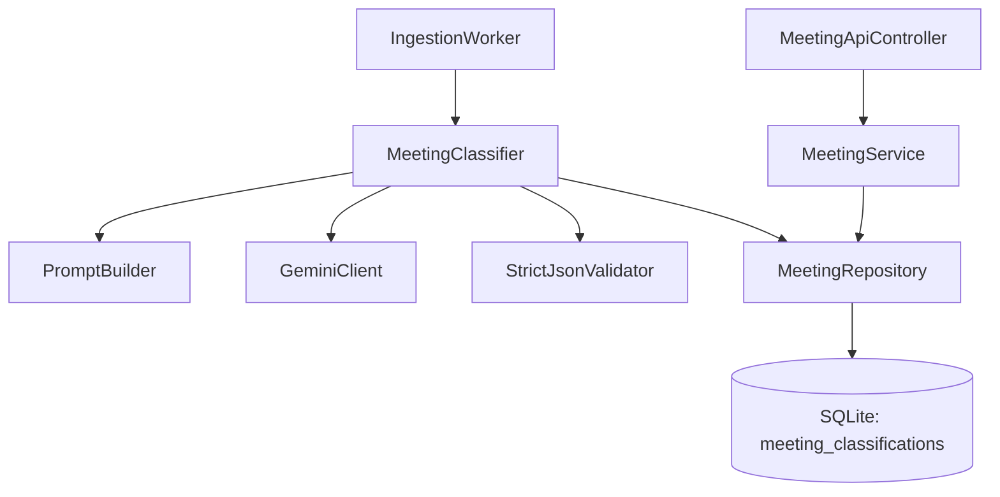

**Senior-architect justification**

- Meeting classification is computed once per email to reduce cost and keep feed fast.
- Separating `Classifier` (write path) from `Service` (read path) makes caching and default semantics explicit.
- Prompt inputs are bounded (2,000 chars) to keep latency/cost predictable.

### Data Abstraction

- **ADT**: `MeetingService`
- **Abstract state**: mapping `(user_id, email_id) -> MeetingStatus`.
- **Rep**: `meeting_classifications` row keyed by `(user_id, email_id)`.
- **Rep invariant**: at most one classification per `(user_id, email_id)`; `confidence ∈ [0,1]`.

### Stable Storage

- SQLite `meeting_classifications` (plus `emails`/`attachments` to construct prompts).

### Storage Schemas

- Uses: `meeting_classifications` (defined in Module 2 DDL).

### External API

**Internal (service) API**

```python
from dataclasses import dataclass
from typing import Optional


@dataclass(frozen=True)
class MeetingStatus:
		meeting_related: bool
		confidence: float
		rationale: Optional[str]
		source: str


class MeetingService:
		def get_status(self, *, user_id: str, email_id: int) -> MeetingStatus:
				"""Return stored status or safe defaults when absent."""
				...
```

**REST API (external callers: web app)**

- `GET /api/meeting/check?emailId=<EmailId>`
	- Auth: Bearer token required
	- Response 200:
		- `{ "emailId": 123, "meetingRelated": true, "confidence": 0.87, "rationale": "...", "source": "gemini" }`
	- Response 404: email not found for user

### Declarations (Public vs Private)

- **Public**: `MeetingClassifier.classify_if_needed`, `MeetingService.get_status`, `MeetingStatus`
- **Private**: prompt-input extraction helpers, truncation logic, DB upsert SQL

### Mermaid Class Hierarchy

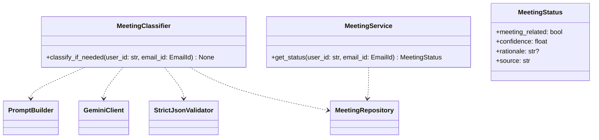

---

## Module 8 — Reply-Need Module (US3)

### Features

**Can do**

- On-demand reply-needed classification by `emailId`.
- Cache results in SQLite by `(userId, emailId)`.
- Reuse US2 meeting signal through `MeetingService`.
- Accept user feedback and store it for later evaluation.
- Deterministic failure behavior returning `UNSURE` (see architecture).

**Does not do**

- Run automatically during ingestion.
- Auto-send replies.

### Internal Architecture

**Text design**

- `ReplyNeedService.classify(email_id)`:
	1. Checks cache in `reply_need_classifications`.
	2. Reads meeting status from `MeetingService`.
	3. Builds prompt and calls Gemini.
	4. Validates strict JSON.
	5. Applies deterministic fallback rules (including `REPLY_NEED_MIN_CONFIDENCE`).
	6. Persists result.
- `ReplyNeedService.submit_feedback(...)` writes `reply_need_feedback`.

**Mermaid diagram**

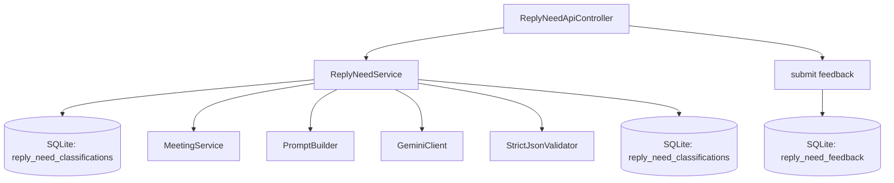

**Senior-architect justification**

- On-demand classification controls cost and keeps browsing fast.
- Caching by `(userId, emailId)` eliminates repeat Gemini calls.
- Deterministic fallback behavior makes the system testable and reliable under LLM failures.

### Data Abstraction

- **ADT**: `ReplyNeedService`
- **Abstract state**: mapping `(user_id, email_id) -> ReplyNeedResult`, plus a set of feedback records.
- **Rep**: rows in `reply_need_classifications` and `reply_need_feedback`.
- **Rep invariant**: at most one classification per `(user_id, email_id)`; reasons list size 1..3 encoded in `reasons_json`.

### Stable Storage

- SQLite tables: `reply_need_classifications`, `reply_need_feedback`.

### Storage Schemas

- Defined in Module 2 DDL.

### External API

**REST API (external callers: web app)**

- `POST /api/reply-need`
	- Auth: Bearer token required
	- Request: `{ "emailId": 123 }`
	- Response 200:
		- `{ "emailId": 123, "label": "NEEDS_REPLY", "confidence": 0.78, "reasons": ["..."], "source": "gemini" }`

- `POST /api/reply-need/feedback`
	- Auth: Bearer token required
	- Request: `{ "emailId": 123, "userLabel": "NO_REPLY_NEEDED", "comment": "optional" }`
	- Response 204: stored

**Internal (service) API**

```python
from dataclasses import dataclass
from typing import Literal


ReplyNeedLabel = Literal["NEEDS_REPLY", "NO_REPLY_NEEDED", "UNSURE"]


@dataclass(frozen=True)
class ReplyNeedResult:
		label: ReplyNeedLabel
		confidence: float
		reasons: list[str]
		source: str


class ReplyNeedService:
		def classify(self, *, user_id: str, email_id: int) -> ReplyNeedResult:
				...

		def submit_feedback(self, *, user_id: str, email_id: int, user_label: Literal["NEEDS_REPLY", "NO_REPLY_NEEDED"], comment: str | None) -> None:
				...
```

### Declarations (Public vs Private)

- **Public**: `ReplyNeedService.classify`, `ReplyNeedService.submit_feedback`, `ReplyNeedResult`
- **Private**: JSON encoding/decoding of reasons, confidence threshold check, cache lookup SQL

### Mermaid Class Hierarchy

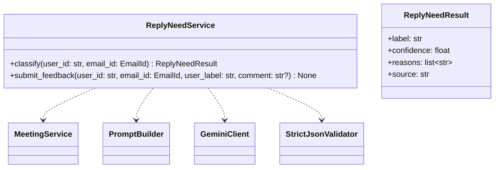

---

## Module 9 — Email Feed & Detail API Module (`EmailApiController`)

### Features

**Can do**

- Serve email list (feed) and email detail views.
- Require authentication for all content.
- Read stored meeting classifications (no Gemini calls on browse).

**Does not do**

- Trigger mailbox ingestion.
- Perform meeting or reply-need classification.

### Internal Architecture

**Text design**

- Controllers are thin: auth → service/repo calls → response DTO.
- Email list queries are indexed by `(user_id, received_at_utc)`.
- Email detail includes attachments metadata and meeting status if available.

**Mermaid diagram**

```mermaid
flowchart TB
	UI[Web App] -->|GET /api/emails| Ctrl[EmailApiController]
	UI -->|GET /api/emails/{emailId}| Ctrl
	Ctrl --> Auth[AuthTokenVerifier]
	Ctrl --> EmailRepo[EmailRepository]
	Ctrl --> AttRepo[AttachmentRepository]
	Ctrl --> MeetSvc[MeetingService]
	EmailRepo --> DB[(SQLite)]
	AttRepo --> DB
	MeetSvc --> DB
```

**Senior-architect justification**

- Keeping controllers thin reduces coupling and makes business logic testable outside HTTP.
- Explicitly not calling Gemini in browse paths prevents latency spikes and unpredictable costs.

### Data Abstraction

- **ADT**: `EmailQueryService` (optional: can be implemented directly via repos)
- **Abstract state**: a view over persisted emails/attachments, filtered by `user_id`.
- **Rep**: database rows.
- **Rep invariant**: callers can only see their own `user_id` rows.

### Stable Storage

- SQLite tables: `emails`, `attachments`, `meeting_classifications`.

### Storage Schemas

- Defined in Module 2 DDL.

### External API (REST)

- `GET /api/emails?limit=50&cursor=<receivedAtUtc>`
	- Auth required
	- Response 200: `{ "items": [EmailSummary...], "nextCursor": "..." | null }`

- `GET /api/emails/{emailId}`
	- Auth required
	- Response 200: `EmailDetail`
	- Response 404: not found

### Declarations (Public vs Private)

- **Public**: `EmailApiController` route handlers + response DTOs
- **Private**: pagination helper functions, DTO mappers

### Mermaid Class Hierarchy

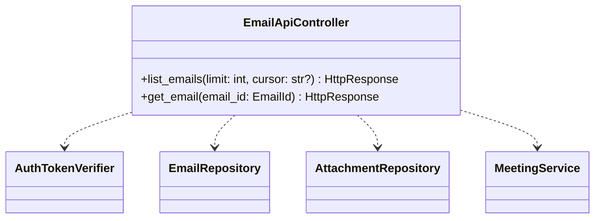

---

## Module 10 — SMTP Outbound Mail Module (`SmtpClient`)

### Features

**Can do**

- Connect to SMTP submission endpoint (STARTTLS/TLS as appropriate).
- Authenticate using per-user app password.
- Send outbound email messages (capability required by shared mailbox integration).

**Does not do**

- Automatically send emails for US2/US3 MVP.
- Expose a public REST endpoint in MVP (unless the frontend includes a compose flow).

### Internal Architecture

**Text design**

- `SmtpClient.send()` accepts a pre-built MIME message.
- Network calls are wrapped with retry/backoff + rate limiting.

**Mermaid diagram**

```mermaid
flowchart TB
	Caller[Future API / Internal Job] --> SMTP[SmtpClient]
	SMTP --> Throttle[RateLimiter + Retry/Backoff]
	SMTP -->|SMTP submission| Server[Mailbox Server (SMTP)]
```

**Senior-architect justification**

- Isolates SMTP protocol details, keeping business services clean.
- Rate limiting prevents account throttling and improves reliability.

### Data Abstraction

- **ADT**: `SmtpClient`
- **Abstract state**: ability to submit RFC5322 messages on behalf of a user.
- **Rep**: SMTP connection/session.
- **Rep invariant**: TLS enabled; authenticated; sender policy enforced by server.

### Stable Storage

- None.

### Storage Schemas

- None.

### External API

```python
class SmtpError(Exception):
		pass


class SmtpClient:
		def send(self, *, user_id: str, mime_message_bytes: bytes) -> None:
				"""Submit an email message via SMTP. Raises SmtpError on failure."""
				...
```

### Declarations (Public vs Private)

- **Public**: `SmtpClient.send`, `SmtpError`
- **Private**: connection/auth negotiation, STARTTLS logic

### Mermaid Class Hierarchy

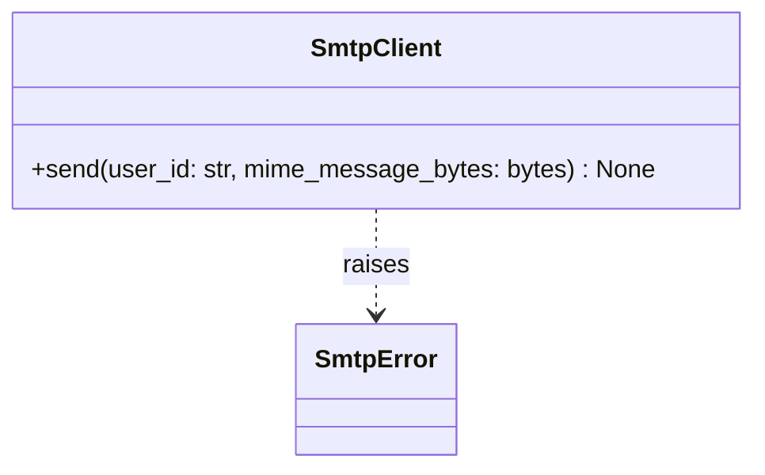

---

## Component-to-Module Mapping (Coverage Checklist)

This section ensures every named architecture component is covered by exactly one module in this spec.

- `AuthTokenVerifier` → Module 1 (Auth)
- SQLite tables + transactions + attachment file locking → Module 2 (Persistence)
- `MailboxClient` → Module 3 (IMAP)
- `IngestionWorker` → Module 4 (Worker)
- `IcsExtractor` → Module 5 (ICS)
- `PromptBuilder`, `GeminiClient`, `Strict JSON Output Validator`, `Rate Limiter + Retry/Backoff` → Module 6 (LLM Utilities)
- `MeetingClassifier`, `MeetingService`, `MeetingApiController` → Module 7 (US2)
- `ReplyNeedService`, `ReplyNeedApiController` → Module 8 (US3)
- `EmailApiController` → Module 9 (Email APIs)
- `SmtpClient` → Module 10 (SMTP)

