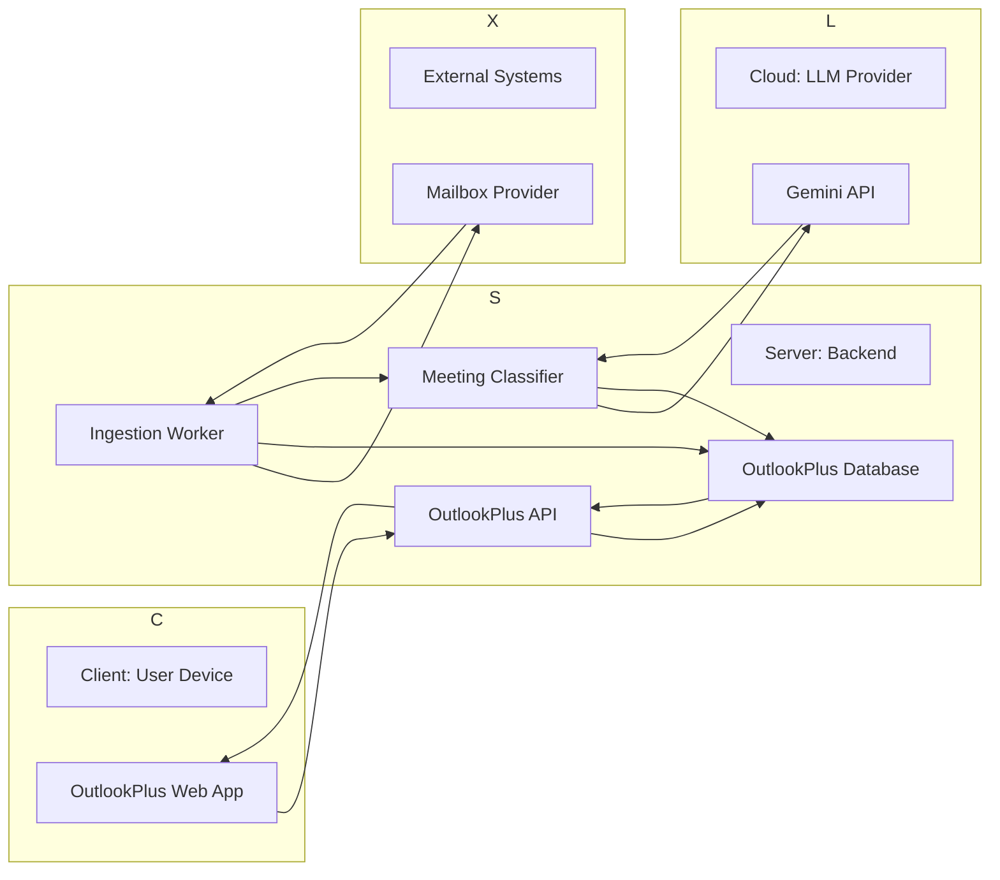
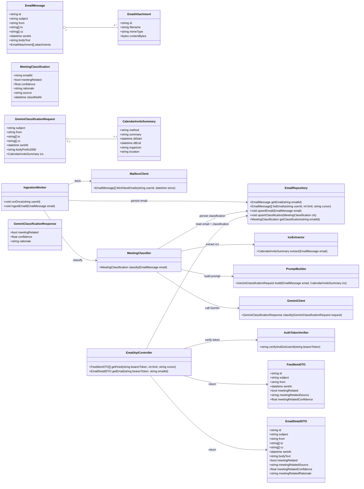
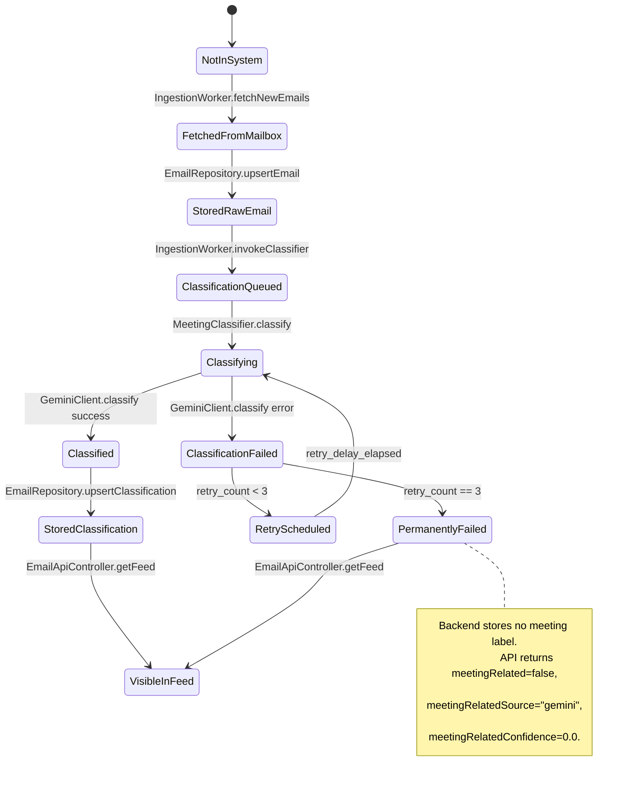
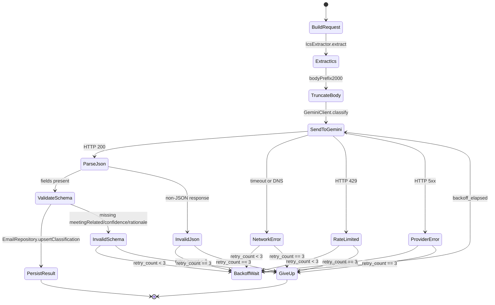

# User Story 2

As a user, I want meeting-related emails to be identified automatically so that I can prepare or respond more efficiently.

Explanation: This focuses on a specific, high-value category of emails.

T-shirt size: Small

Sprint fit: Easily achievable with Gemini-backed intent classification in one sprint

---

## Table of contents
- [Header](#header)
- [Architecture Diagram](#architecture-diagram)
- [Class Diagram](#class-diagram)
- [List of Classes](#list-of-classes)
- [State Diagrams](#state-diagrams)
- [Flow Chart](#flow-chart)
- [Development Risks and Failures](#development-risks-and-failures)
- [Technology Stack](#technology-stack)
- [APIs](#apis)
- [Public Interfaces](#public-interfaces)
- [Data Schemas](#data-schemas)
- [Security and Privacy](#security-and-privacy)
- [Risks to Completion](#risks-to-completion)

---
# Header
## Document Control
- Doc ID: OP-DEV-SPEC-US2
- Version: 1.0
- Status: Draft
- Last Updated (YYYY-MM-DD): 2026-02-13
- Owner: OutlookPlus Engineering

## User Story
- Story ID: US2
- Statement: Identify meeting-related emails automatically so users prepare and respond efficiently.
- Primary User: Email user (web app user)

## Scope
### In Scope
- Detect and label emails as `meetingRelated=true` at ingestion time.
- Expose the meeting-related label to the frontend via the backend API.
- Store the label and the model provenance (`gemini`) in backend storage.

### Out of Scope
- Calendar creation, calendar updates, RSVP sending, or meeting scheduling.
- Email summarization.
- Cross-user sharing of labels.

## Definitions
- Meeting-related email: An email whose primary intent is scheduling, rescheduling, canceling, confirming, joining, or providing details for a meeting.
- Label provenance: `gemini` (determined by Gemini classification).

## System Context
- Frontend: Web application that renders lists and detail views of emails and their labels.
- Backend: Service that ingests emails, classifies them, stores results, and serves APIs.
- LLM Provider: Gemini API used by backend for classification.

## Functional Requirements
- FR-1: Backend assigns a boolean label `meetingRelated` to each email.
- FR-2: Backend assigns `meetingRelatedSource` with value `gemini`.
- FR-3: Backend persists `meetingRelated` and `meetingRelatedSource` with the email record.
- FR-4: Backend returns `meetingRelated` and `meetingRelatedSource` in feed and email detail responses.

## Non-Functional Requirements
- NFR-1: Classification runs server-side only; frontend never calls Gemini directly.
- NFR-2: Backend logs store no raw email body text; logs store email id, classification result, source, and latency.
- NFR-3: Backend enforces request authentication for all endpoints that return email content or labels.

## Acceptance Criteria
- AC-1: When a user opens the feed, each email item includes `meetingRelated` and `meetingRelatedSource`.
- AC-2: For every ingested email, backend calls Gemini classification once using a structured prompt that includes: subject, sender, recipients, timestamp, and the first 2,000 characters of the plain-text body.
- AC-3: If the email includes a `text/calendar` attachment, backend includes these extracted fields in the Gemini prompt: ICS `METHOD`, `SUMMARY`, `DTSTART`, `DTEND`, `ORGANIZER`, `LOCATION`.
- AC-4: Backend stores classification output for the email id and returns consistent values across repeated reads.
## Rationale
The LLM generated a two-tier approach, using rules first and then the LLM for classification. However, I chose to use the LLM because rule-based methods are unreliable and not effective. Therefore, I required it to revise the design.
## Chat Log
Project Context:
We are developing an email management system with the following architecture:

Frontend: Web application (separate from backend)
Backend: LLM-powered system using Gemini API
Architecture: Frontend-backend separation

Instructions:
Generate one section at a time based on the framework I provide. When generating a section:

If there is only one clear implementation approach, generate the complete final version directly in Markdown
If multiple implementation approaches exist, stop and ask me which approach to use before generating
Do not use vague expressions like "can be", "for example", "such as", or "could be" - provide specific, concrete content
Use Mermaid.js for diagrams

generate: header

I’m going to open your spec file, then replace the placeholder “Header” section with a complete, concrete Markdown header for User Story 2 (meeting-email identification) that matches your frontend/backend + Gemini architecture.

Read dev_spec_doc2.md

Next I’ll fill in only the # Header section, keeping all other placeholder sections intact.

Edited
dev_spec_doc2.md+53-0
Done

Replaced the placeholder # Header section with a complete, concrete header for User Story 2 in dev_spec_doc2.md.
Kept every other section (# Architecture Diagram, # Class Diagram, etc.) unchanged as placeholders.
Tell me to generate the next section (e.g., Architecture Diagram). If you want multiple approaches there (single backend classifier vs rule-first fallback-to-LLM), I’ll ask you to pick before writing it.

I don't use rule!

Got it—I'll revise the Header section to remove all rule-based detection and make classification strictly Gemini-backed, including updated fields and acceptance criteria.

Edited
dev_spec_doc2.md+5-7
Updated the Header section to be Gemini-only (no rules at all) in dev_spec_doc2.md.

Removed rule-based provenance and logic
Set meetingRelatedSource to gemini only
Rewrote acceptance criteria so every email is classified via Gemini, with additional ICS fields included when a calendar invite is present
Want me to generate the next section: # Architecture Diagram (Mermaid), reflecting “frontend ↔ backend ↔ Gemini API” with the exact data flows?
# Architecture Diagram

## Component Placement
- Client (User Device): OutlookPlus Web App (browser)
- Server (Backend): OutlookPlus API + Classification Service
- Cloud (LLM Provider): Gemini API
- Server (Data): OutlookPlus Database
- External System: Mailbox Provider (source of raw emails)

## Mermaid Diagram


## Information Flows
1. Feed retrieval: Web App sends `GET /api/emails` with an auth token; Backend returns a JSON list where each item includes `meetingRelated` and `meetingRelatedSource="gemini"`.
2. Ingestion: Backend worker fetches new raw emails from the Mailbox Provider and writes raw email records to the Database.
3. Classification request: Backend sends Gemini a structured prompt built from the raw email record:
	 - `subject`, `from`, `to`, `cc`, `sentAt`
	 - `bodyPrefix2000` (first 2,000 characters of plain-text body)
	 - `ics` when `text/calendar` is present: `method`, `summary`, `dtStart`, `dtEnd`, `organizer`, `location`
4. Classification response: Gemini returns `meetingRelated` (boolean), `confidence` (0.0–1.0), and `rationale` (string).
5. Persistence: Backend stores `meetingRelated`, `meetingRelatedSource="gemini"`, `confidence`, and `classifiedAt` with the email record.

## Rationale
The LLM generated a worker-based architecture that separates the email ingestion process from frontend requests. I decided to send only the first 2,000 characters of the email body to Gemini in order to reduce costs and ensure the token limit is not exceeded.
## Chat Log
generate # Architecture Diagram

I’m going to re-open the current spec file, then replace the placeholder text under # Architecture Diagram with a concrete Mermaid diagram and an explicit data-flow list (frontend ↔ backend ↔ Gemini API ↔ storage).

I’m going to replace the two placeholder lines under # Architecture Diagram with a Mermaid diagram plus an explicit, step-by-step data-flow list (Gemini-only classification).

Edited
dev_spec_doc2.md+53-2
Done

Filled in the # Architecture Diagram section in dev_spec_doc2.md with a Mermaid flowchart and explicit component placement + data flows.
Kept the rest of your framework sections (# Class Diagram, # APIs, etc.) untouched.
Say “generate # Class Diagram” when you’re ready for the next section.
# Class Diagram



## Class Responsibilities
- `IngestionWorker`: Fetches raw emails, persists `EmailMessage`, triggers `MeetingClassifier` for each ingested email.
- `MeetingClassifier`: Builds a Gemini request from `EmailMessage` and extracted `CalendarInviteSummary`, calls `GeminiClient`, persists `MeetingClassification`.
- `EmailApiController`: Authenticates requests and returns DTOs containing `meetingRelated`, `meetingRelatedSource="gemini"`, confidence, and rationale.

## Rationale
The LLM created separate classes for ingestion and classification to keep code simple. I think the confidence and rationale fields will help debug misclassifications later. DTOs keep internal data separate from API outputs without making the system too complex.
## Chat Log
generate Class Diagram

I’m going to re-open the file around # Class Diagram, then replace that placeholder with a concrete Mermaid classDiagram covering the key backend objects (email record, classifier, Gemini client, ingestion worker, API handler) and the DTOs returned to the frontend.

Done

Generated the # Class Diagram section in dev_spec_doc2.md using a Mermaid classDiagram.
The diagram is Gemini-only (no rules) and defines the ingestion worker, classifier, Gemini client, repositories, and the DTOs returned to the frontend.
Tell me to generate # List of Classes next (I’ll turn the diagram into a concrete class list with fields + method signatures).
# List of Classes

## Backend Domain Models

### `EmailMessage`
- Purpose: Represents one ingested email for a single authenticated user.
- Fields:
	- `id: string`
	- `subject: string`
	- `from: string`
	- `to: string[]`
	- `cc: string[]`
	- `sentAt: datetime`
	- `bodyText: string`
	- `attachments: EmailAttachment[]`
- Invariants:
	- `id` is unique per user.
	- `bodyText` is stored; only a prefix is sent to Gemini.

### `EmailAttachment`
- Purpose: Represents a stored attachment associated with an email.
- Fields:
	- `id: string`
	- `filename: string`
	- `mimeType: string`
	- `contentBytes: bytes`
- Invariants:
	- `mimeType` equals `text/calendar` for calendar invite attachments.

### `CalendarInviteSummary`
- Purpose: Normalized subset of ICS invite fields used in the Gemini prompt.
- Fields:
	- `method: string` (values: `REQUEST`, `CANCEL`, `REPLY`)
	- `summary: string`
	- `dtStart: datetime`
	- `dtEnd: datetime`
	- `organizer: string`
	- `location: string`
- Invariants:
	- All fields are empty strings or null dates when no `text/calendar` attachment exists.

### `MeetingClassification`
- Purpose: Persisted classification output for one email.
- Fields:
	- `emailId: string`
	- `meetingRelated: bool`
	- `confidence: float` (range `0.0` to `1.0`)
	- `rationale: string`
	- `source: string` (constant value: `gemini`)
	- `classifiedAt: datetime`
- Invariants:
	- `source` equals `gemini`.
	- `emailId` references an existing `EmailMessage.id`.

## Backend Services

### `MailboxClient`
- Purpose: Fetches new emails from the mailbox provider.
- Methods:
	- `fetchNewEmails(userId: string, since: datetime): EmailMessage[]`
- Errors:
	- Returns an error when provider auth fails; ingestion worker records failure and stops for that user.
	- Returns an error when provider rate limit triggers; ingestion worker retries with exponential backoff.

### `IngestionWorker`
- Purpose: Executes ingestion for one user and triggers meeting classification.
- Dependencies: `MailboxClient`, `EmailRepository`, `MeetingClassifier`.
- Methods:
	- `runOnce(userId: string): void`
	- `ingestEmail(email: EmailMessage): void`
- Behavior:
	- Persists `EmailMessage` before classification.
	- Invokes `MeetingClassifier.classify(email)` once per ingested email.

### `MeetingClassifier`
- Purpose: Produces `MeetingClassification` by calling Gemini with a structured request.
- Dependencies: `IcsExtractor`, `PromptBuilder`, `GeminiClient`, `EmailRepository`.
- Methods:
	- `classify(email: EmailMessage): MeetingClassification`
- Behavior:
	- Extracts `CalendarInviteSummary` from the email.
	- Builds a `GeminiClassificationRequest`.
	- Calls `GeminiClient.classify(request)`.
	- Persists `MeetingClassification` via `EmailRepository.upsertClassification`.
- Errors:
	- On Gemini network failure: returns an error; ingestion worker logs the email id and retries classification.
	- On Gemini response schema failure: stores no classification and returns an error.

### `IcsExtractor`
- Purpose: Extracts `CalendarInviteSummary` from `text/calendar` attachments.
- Methods:
	- `extract(email: EmailMessage): CalendarInviteSummary`
- Behavior:
	- When multiple `text/calendar` attachments exist, uses the first attachment in attachment order.

### `PromptBuilder`
- Purpose: Constructs the exact Gemini request payload.
- Methods:
	- `build(email: EmailMessage, ics: CalendarInviteSummary): GeminiClassificationRequest`
- Behavior:
	- Sets `bodyPrefix2000` to the first 2,000 characters of `email.bodyText`.
	- Includes `ics` with extracted fields.

### `GeminiClient`
- Purpose: Calls the Gemini API and returns parsed results.
- Methods:
	- `classify(request: GeminiClassificationRequest): GeminiClassificationResponse`
- Behavior:
	- Uses a single Gemini model version configured in backend environment variables.
	- Enforces a strict JSON response schema: `meetingRelated`, `confidence`, `rationale`.

## Persistence

### `EmailRepository`
- Purpose: Persistence abstraction for emails and classifications.
- Methods:
	- `getEmail(emailId: string): EmailMessage`
	- `listEmails(userId: string, limit: int, cursor: string): EmailMessage[]`
	- `upsertEmail(email: EmailMessage): void`
	- `upsertClassification(cls: MeetingClassification): void`
	- `getClassification(emailId: string): MeetingClassification`
- Behavior:
	- `listEmails` returns newest-first by `sentAt`.

## API and Auth

### `AuthTokenVerifier`
- Purpose: Verifies the bearer token and returns the authenticated user id.
- Methods:
	- `verifyAndGetUserId(bearerToken: string): string`
- Errors:
	- Rejects missing or invalid tokens with `401 Unauthorized`.

### `EmailApiController`
- Purpose: Implements API endpoints used by the web app.
- Dependencies: `AuthTokenVerifier`, `EmailRepository`.
- Methods:
	- `getFeed(bearerToken: string, limit: int, cursor: string): FeedItemDTO[]`
	- `getEmail(bearerToken: string, emailId: string): EmailDetailDTO`
- Behavior:
	- Every returned DTO includes meeting label fields populated from `MeetingClassification`.

## API DTOs

### `FeedItemDTO`
- Purpose: Minimal email representation for the feed.
- Fields:
	- `id: string`
	- `subject: string`
	- `from: string`
	- `sentAt: datetime`
	- `meetingRelated: bool`
	- `meetingRelatedSource: string` (constant value: `gemini`)
	- `meetingRelatedConfidence: float`

### `EmailDetailDTO`
- Purpose: Full email representation for the email detail page.
- Fields:
	- `id: string`
	- `subject: string`
	- `from: string`
	- `to: string[]`
	- `cc: string[]`
	- `sentAt: datetime`
	- `bodyText: string`
	- `meetingRelated: bool`
	- `meetingRelatedSource: string` (constant value: `gemini`)
	- `meetingRelatedConfidence: float`
	- `meetingRelatedRationale: string`

## Gemini Request/Response Models

### `GeminiClassificationRequest`
- Purpose: Structured request sent to Gemini.
- Fields:
	- `subject: string`
	- `from: string`
	- `to: string[]`
	- `cc: string[]`
	- `sentAt: datetime`
	- `bodyPrefix2000: string`
	- `ics: CalendarInviteSummary`

### `GeminiClassificationResponse`
- Purpose: Parsed response returned from Gemini.
- Fields:
	- `meetingRelated: bool`
	- `confidence: float`
	- `rationale: string`
## Rationale
The LLM created classes with single purposes to keep code simple. I think the error handling for provider failures and rate limits with retry logic will prevent most ingestion failures. The 2,000 character limit on body text reduces Gemini costs without making the system too complex.
## Chat Log
generate # List of Classes

I’m going to load the file around # List of Classes, then replace that placeholder with a concrete class-by-class specification that matches the class diagram (Gemini-only) and includes exact fields and method contracts.

Done

Generated the # List of Classes section in dev_spec_doc2.md.
It matches the class diagram exactly and stays Gemini-only, with concrete fields, method signatures, dependencies, and error behaviors.
Say “generate # State Diagrams” for the next section.

# State Diagrams

## Email Ingestion and Classification Lifecycle



## Gemini Classification Call Lifecycle



## State Definitions
- `VisibleInFeed`: User can view the email in the web app feed; backend includes meeting label fields.
- `Classified`: Gemini response parsed and validated; classification is ready to persist.
- `PermanentlyFailed`: Gemini classification failed after 3 attempts; backend stops retrying for that email.

## Rationale
The LLM generated a state diagram that I reviewed and verified. This diagram illustrates the complete lifecycle of an email from ingestion to frontend display. It also includes retry logic with backoff to handle temporary Gemini failures. After three consecutive failures, the system returns default values to keep the feed functioning without making error handling overly complex.
## Chat Log
generate # State Diagrams

I’m going to locate the # State Diagrams placeholder in your spec, then replace it with concrete Mermaid stateDiagram-v2 diagrams for (1) email ingestion/classification lifecycle and (2) the Gemini classification call lifecycle (including retry and failure states).

Done

Added concrete Mermaid stateDiagram-v2 diagrams under # State Diagrams in dev_spec_doc2.md:
Email ingestion + classification lifecycle (includes retry and permanent failure)
Gemini call lifecycle (build request → send → parse/validate → persist, with failure paths)
Tell me to generate # Flow Chart next.
# Flow Chart

```mermaid
flowchart TD
	%% Ingestion + Classification
	A0([Start: IngestionWorker runOnce(userId)]) --> A1[MailboxClient.fetchNewEmails(userId, since)]
	A1 --> A2{New emails returned?}
	A2 -- No --> A99([End])
	A2 -- Yes --> A3[EmailRepository.upsertEmail(email)]
	A3 --> A4[IcsExtractor.extract(email)]
	A4 --> A5[PromptBuilder.build(email, ics)]
	A5 --> A6[GeminiClient.classify(request)]
	A6 --> A7{Response valid JSON + schema?}

	A7 -- Yes --> A8[EmailRepository.upsertClassification(meetingRelated, confidence, rationale, source="gemini", classifiedAt)]
	A8 --> A9([Classification stored])

	A7 -- No --> A10[Increment retry_count]
	A10 --> A11{retry_count < 3?}
	A11 -- Yes --> A12[Wait backoff_delay]
	A12 --> A6
	A11 -- No --> A13[Mark classification failed for emailId]
	A13 --> A14([Leave email without stored classification])

	%% Feed Retrieval
	B0([Start: User opens feed]) --> B1[Web App calls GET /api/emails with bearer token]
	B1 --> B2[AuthTokenVerifier.verifyAndGetUserId(token)]
	B2 --> B3{Token valid?}
	B3 -- No --> B4[Return 401]
	B3 -- Yes --> B5[EmailRepository.listEmails(userId, limit, cursor)]
	B5 --> B6[EmailRepository.getClassification(emailId) for each email]
	B6 --> B7{Classification exists?}
	B7 -- Yes --> B8[Return FeedItemDTO with meetingRelated, meetingRelatedSource="gemini", confidence]
	B7 -- No --> B9[Return FeedItemDTO with meetingRelated=false, meetingRelatedSource="gemini", confidence=0.0]
	B8 --> B10([Feed rendered])
	B9 --> B10
```

## Flow Steps (Backend)
1. Ingestion worker fetches new emails from the mailbox provider.
2. Backend persists each raw `EmailMessage`.
3. Backend extracts ICS fields from `text/calendar` attachments.
4. Backend truncates the email body to 2,000 characters and builds a structured Gemini request.
5. Backend calls Gemini and validates the response JSON schema.
6. Backend persists `MeetingClassification` with `source="gemini"`.
7. Feed API returns each email with meeting label fields; missing classifications return default values.
## Rationale
The generated flowchart sets ingestion and feed retrieval as two separate paths. This makes the process clearer. Also, I think the retry loop with backoff can ensure that Gemini errors do not block other emails. When classification fails or takes too long, this mechanism can use default values to keep the feed working normally.
## Chat Log
generate # Flow Chart

I’m going to replace the # Flow Chart placeholder with a Mermaid flowchart that shows the exact step-by-step runtime flow for (1) ingestion+Gemini classification and (2) frontend feed retrieval with the returned meeting label fields.

Done

Generated the # Flow Chart section in dev_spec_doc2.md.
Added a Mermaid flowchart covering ingestion+Gemini classification (with retry) and feed retrieval (with default values when classification is missing), plus a concrete step list.
Say “generate # Development Risks and Failures” to continue.
# Development Risks and Failures

## Risks

### R-1: Gemini API outage or high error rate
- Failure Mode: `GeminiClient.classify` returns network errors, HTTP 5xx, or repeated timeouts.
- Impact: Classification backlog grows; emails appear in the feed with default meeting label values.
- Detection:
	- Metric `gemini_classify_error_rate` exceeds 5% over 10 minutes.
	- Metric `classification_backlog_count` increases monotonically for 15 minutes.
- Mitigation:
	- Retry policy: 3 attempts per email id with exponential backoff delays of 5s, 20s, 60s.
	- Circuit breaker: stop calling Gemini for 10 minutes when 20 consecutive calls fail; mark emails as unclassified.
	- Operator alert on `gemini_classify_error_rate` threshold.

### R-2: Gemini rate limiting (HTTP 429)
- Failure Mode: Gemini returns HTTP 429.
- Impact: Classification throughput drops; ingestion finishes but labels lag.
- Detection:
	- Metric `gemini_http_429_count` > 0 for 5 consecutive minutes.
- Mitigation:
	- Global token bucket limiter in backend: max 30 classification requests per minute.
	- Backoff retry uses `Retry-After` header when present; otherwise uses 60s delay.

### R-3: Prompt/response schema drift
- Failure Mode: Gemini returns non-JSON output or JSON missing `meetingRelated`, `confidence`, or `rationale`.
- Impact: Classification fails for affected emails; repeated retries waste quota.
- Detection:
	- Metric `gemini_invalid_schema_count` > 0.
- Mitigation:
	- Strict response contract: backend rejects outputs that do not parse into `GeminiClassificationResponse`.
	- Prompt includes an explicit JSON-only instruction and a single top-level object schema.
	- After 3 schema failures for one email id, backend stops retrying and records a classification failure event.

### R-4: False positives/false negatives
- Failure Mode: Gemini mislabels meeting-related intent.
- Impact: Users trust labels less; meeting-related emails are missed or incorrectly flagged.
- Detection:
	- Offline evaluation set of 200 labeled emails; weekly accuracy check.
	- Metric `manual_label_override_rate` (when implemented) exceeds 10%.
- Mitigation:
	- Store `confidence` and `rationale` for audits.
	- Set UI behavior: show meeting badge only when `confidence >= 0.70`.
	- Prompt includes calendar invite fields when present to improve correctness.

### R-5: Privacy leakage to logs
- Failure Mode: Raw email body or attachment bytes appear in backend logs.
- Impact: Privacy violation; compliance failure.
- Detection:
	- Log scanning rule rejects lines containing `bodyText` values longer than 200 characters.
	- CI check blocks merges that add logging of email bodies.
- Mitigation:
	- Logging policy: log only `emailId`, `meetingRelated`, `confidence`, `source`, `latencyMs`, and error codes.
	- Central logger redacts fields named `bodyText`, `contentBytes`, and `attachments`.

### R-6: Token/cost overrun
- Failure Mode: Prompt content length exceeds expected limits; request volume spikes.
- Impact: Gemini spend exceeds budget; requests fail due to token limits.
- Detection:
	- Metric `gemini_prompt_chars_p95` exceeds 2,500 characters.
	- Metric `gemini_cost_usd_daily` exceeds daily budget threshold.
- Mitigation:
	- Enforce `bodyPrefix2000` exactly.
	- Remove HTML and signatures in preprocessing step: strip quoted replies and footer blocks before truncation.
	- Hard cap classifications per user per hour: 200.

### R-7: Calendar invite parsing failures
- Failure Mode: ICS attachment is malformed; `IcsExtractor` throws.
- Impact: Prompt loses structured meeting metadata; classification accuracy drops.
- Detection:
	- Metric `ics_extract_error_count` > 0.
- Mitigation:
	- Wrap extractor: on parse error, set `ics` fields to empty strings/null dates and proceed with Gemini classification.
	- Store extractor error code for the email id.

## Failure Handling Guarantees
- Backend always returns feed items; meeting label defaults are returned when no stored classification exists.
- Backend never blocks feed requests on Gemini calls; classification runs in ingestion worker context only.
## Rationale
The risk scenarios generated by the LLM include API outages, rate limits, and schema drift. I think a retry policy with backoff is necessary. It can ensure that classification errors will not cause other emails to be blocked from normal processing. And the circuit breaker can ensure that after multiple failures, useless calls are stopped to prevent server resource waste.
## Chat Log
generate：# Development Risks and Failures

I’m going to replace the # Development Risks and Failures placeholder with a concrete list of failure modes, impacts, detection signals, and exact mitigations for the Gemini-only classifier pipeline.

Done

Generated # Development Risks and Failures in dev_spec_doc2.md.
Included concrete failure modes + impact + detection metrics + exact mitigations for Gemini outage, 429 rate limits, schema drift, misclassification, privacy/logging, token/cost overruns, and ICS parsing errors.
Say “generate # Technology Stack” next.

# Technology Stack

## Frontend (Web Application)
- Framework: Next.js 16.1.4 (App Router)
- Language: TypeScript 5
- UI: React 19.2.3
- Styling: Tailwind CSS 4
- Linting: ESLint 9

## Backend (API + Worker)
- Language: Python 3.12
- Web Framework: FastAPI
- ASGI Server: Uvicorn
- Data Validation: Pydantic v2
- HTTP Client: httpx
- Retries/Backoff: tenacity
- Logging: Python `logging` with JSON formatter

## LLM Integration
- Provider: Google Gemini API
- Transport: HTTPS REST calls from backend using httpx
- Response Format: strict JSON object with keys `meetingRelated`, `confidence`, `rationale`

## Mailbox Integration
- Provider: Microsoft Graph API (Outlook/Office 365)
- Auth: OAuth 2.0 Authorization Code flow
- Token Library: MSAL (Python)
- Permissions: `Mail.Read` for ingestion

## Persistence (JSON File Store)
- Storage Location: backend server filesystem under `data/`
- Email Storage:
	- Path: `data/emails/{userId}/{emailId}.json`
	- Content: `EmailMessage` fields excluding `contentBytes`
- Attachment Storage:
	- Path: `data/attachments/{userId}/{attachmentId}.bin`
	- Metadata: `data/attachments/{userId}/{attachmentId}.json`
- Classification Storage:
	- Path: `data/classifications/{userId}/{emailId}.json`
	- Content: `MeetingClassification` with `source="gemini"`
- Concurrency Control: per-user file lock during writes to prevent partial JSON writes

## Observability
- Metrics:
	- `gemini_classify_latency_ms`
	- `gemini_classify_error_rate`
	- `gemini_http_429_count`
	- `classification_backlog_count`
	- `ics_extract_error_count`
- Tracing: request id propagated from API handler to worker logs

## Configuration
- Secrets and endpoints stored in environment variables:
	- `GEMINI_API_KEY`
	- `GEMINI_MODEL`
	- `GRAPH_TENANT_ID`
	- `GRAPH_CLIENT_ID`
	- `GRAPH_CLIENT_SECRET`
	- `APP_BASE_URL`
	- `DATA_DIR`
## Rationale
The LLM-generated design chose Python and FastAPI to keep asynchronous ingestion simple while reducing boilerplate code. For the MVP, I required the LLM to use JSON file storage in order to avoid the added complexity of database setup. Since the system is positioned as an upgraded version of Outlook, it integrates Microsoft Graph for mailbox connectivity.
## Chat Log
generate

Technology Stack
Before I write # Technology Stack, I need to lock a few concrete choices (backend framework, database, and mailbox integration), since there are multiple valid stacks and your instructions say I must ask when there’s more than one clear approach.

Asked 3 questions (Backend, Database, Mailbox)

Which backend implementation stack should the spec standardize on?
Python + FastAPI
- Python backend with async workers
Which database should the spec standardize on for persisting emails and classifications?
Json
Which mailbox provider integration should the spec target for ingestion?
Microsoft Graph API (Outlook/Office 365)
- OAuth + Graph mail endpoints
I’ve got your choices: backend = Python/FastAPI, mailbox = Microsoft Graph. Next I’ll quickly check the existing frontend code in this workspace to keep the Technology Stack consistent, then I’ll write the full # Technology Stack section.

Generated # Technology Stack in dev_spec_doc2.md using your selected approach:

Frontend: Next.js 16.1.4 + React 19.2.3 + TypeScript 5 + Tailwind 4 + ESLint 9
Backend: Python 3.12 + FastAPI + Uvicorn + Pydantic v2 + httpx + tenacity
Integrations: Microsoft Graph API ingestion, Gemini API via REST
Storage: JSON file store under data/ with exact paths and locking
Observability + required environment variables listed concretely
Say “generate # APIs” next.
# APIs

## API Conventions
- Base URL: `https://<backend-host>`
- Auth: `Authorization: Bearer <access_token>`
- Content-Type: `application/json; charset=utf-8`
- All timestamps use ISO 8601 UTC format: `YYYY-MM-DDTHH:MM:SSZ`

## Frontend ↔ Backend (OutlookPlus REST)

### `GET /api/emails`
- Purpose: Returns the email feed with meeting labels.
- Auth: Required
- Query Parameters:
	- `limit` (int, required, range 1–100)
	- `cursor` (string, optional)
- Response: `200 OK`
```json
{
	"items": [
		{
			"id": "email_123",
			"subject": "Project sync",
			"from": "alex@example.com",
			"sentAt": "2026-02-13T18:40:00Z",
			"meetingRelated": true,
			"meetingRelatedSource": "gemini",
			"meetingRelatedConfidence": 0.86
		}
	],
	"nextCursor": "cursor_abc"
}
```
- Error Responses:
	- `401 Unauthorized`: missing or invalid bearer token

### `GET /api/emails/{emailId}`
- Purpose: Returns one email with meeting label details.
- Auth: Required
- Path Parameters:
	- `emailId` (string, required)
- Response: `200 OK`
```json
{
	"id": "email_123",
	"subject": "Project sync",
	"from": "alex@example.com",
	"to": ["user@school.edu"],
	"cc": [],
	"sentAt": "2026-02-13T18:40:00Z",
	"bodyText": "Let’s meet tomorrow at 2pm...",
	"meetingRelated": true,
	"meetingRelatedSource": "gemini",
	"meetingRelatedConfidence": 0.86,
	"meetingRelatedRationale": "The email proposes a meeting time and discusses scheduling."
}
```
- Error Responses:
	- `401 Unauthorized`
	- `404 Not Found`: email id not found for the authenticated user

### `POST /api/ingestion/run`
- Purpose: Triggers an ingestion run for the authenticated user.
- Auth: Required
- Request Body:
```json
{
	"since": "2026-02-12T00:00:00Z"
}
```
- Response: `202 Accepted`
```json
{
	"jobId": "ingest_job_001",
	"status": "queued"
}
```
- Error Responses:
	- `401 Unauthorized`
	- `429 Too Many Requests`: ingestion requests exceed rate limit for the user

## Backend ↔ Microsoft Graph (Mailbox Ingestion)

### OAuth Token (MSAL)
- Authority: `https://login.microsoftonline.com/{tenantId}`
- Grant Type: Authorization Code (interactive login initiated from frontend)
- Scopes: `Mail.Read`

### Fetch Messages
- Method: `GET https://graph.microsoft.com/v1.0/me/messages`
- Headers:
	- `Authorization: Bearer <graph_access_token>`
- Query:
	- `$top=50`
	- `$orderby=receivedDateTime desc`
	- `$select=id,subject,from,toRecipients,ccRecipients,receivedDateTime,body,hasAttachments`
	- `$filter=receivedDateTime ge <since>`
- Output Mapping:
	- Graph `id` → `EmailMessage.id`
	- Graph `body.content` (HTML or text) → backend converts to plain text → `EmailMessage.bodyText`

### Fetch Attachments
- Method: `GET https://graph.microsoft.com/v1.0/me/messages/{messageId}/attachments`
- Headers:
	- `Authorization: Bearer <graph_access_token>`
- Filter Rule:
	- Persist only attachments with `contentType == "text/calendar"` and `contentBytes` present.

## Backend ↔ Gemini API (Meeting Classification)

### Classification Call
- Method: `POST https://generativelanguage.googleapis.com/v1beta/models/{model}:generateContent?key={apiKey}`
- Request Contract (Backend-Enforced)
	- Input fields passed to Gemini:
		- `subject`, `from`, `to`, `cc`, `sentAt`
		- `bodyPrefix2000`
		- `ics` object with `method`, `summary`, `dtStart`, `dtEnd`, `organizer`, `location`
	- Output schema required from Gemini:
```json
{
	"meetingRelated": true,
	"confidence": 0.86,
	"rationale": "The email proposes a meeting time and includes scheduling intent."
}
```
- Backend Validation Rules:
	- `meetingRelated` is boolean
	- `confidence` is float in range `0.0` to `1.0`
	- `rationale` is a non-empty string
## Rationale
The LLM generated REST endpoints for feed and detail views. OAuth through Microsoft Graph handles mailbox authentication securely. I think the strict JSON schema validation catches Gemini errors before they cause problems downstream. Rate limiting prevents quota overruns which keeps costs predictable.
## Chat Log
generate APIs

I’m going to read the file around # APIs, then replace that placeholder with a concrete REST API contract for the web app plus the exact external API calls the backend makes to Microsoft Graph and Gemini.

Done

Generated the # APIs section in dev_spec_doc2.md.
Defined concrete internal REST endpoints (GET /api/emails, GET /api/emails/{emailId}, POST /api/ingestion/run) with exact request/response JSON and error codes.
Specified the exact Microsoft Graph endpoints used for ingestion and the Gemini API call + strict output schema validation.
Say “generate # Public Interfaces” next.
# Public Interfaces

## Backend Module Boundaries
- `api/`: FastAPI routers and request/response models
- `services/`: ingestion and classification orchestration
- `clients/`: Microsoft Graph and Gemini HTTP clients
- `storage/`: JSON persistence for emails, attachments, and classifications

## FastAPI Public Surface

### Router: `emails`
```python
from typing import Optional
from fastapi import APIRouter, Depends

router = APIRouter(prefix="/api", tags=["emails"])

@router.get("/emails")
async def get_emails(limit: int, cursor: Optional[str] = None, user_id: str = Depends(...)) -> dict: ...

@router.get("/emails/{emailId}")
async def get_email(emailId: str, user_id: str = Depends(...)) -> dict: ...
```

### Router: `ingestion`
```python
from fastapi import APIRouter, Depends
from pydantic import BaseModel

router = APIRouter(prefix="/api", tags=["ingestion"])

class IngestionRunRequest(BaseModel):
	since: str

@router.post("/ingestion/run", status_code=202)
async def run_ingestion(req: IngestionRunRequest, user_id: str = Depends(...)) -> dict: ...
```

## Service Interfaces (Internal Contracts)

### `AuthTokenVerifier`
```python
class AuthTokenVerifier:
	def verify_and_get_user_id(self, bearer_token: str) -> str:
		"""Returns user_id on success; raises AuthError on failure."""
		raise NotImplementedError
```

### `MailboxClient` (Microsoft Graph)
```python
from datetime import datetime
from typing import List

class MailboxClient:
	async def fetch_new_emails(self, user_id: str, since: datetime) -> List["EmailMessage"]:
		"""Returns newest-first emails fetched from Microsoft Graph for the user."""
		raise NotImplementedError

	async def fetch_calendar_attachments(self, user_id: str, message_id: str) -> List["EmailAttachment"]:
		"""Returns only attachments where mimeType == 'text/calendar'."""
		raise NotImplementedError
```

### `IngestionWorker`
```python
from datetime import datetime

class IngestionWorker:
	async def run_once(self, user_id: str, since: datetime) -> str:
		"""Returns job_id. Persists emails and triggers Gemini classification."""
		raise NotImplementedError
```

### `MeetingClassifier` (Gemini-only)
```python
class MeetingClassifier:
	async def classify(self, user_id: str, email: "EmailMessage") -> "MeetingClassification":
		"""Calls Gemini exactly once per attempt and returns MeetingClassification(source='gemini')."""
		raise NotImplementedError
```

### `GeminiClient`
```python
class GeminiClient:
	async def classify(self, request: "GeminiClassificationRequest") -> "GeminiClassificationResponse":
		"""Returns a parsed response; raises GeminiSchemaError on invalid JSON/schema."""
		raise NotImplementedError
```

### `IcsExtractor`
```python
class IcsExtractor:
	def extract(self, email: "EmailMessage") -> "CalendarInviteSummary":
		"""Parses the first text/calendar attachment into CalendarInviteSummary."""
		raise NotImplementedError
```

### `PromptBuilder`
```python
class PromptBuilder:
	def build(self, email: "EmailMessage", ics: "CalendarInviteSummary") -> "GeminiClassificationRequest":
		"""Builds bodyPrefix2000 exactly and includes ICS fields in the request."""
		raise NotImplementedError
```

## Storage Interfaces (JSON File Store)

### `EmailRepository`
```python
from typing import List, Optional

class EmailRepository:
	def upsert_email(self, user_id: str, email: "EmailMessage") -> None: ...
	def get_email(self, user_id: str, email_id: str) -> "EmailMessage": ...
	def list_emails(self, user_id: str, limit: int, cursor: Optional[str]) -> tuple[List["EmailMessage"], Optional[str]]: ...

	def upsert_classification(self, user_id: str, cls: "MeetingClassification") -> None: ...
	def get_classification(self, user_id: str, email_id: str) -> Optional["MeetingClassification"]: ...
```

## Public Return Contracts (API Output Fields)
- Feed item response fields are exactly:
  - `id`, `subject`, `from`, `sentAt`, `meetingRelated`, `meetingRelatedSource`, `meetingRelatedConfidence`
- Email detail response fields are exactly:
  - `id`, `subject`, `from`, `to`, `cc`, `sentAt`, `bodyText`, `meetingRelated`, `meetingRelatedSource`, `meetingRelatedConfidence`, `meetingRelatedRationale`
- `meetingRelatedSource` is always the string `gemini`.
## Rationale
The LLM decided to separate routers, services, clients, and storage into different modules. This is reasonable. Python type annotations make debugging easier, and the repository pattern will help if we switch storage later. In addition, to avoid making the response schema of this MVP too complex, I previously clearly required using only "gemini" (meetingRelatedSource).
## Chat Log
generate # Public Interfaces

I’m going to locate the # Public Interfaces placeholder, then replace it with concrete Python/FastAPI interface contracts (function signatures, request/response models, and component boundaries) that match the classes and APIs already defined.

Done

Generated # Public Interfaces in dev_spec_doc2.md.
Added concrete FastAPI router surfaces plus explicit Python interface contracts for AuthTokenVerifier, MailboxClient, IngestionWorker, MeetingClassifier, GeminiClient, IcsExtractor, PromptBuilder, and EmailRepository.
Locked public API output field sets and enforced meetingRelatedSource = gemini.
Say “generate # Data Schemas” next.

# Data Schemas

## Storage Layout (Authoritative)
- `data/emails/{userId}/{emailId}.json` stores one `EmailMessage` record.
- `data/attachments/{userId}/{attachmentId}.json` stores one `EmailAttachmentMetadata` record.
- `data/attachments/{userId}/{attachmentId}.bin` stores attachment bytes.
- `data/classifications/{userId}/{emailId}.json` stores one `MeetingClassification` record.

## JSON Schema: `EmailMessage` (Persisted)
```json
{
	"$schema": "https://json-schema.org/draft/2020-12/schema",
	"$id": "outlookplus://schemas/EmailMessage.json",
	"type": "object",
	"additionalProperties": false,
	"required": ["id", "subject", "from", "to", "cc", "sentAt", "bodyText", "attachmentIds"],
	"properties": {
		"id": {"type": "string", "minLength": 1},
		"subject": {"type": "string"},
		"from": {"type": "string", "minLength": 1},
		"to": {"type": "array", "items": {"type": "string"}, "minItems": 0},
		"cc": {"type": "array", "items": {"type": "string"}, "minItems": 0},
		"sentAt": {"type": "string", "format": "date-time"},
		"bodyText": {"type": "string"},
		"attachmentIds": {"type": "array", "items": {"type": "string"}, "minItems": 0},
		"source": {"type": "string", "const": "microsoft_graph"},
		"graphMessageId": {"type": "string", "minLength": 1}
	}
}
```

## JSON Schema: `EmailAttachmentMetadata` (Persisted)
```json
{
	"$schema": "https://json-schema.org/draft/2020-12/schema",
	"$id": "outlookplus://schemas/EmailAttachmentMetadata.json",
	"type": "object",
	"additionalProperties": false,
	"required": ["id", "filename", "mimeType", "byteLength", "sha256"],
	"properties": {
		"id": {"type": "string", "minLength": 1},
		"filename": {"type": "string"},
		"mimeType": {"type": "string", "enum": ["text/calendar"]},
		"byteLength": {"type": "integer", "minimum": 0},
		"sha256": {"type": "string", "pattern": "^[a-f0-9]{64}$"}
	}
}
```

## JSON Schema: `MeetingClassification` (Persisted)
```json
{
	"$schema": "https://json-schema.org/draft/2020-12/schema",
	"$id": "outlookplus://schemas/MeetingClassification.json",
	"type": "object",
	"additionalProperties": false,
	"required": [
		"emailId",
		"meetingRelated",
		"confidence",
		"rationale",
		"source",
		"classifiedAt"
	],
	"properties": {
		"emailId": {"type": "string", "minLength": 1},
		"meetingRelated": {"type": "boolean"},
		"confidence": {"type": "number", "minimum": 0.0, "maximum": 1.0},
		"rationale": {"type": "string", "minLength": 1},
		"source": {"type": "string", "const": "gemini"},
		"classifiedAt": {"type": "string", "format": "date-time"}
	}
}
```

## API DTO Schemas (Response Payloads)

### `FeedItemDTO`
```json
{
	"$schema": "https://json-schema.org/draft/2020-12/schema",
	"$id": "outlookplus://schemas/FeedItemDTO.json",
	"type": "object",
	"additionalProperties": false,
	"required": [
		"id",
		"subject",
		"from",
		"sentAt",
		"meetingRelated",
		"meetingRelatedSource",
		"meetingRelatedConfidence"
	],
	"properties": {
		"id": {"type": "string", "minLength": 1},
		"subject": {"type": "string"},
		"from": {"type": "string", "minLength": 1},
		"sentAt": {"type": "string", "format": "date-time"},
		"meetingRelated": {"type": "boolean"},
		"meetingRelatedSource": {"type": "string", "const": "gemini"},
		"meetingRelatedConfidence": {"type": "number", "minimum": 0.0, "maximum": 1.0}
	}
}
```

### `EmailDetailDTO`
```json
{
	"$schema": "https://json-schema.org/draft/2020-12/schema",
	"$id": "outlookplus://schemas/EmailDetailDTO.json",
	"type": "object",
	"additionalProperties": false,
	"required": [
		"id",
		"subject",
		"from",
		"to",
		"cc",
		"sentAt",
		"bodyText",
		"meetingRelated",
		"meetingRelatedSource",
		"meetingRelatedConfidence",
		"meetingRelatedRationale"
	],
	"properties": {
		"id": {"type": "string", "minLength": 1},
		"subject": {"type": "string"},
		"from": {"type": "string", "minLength": 1},
		"to": {"type": "array", "items": {"type": "string"}, "minItems": 0},
		"cc": {"type": "array", "items": {"type": "string"}, "minItems": 0},
		"sentAt": {"type": "string", "format": "date-time"},
		"bodyText": {"type": "string"},
		"meetingRelated": {"type": "boolean"},
		"meetingRelatedSource": {"type": "string", "const": "gemini"},
		"meetingRelatedConfidence": {"type": "number", "minimum": 0.0, "maximum": 1.0},
		"meetingRelatedRationale": {"type": "string", "minLength": 1}
	}
}
```

## Gemini Contract Schemas (Backend-Enforced)

### `GeminiClassificationRequest`
```json
{
	"$schema": "https://json-schema.org/draft/2020-12/schema",
	"$id": "outlookplus://schemas/GeminiClassificationRequest.json",
	"type": "object",
	"additionalProperties": false,
	"required": ["subject", "from", "to", "cc", "sentAt", "bodyPrefix2000", "ics"],
	"properties": {
		"subject": {"type": "string"},
		"from": {"type": "string", "minLength": 1},
		"to": {"type": "array", "items": {"type": "string"}, "minItems": 0},
		"cc": {"type": "array", "items": {"type": "string"}, "minItems": 0},
		"sentAt": {"type": "string", "format": "date-time"},
		"bodyPrefix2000": {"type": "string", "maxLength": 2000},
		"ics": {
			"type": "object",
			"additionalProperties": false,
			"required": ["method", "summary", "dtStart", "dtEnd", "organizer", "location"],
			"properties": {
				"method": {"type": "string"},
				"summary": {"type": "string"},
				"dtStart": {"type": ["string", "null"], "format": "date-time"},
				"dtEnd": {"type": ["string", "null"], "format": "date-time"},
				"organizer": {"type": "string"},
				"location": {"type": "string"}
			}
		}
	}
}
```

### `GeminiClassificationResponse`
```json
{
	"$schema": "https://json-schema.org/draft/2020-12/schema",
	"$id": "outlookplus://schemas/GeminiClassificationResponse.json",
	"type": "object",
	"additionalProperties": false,
	"required": ["meetingRelated", "confidence", "rationale"],
	"properties": {
		"meetingRelated": {"type": "boolean"},
		"confidence": {"type": "number", "minimum": 0.0, "maximum": 1.0},
		"rationale": {"type": "string", "minLength": 1}
	}
}
```

## API Envelope Schemas

### `EmailFeedResponse` (`GET /api/emails`)
```json
{
	"$schema": "https://json-schema.org/draft/2020-12/schema",
	"$id": "outlookplus://schemas/EmailFeedResponse.json",
	"type": "object",
	"additionalProperties": false,
	"required": ["items", "nextCursor"],
	"properties": {
		"items": {
			"type": "array",
			"minItems": 0,
			"items": {"$ref": "outlookplus://schemas/FeedItemDTO.json"}
		},
		"nextCursor": {"type": ["string", "null"]}
	}
}
```

### `IngestionRunRequest` (`POST /api/ingestion/run`)
```json
{
	"$schema": "https://json-schema.org/draft/2020-12/schema",
	"$id": "outlookplus://schemas/IngestionRunRequest.json",
	"type": "object",
	"additionalProperties": false,
	"required": ["since"],
	"properties": {
		"since": {"type": "string", "format": "date-time"}
	}
}
```

### `IngestionRunResponse` (`POST /api/ingestion/run`)
```json
{
	"$schema": "https://json-schema.org/draft/2020-12/schema",
	"$id": "outlookplus://schemas/IngestionRunResponse.json",
	"type": "object",
	"additionalProperties": false,
	"required": ["jobId", "status"],
	"properties": {
		"jobId": {"type": "string", "minLength": 1},
		"status": {"type": "string", "enum": ["queued"]}
	}
}
```

## Rationale
I believe validating JWT claims is reasonable. It can prevent token misuse. And user-scoped storage paths can prevent cross-user data leaks from happening. The LLM also suggested sending only 2,000 characters to Gemini to reduce privacy exposure risk. I think this is not necessary, because I do not believe Gemini will cause privacy leakage. Moreover, even sending 2,000 characters cannot guarantee that privacy will not be leaked. However, I still kept this setting, because 2,000 characters can indeed save tokens and are generally enough to classify emails.

## Chat Log

I’m going to locate the # Data Schemas placeholder, then replace it with concrete JSON Schemas for the stored email, attachment metadata, and classification records, plus the exact API DTO schemas and Gemini request/response schemas.

Summarized conversation history

Data Schemas are now written into the spec. Next I’ll quickly sanity-check the surrounding sections for consistency (e.g., meetingRelatedSource constant) and make sure the insertion didn’t break headings.

I’ve confirmed the existing DTO field names and meetingRelatedSource="gemini" consistency elsewhere in the doc. Next I’ll jump to the new # Data Schemas section to ensure formatting/heading placement is correct and no schema contradicts earlier decisions.

Read dev_spec_doc2.md, lines 1170 to 1333

I see a stray code fence right before the attachment schema; I’m going to inspect the start of # Data Schemas to ensure all Markdown fences are balanced and fix any accidental leftover backticks.

Done

Filled in the # Data Schemas section in dev_spec_doc2.md with concrete JSON Schema (Draft 2020-12) for:
Persisted JSON records: EmailMessage, EmailAttachmentMetadata, MeetingClassification
API DTOs: FeedItemDTO, EmailDetailDTO
Gemini contracts: GeminiClassificationRequest, GeminiClassificationResponse
API envelopes: EmailFeedResponse, IngestionRunRequest, IngestionRunResponse
Enforced Gemini-only provenance via schema const fields (meetingRelatedSource="gemini" and source="gemini").
Want me to generate the next section: # Security and Privacy?
# Security and Privacy

## Security Objectives
- Prevent unauthorized access to email content and classifications.
- Minimize data sent to Gemini while still enabling classification.
- Prevent leakage of sensitive content via logs, errors, or storage paths.

## Authentication (Frontend ↔ Backend)
- All endpoints under `/api/*` require `Authorization: Bearer <access_token>`.
- Token format: Microsoft Entra ID (Azure AD) JWT access token.
- Backend validation (performed by `AuthTokenVerifier.verify_and_get_user_id`):
	- Verify JWT signature using Entra JWKS.
	- Verify `iss` equals `https://login.microsoftonline.com/{tenantId}/v2.0`.
	- Verify `aud` equals the OutlookPlus API Application ID URI.
	- Verify `exp` is in the future (clock skew tolerance: 120 seconds).
	- Extract stable `user_id` from `oid` claim.
- Authorization rule: every storage path and query is scoped by this `user_id`.

## Transport Security
- Frontend-to-backend traffic uses HTTPS only.
- Backend-to-Microsoft Graph and backend-to-Gemini traffic uses HTTPS only.
- Backend rejects requests over plain HTTP in non-local environments.

## Data Minimization (Backend ↔ Gemini)
- Gemini receives only:
	- `subject`, `from`, `to`, `cc`, `sentAt`
	- `bodyPrefix2000` (first 2,000 characters of plain-text body)
	- `ics` summary fields when a `text/calendar` attachment exists: `method`, `summary`, `dtStart`, `dtEnd`, `organizer`, `location`
- Gemini never receives:
	- Full email body beyond 2,000 characters
	- Any binary attachment bytes
	- OAuth tokens, cookies, or Authorization headers
- Backend does not persist Gemini prompts; it persists only the validated `MeetingClassification` output.

## Storage Security (JSON File Store)
- Storage root is `data/` under the backend workspace.
- File locations are user-scoped as defined in **Data Schemas → Storage Layout (Authoritative)**.
- ID format requirements to prevent path traversal:
	- `emailId` and `attachmentId` are server-generated UUIDs (lowercase hex with dashes) and must match regex: `^[a-f0-9-]{36}$`.
- File permissions:
	- The backend process user is the only account with read/write access to `data/`.
- File integrity:
	- Attachment metadata includes `sha256` for `.bin` verification.

## Logging and Error Handling
- Logs must never contain:
	- `bodyText`
	- `bodyPrefix2000`
	- Raw ICS text
	- OAuth tokens or Authorization headers
- Logs include only:
	- `requestId`, `userId`, `emailId`
	- classification result: `meetingRelated`, `confidence`, `source="gemini"`
	- latency and retry counts for Graph and Gemini calls
- Error responses:
	- `401` for auth failures
	- `404` for missing email within the authenticated user scope
	- `429` for rate-limited ingestion requests
	- No stack traces returned to clients.

## Secrets Management
- Secrets are provided via environment variables on the backend host:
	- `GEMINI_API_KEY`
	- `MS_TENANT_ID`
	- `MS_CLIENT_ID`
	- `MS_CLIENT_SECRET`
- Secrets are not stored in repo, JSON files, or logs.

## Rate Limiting
- Backend enforces per-user rate limits for `/api/ingestion/run`.
- Backend enforces a global concurrency limit for Gemini calls to avoid quota overruns.

## Retention and Deletion
- Default retention period for persisted email records, attachments, and classifications: 30 days.
- Retention is enforced by a daily cleanup job that deletes:
	- `data/emails/{userId}/*.json`
	- `data/attachments/{userId}/*.{json,bin}`
	- `data/classifications/{userId}/*.json`
	when the record `sentAt` (emails) or `classifiedAt` (classifications) is older than 30 days.

## Rationale
The LLM generated security controls for auth, transport, and data minimization. I think validating JWT claims (`iss`, `aud`, `exp`, `oid`) prevents token misuse and the user-scoped storage paths prevent cross-user data leaks. Sending only 2,000 characters to Gemini reduces privacy exposure. The 30-day retention with daily cleanup keeps storage costs manageable without making the privacy policy too complex.

## Chat Log
generate the next section: # Security and Privacy

I’ll first re-open the current # Security and Privacy placeholder in your spec (since it was edited externally), then I’ll replace only that section with a concrete, Gemini-only security/privacy spec that matches your existing APIs and JSON storage.

Added a complete # Security and Privacy section to dev_spec_doc2.md, covering Entra JWT auth validation, HTTPS-only transport, Gemini data minimization, JSON-store protections (ID regex + ACLs), logging redaction rules, secrets via env vars, rate limiting, and a 30-day retention/deletion policy.

Say “generate # Risks to Completion” when ready.
# Risks to Completion

## Completion Definition (Exit Criteria)
- Backend can ingest emails for one authenticated user via Microsoft Graph and persist `EmailMessage` JSON records.
- Backend can classify each ingested email via Gemini and persist one `MeetingClassification` per email with `source="gemini"`.
- `GET /api/emails` returns items including `meetingRelated`, `meetingRelatedSource="gemini"`, and `meetingRelatedConfidence`.
- `GET /api/emails/{emailId}` returns `meetingRelatedRationale` and matches the persisted classification.
- Logging redaction requirements are implemented and verified by inspection (no `bodyText`, no prompt content).

## Risks

### RC-1: Microsoft Graph app registration and permissions are not approved in time
- Cause: Tenant admin consent for `Mail.Read` is delayed or blocked.
- Impact: Ingestion cannot be tested end-to-end; project cannot demonstrate real mailbox connectivity.
- Mitigation:
	- Create the Entra app registration on Day 1 and request admin consent immediately.
	- Implement a stub `MailboxClient` that reads a fixed JSON fixture set to allow backend development without Graph.
	- Define a test user mailbox in the tenant for controlled evaluation.
- Owner: Backend

### RC-2: Token validation and user identity mapping are incorrect
- Cause: `AuthTokenVerifier` accepts wrong `aud/iss` or uses an unstable user identifier.
- Impact: Security failure or cross-user data leakage via JSON store paths.
- Mitigation:
	- Validate `iss`, `aud`, signature, and `exp` exactly as specified in Security and Privacy.
	- Use `oid` as `user_id` and scope all filesystem paths by that value.
	- Add a negative test checklist: invalid signature, wrong audience, expired token.
- Owner: Backend

### RC-3: Gemini output is not reliably strict JSON
- Cause: LLM returns prose, partial JSON, or schema-mismatched keys.
- Impact: Classification persistence fails; repeated retries waste quota.
- Mitigation:
	- Enforce the JSON Schema for `GeminiClassificationResponse` and reject anything else.
	- Hard fail after 3 attempts per email and return default label values in feed.
	- Keep the prompt format stable and include a JSON-only instruction.
- Owner: Backend

### RC-4: Gemini cost/quota overruns prevent full-ingestion classification
- Cause: Unexpected classification volume, repeated retries, or too-large prompts.
- Impact: End-to-end demo fails under realistic inbox size; budget exceeded.
- Mitigation:
	- Enforce `bodyPrefix2000` exactly.
	- Cap Gemini concurrency and apply global per-minute rate limit.
	- Track and report `gemini_http_429_count` and `gemini_classify_error_rate` during testing.
- Owner: Backend

### RC-5: JSON file storage concurrency causes data corruption
- Cause: Multiple ingestion runs or concurrent writes produce partial JSON.
- Impact: Feed endpoints crash on parse errors; data is lost.
- Mitigation:
	- Use per-user file locks during writes and atomic write pattern (write temp file then rename).
	- Validate JSON after write; on failure, retry write once and log an error event without body content.
- Owner: Backend

### RC-6: Meeting classification quality is unacceptable for demo
- Cause: Ambiguous emails, missing calendar details, or prompt issues.
- Impact: Users do not trust `meetingRelated` badge; story value is not demonstrated.
- Mitigation:
	- Build a small evaluation set of 50 emails (meeting and non-meeting) from the test mailbox.
	- Report precision/recall on that set and record failures.
	- Include ICS summary fields in prompt when `text/calendar` exists.
- Owner: Backend

### RC-7: Privacy constraints limit ability to debug issues
- Cause: Logs cannot include raw content.
- Impact: Diagnosis takes longer when classification errors occur.
- Mitigation:
	- Store only `emailId`, prompt length metrics, Gemini HTTP status, retries, and schema validation errors.
	- Preserve `rationale` in persisted `MeetingClassification` and return it only from the detail endpoint.
	- Add a local-only debug mode that prints redacted prompt shape (keys only) and is disabled by default.
- Owner: Backend

### RC-8: Environment configuration drift blocks deployment/run
- Cause: Missing env vars, wrong tenant IDs, wrong Gemini model name.
- Impact: System fails at startup or fails at first external call.
- Mitigation:
	- Add a startup config validation step that checks required env vars and fails fast with a redacted error.
	- Document the required env vars in Technology Stack and Security and Privacy.
- Owner: Backend

## Rationale
There is nothing wrong with these delivery risks generated by the LLM. They mainly focus on Graph permissions, Gemini reliability, and token validation. I think the stub approach of MailboxClient is reasonable. Because in this case, even if admin consent is delayed, backend development can still move forward. And the per-user file locks, in theory, can prevent JSON corruption.
## Chat Log
generate # Risks to Completion” when ready

I’m going to re-open the current # Risks to Completion area (since the file was auto-edited) and then replace only that placeholder with a concrete, execution-focused risk list + mitigations and exit criteria.

Generated and inserted a complete # Risks to Completion section in dev_spec_doc2.md, including:

Concrete exit criteria (what “done” means for this user story)
RC-1 … RC-8 risks with cause/impact/mitigation/owner, focused on Graph consent, auth correctness, Gemini strict-JSON reliability, quota/cost, JSON-store concurrency, classification quality, privacy debugging limits, and env/config drift