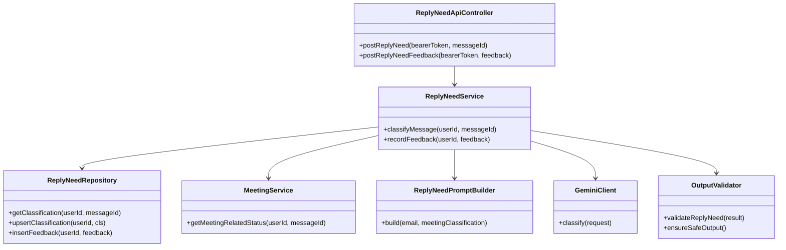
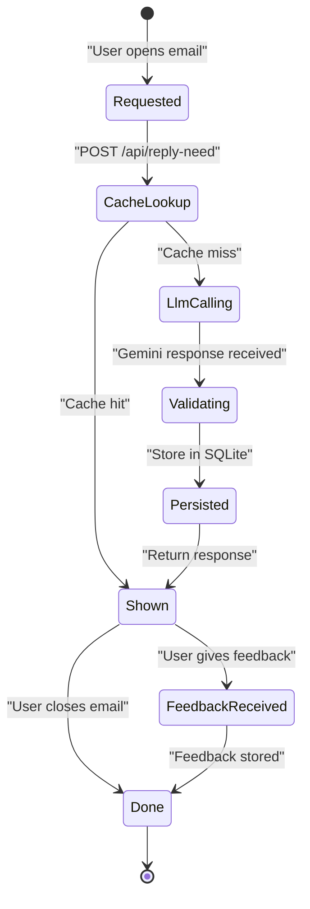
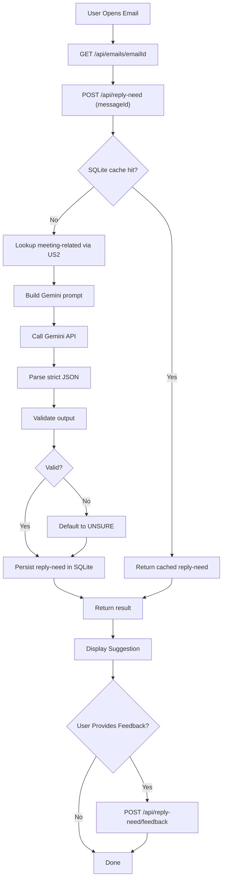

# Dev Spec — User Story 3: Reply Needed Suggestion

## User Story
As a user, I want the AI agent to suggest whether an email needs a reply so that I can avoid unnecessary responses.

Explanation: This helps users decide when no action is required.  
T-shirt size: Small  
Sprint fit: Works well as a lightweight classification task in one sprint

---

## Harmonized Backend Assumptions (US2 + US3)

US3 shares a single backend with US2:
- One FastAPI backend that serves `/api/emails`, `/api/meeting/*`, and `/api/reply-need/*`.
- One mailbox ingestion worker that fetches mail via IMAP and persists normalized email data.
- One Gemini client reused for both meeting detection (US2) and reply-need classification (US3).
- One SQLite3 database for all structured data (emails, classifications, feedback).

> [!NOTE]
> Revision for harmonization (2026-03-04): removed Redis/Postgres assumptions, removed rules-first logic (LLM-only), and updated the request flow so the client never calls the mailbox provider directly.

<details>
<summary><strong>ORIGINAL vs REVISED (architecture + storage)</strong></summary>

**ORIGINAL**
```md
Cloud (External Services):
- Email Provider API (Gmail/Outlook): provides email content
- LLM API (OpenAI/Gemini): handles complex classification

Storage Layer:
- Cache (Redis)
- Database (PostgreSQL)
```

**REVISED**
```md
Cloud (External Services):
- IMAP/SMTP: mailbox ingestion (server-side only) and outbound mail capability
- Gemini API: reply-need classification

Storage Layer:
- SQLite3 database: emails + classifications + feedback
```
</details>

> [!NOTE]
> The “Chat Log” sections in this document are historical and may reference discarded alternatives (rules-first, Redis, OpenAI, direct mailbox calls). The authoritative design is the non-chat-log content in each section.

# Dependency Note

**This user story (US3: Reply Needed Suggestion) depends on US2: Meeting Detection.**

US3 uses the meeting classification result from US2 to improve reply-need predictions. Specifically:
- When an email is classified as meeting-related by US2, US3 biases toward `NEEDS_REPLY` when the email contains a direct question or explicit action request.
- This dependency means US2 must be implemented first, or at minimum, US2's API endpoint must be available for US3 to call.

---

# Modifications to US2 Dev Spec

To support User Story 3, the development specification of User Story 2 was updated as follows:

1. **API Changes**  
  US2 exposes an internal endpoint `GET /api/meeting/check` so downstream services (such as ReplyNeedService) can reuse the stored meeting classification result without re-running Gemini.

2. **Data Model Changes**  
  Meeting classification is persisted and queryable by `messageId` (same value as `EmailMessage.id`).

3. **Architecture Updates**  
  The system architecture includes a data flow from US2 meeting classification storage to US3 reply-need classification.

4. **Class Design Updates**  
  US2 provides `MeetingService.get_meeting_related_status(...)` to fetch stored `MeetingClassification` for internal reuse.

---

# Header

## Feature Name
Reply-Needed Suggestion

## Summary
The system classifies an email as NEEDS_REPLY, NO_REPLY_NEEDED, or UNSURE, helping users avoid unnecessary responses.

## Goals
- Provide a clear reply suggestion label for each email.
- Include a confidence score and 1–3 short reason tags.
- Fail safely by using UNSURE when confidence is low.

## Non-Goals (MVP)
- Automatically sending replies

## Assumptions
- The backend already stores normalized email metadata + body text (sanitized) from ingestion.
- Classification is triggered when the user opens an email; the client sends `messageId` only.

## Rationale
I chose a three-label system because it's simple to implement in one sprint and safe for users. Having an UNSURE option means we don't have to pretend we're confident when we're not - this seemed more honest than forcing every email into just two categories. The confidence score and reason tags help users understand the decision, which I think is important for building trust in the AI feature.

## Chat Log

**User:**
Hey, can you help me write a header section for a dev spec? The user story is: "As a user, I want the AI agent to suggest whether an email needs a reply so that I can avoid unnecessary responses." I need to include summary, goals, non-goals, assumptions, and rationale. Keep it simple since this is just an MVP for one sprint.

**Assistant:**
Sure! Here's a header section:

The system will classify emails into three categories: NEEDS_REPLY, NO_REPLY_NEEDED, or UNSURE. The main goals are to give users a clear label for each email, include a confidence score with 1-3 reason tags, and fail safely by using UNSURE when the system isn't confident. For the MVP, we won't do automatic replies, personalized learning, or analyze long email threads. We're assuming the app can access email metadata and body text, and that classification happens when a user opens an email. The three-label approach keeps things simple and safe - having UNSURE as an option means the system can admit when it's not sure instead of giving bad advice.

**User:**
Perfect! Can you make the rationale a bit longer? Like explain why the three-label system is better.

**Assistant:**
The three-label system keeps the feature lightweight and safe. By including UNSURE as an option, we reduce the risk of giving users wrong advice. This builds trust because the system admits when it's not sure instead of guessing. The confidence score and reason tags help users understand why the system made its decision, which makes the feature more transparent and useful.

---

# Architecture Diagram

## Components and Where They Run

**Client (Browser/Email UI):**
- OutlookPlus Web App (Next.js)
- Reply suggestion display component

**Server (Shared Backend — FastAPI):**
- ReplyNeedApiController: handles HTTP requests
- ReplyNeedService: orchestrates reply-need classification
- MeetingService (from US2): provides `meetingRelated` status
- GeminiClient: calls Gemini for classification
- OutputValidator: enforces safe outputs
- EmailRepository/ReplyNeedRepository: read/write SQLite3

**Cloud (External Services):**
- IMAP/SMTP servers: mailbox ingestion (server-side only) and outbound mail capability
- Gemini API: reply-need classification (server-side only)

**Storage Layer:**
- SQLite3 database: emails + meeting classifications + reply-need classifications + feedback

## Data Flow

1. User opens an email in the UI.
2. Client loads the email details from the shared backend (`GET /api/emails/{emailId}`).
3. Client requests reply-need classification by `messageId` (`POST /api/reply-need`).
4. Backend checks SQLite for an existing reply-need classification for `(userId, messageId)`.
  - If present: return cached result.
5. Backend fetches meeting-related status from US2 via `MeetingService` (or `GET /api/meeting/check`).
6. Backend builds a structured Gemini prompt including meeting-related context.
7. Backend calls Gemini and parses strict JSON output.
8. OutputValidator enforces schema + safe defaults (`UNSURE`) when needed.
9. Backend persists the reply-need result in SQLite (cache).
10. Backend returns label + confidence + reasons to client.
11. (Optional) Client sends feedback; backend stores feedback in SQLite.
```mermaid
flowchart TB
  subgraph Client["Client (OutlookPlus Web App)"]
    UI[Email Interface]
    Display[Reply Suggestion Display]
  end

  subgraph Server["Shared Backend (FastAPI)"]
    Emails[EmailApiController]
    ReplyApi[ReplyNeedApiController]
    ReplySvc[ReplyNeedService]
    MeetingSvc[MeetingService (US2)]
    Gemini[GeminiClient]
    Validator[OutputValidator]
  end

  subgraph Storage["Storage"]
    DB[(SQLite3)]
  end

  subgraph External["External Services"]
    ImapSmtp["IMAP/SMTP Servers"]
    GeminiApi[Gemini API]
  end

  UI -->|Open email| Emails
  Emails -->|Read email| DB
  Emails --> UI

  UI -->|POST /api/reply-need (messageId)| ReplyApi
  ReplyApi --> ReplySvc
  ReplySvc -->|Cache read/write| DB
  ReplySvc --> MeetingSvc
  MeetingSvc --> DB
  ReplySvc --> Gemini
  Gemini --> GeminiApi
  GeminiApi --> Gemini
  ReplySvc --> Validator
  Validator --> ReplyApi
  ReplyApi --> Display

  ImapSmtp -.->|Ingestion (server-side)| DB
```

## Rationale

This design matches US2 by using a single Gemini-only classifier path. Reply-need results are cached in SQLite so reopening the same email does not trigger another Gemini call. The validator ensures the user always gets a safe, schema-valid response, defaulting to `UNSURE` on errors.

## Chat Log

**User:**
I need to create an architecture diagram for this feature. Can you describe the main components and where they run? Like what's on the client, what's on the server, and what external services we need?

**Assistant:**
Here's a breakdown:

Client side: You'll have the email UI where users read emails, and a display component to show the reply suggestion.

Server side: You need a controller to handle requests, a service to coordinate everything, a rule engine for quick checks, an aggregator to combine results, and a validator to make sure outputs are safe.

External services: Email provider API (like Gmail or Outlook) to get the email content, and an LLM API (OpenAI or Gemini) for complex cases.

You should also have a cache (like Redis) to store recent results and a database (like PostgreSQL) for user feedback.

**User:**
Cool, and what's the data flow? Like step by step what happens when a user opens an email?

**Assistant:**
1. User opens email
2. Client gets email data from the email provider
3. Client sends request to your backend
4. Backend runs rule checks first
5. If rules are confident, skip the LLM
6. If not confident, call the LLM
7. Combine the results
8. Validate the output
9. Send back to client
10. Show the suggestion
11. Optionally, user can give feedback

**User:**
Why do we check rules first before using the LLM?

**Assistant:**
It's mainly about cost and speed. Simple emails like "FYI" or newsletters can be classified really quickly with just rules. The LLM is slower and costs money per API call, so we only use it when we really need it. Plus having a cache means we don't classify the same email twice.

---

# Class Diagram


## Rationale

I organized the classes so each one does one job: the controller handles HTTP, the service orchestrates, the repository handles SQLite persistence, and the Gemini client + prompt builder encapsulate LLM I/O. This keeps US3 consistent with US2’s Gemini-only approach.

## Chat Log

**User:**
Now I need a class diagram. What classes should I have and what should each one do?

**Assistant:**
You'll want these classes:

1. ReplyNeedController - handles the HTTP requests
2. ReplyNeedService - coordinates the whole workflow
3. RuleEngine - runs the quick rule checks
4. LlmClassifier - calls the LLM API
5. DecisionAggregator - combines rule and LLM outputs
6. OutputValidator - makes sure the output is valid

The controller talks to the service, and the service uses all the other classes.

**User:**
What methods should each class have? Like give me specifics.

**Assistant:**
ReplyNeedController:
- handleReplyNeedRequest() - processes the classification request
- handleFeedbackRequest() - handles user feedback

ReplyNeedService:
- classifyEmail() - main function that coordinates everything
- processFeedback() - stores user feedback

RuleEngine:
- analyzeEmail() - runs all the rules
- checkDirectQuestion() - looks for question marks
- checkInformational() - detects newsletters
- checkAutoReply() - checks if it's an auto-reply

LlmClassifier:
- classify() - calls the LLM
- buildPrompt() - creates the prompt
- parseResponse() - parses what the LLM returns

DecisionAggregator:
- combine() - merges rule and LLM results
- calculateConfidence() - figures out how confident we are
- selectBestLabel() - picks the final label

OutputValidator:
- validate() - checks if output is valid
- ensureSafeOutput() - defaults to UNSURE if something's wrong
- checkEnumValid() - makes sure the label is one of our three options

---

# List of Classes

## ReplyNeedApiController
**Responsibility:** Handles HTTP requests for reply-need prediction and feedback (FastAPI route handlers).

**Key Methods:**
- `postReplyNeed(bearerToken, messageId)`: Authenticates, calls the service, returns the reply-need response.
- `postReplyNeedFeedback(bearerToken, feedback)`: Authenticates, validates feedback payload, records feedback.

**Dependencies:** ReplyNeedService

**Why this exists:** Keeps HTTP concerns separate from classification logic.

## ReplyNeedService
**Responsibility:** Orchestrates reply-need classification end-to-end (Gemini-only) with SQLite caching.

**Key Methods:**
- `classifyMessage(userId, messageId)`: Main entry point. Cache-checks, loads email, fetches meeting context from US2, calls Gemini, validates, persists, returns.
- `recordFeedback(userId, feedback)`: Persists user feedback for later evaluation.

**Dependencies:** EmailRepository (US2), MeetingService (US2), ReplyNeedRepository, ReplyNeedPromptBuilder, GeminiClient, OutputValidator.

**Integration with US2:** Calls `MeetingService.getMeetingRelatedStatus(userId, messageId)` (or the internal endpoint `GET /api/meeting/check`) to reuse stored meeting classification results.

**Failure Behavior:** If meeting classification is missing/unavailable, proceed without meeting context and rely on Gemini + safe validation.

## ReplyNeedRepository
**Responsibility:** SQLite persistence for reply-need classifications and feedback.

**Key Methods:**
- `getClassification(userId, messageId)`
- `upsertClassification(userId, classification)`
- `insertFeedback(userId, feedback)`

## ReplyNeedPromptBuilder
**Responsibility:** Builds the structured Gemini request from stored email fields.

**Behavior:**
- Uses `bodyPrefix2000` (first 2,000 characters) like US2 to control cost and tokens.
- Includes meeting context from US2 (meetingRelated + confidence + short rationale).
- Requires strict JSON output with: `replyNeededLabel`, `confidence`, `reasons`.

## GeminiClient
**Responsibility:** Calls Gemini API and returns parsed strict JSON results (shared with US2).

## OutputValidator
**Responsibility:** Ensures safe, valid, schema-conformant outputs.

**Validation Rules:**
- `replyNeededLabel` is exactly one of: `NEEDS_REPLY`, `NO_REPLY_NEEDED`, `UNSURE`
- `confidence` is in `[0.0, 1.0]`
- `reasons` length is 1–3; reason codes are short strings

**Safe Default:** `UNSURE` with low confidence and generic reason(s).

## Rationale

This class layout mirrors US2’s approach: a single Gemini path, persistence via repositories, and strict validation to fail safely.

## Chat Log

**User:**
Can you write detailed descriptions for each class? Like what they're responsible for and what methods they have?

**Assistant:**
Sure! Let me break down each class:

ReplyNeedController handles HTTP stuff - it takes requests, validates them, calls the service, and sends responses back.

ReplyNeedService is the coordinator. It decides whether to use rules or the LLM, calls the right classes in order, and makes sure everything works together.

RuleEngine does fast pattern matching. It checks for obvious things like "FYI" emails or emails with question marks.

LlmClassifier talks to the LLM API. It builds the prompt, sends it, and parses what comes back.

DecisionAggregator is like a referee when rules and LLM disagree. It decides which one to trust more.

OutputValidator is the safety check. It makes sure we never send broken data to users. If something's wrong, it defaults to UNSURE.

**User:**
Why separate all these? Couldn't we just put everything in one class?

**Assistant:**
You could, but it would be hard to maintain. With separate classes, each one has a single job. If you need to change how rules work, you only touch RuleEngine. If you want to switch LLM providers, you only change LlmClassifier. It also makes testing way easier - you can test the validator independently to make sure it catches all edge cases. This is called "separation of concerns" and it's a standard practice in software engineering.

---

# State Diagrams


## Rationale

I kept the state diagram simple because we don't need to track every little thing that happens internally. The main states are what matters to the user: email sitting unread, user opens it and requests classification, backend processes it, result gets shown, and then either the user gives feedback or just closes it. All the internal stuff like rule checking and LLM calls happen inside the "Processing" state. This is enough for an MVP.

## Chat Log

**User:**
I need a state diagram for the email classification lifecycle. Like what states does an email go through?

**Assistant:**
Here's the flow:

1. Email starts as Unprocessed (just sitting in inbox)
2. Becomes Requested when user opens it
3. Goes to RuleChecking when backend starts processing
4. Either goes straight to Classified (if rule is confident) or to LlmCalling (if uncertain)
5. After LLM responds, goes to Classified
6. Then Validated to check safety
7. Then Shown to display to user
8. User can give Feedback or just close it (Done)

**User:**
Should we track every internal step like rule checking and LLM calling as separate states?

**Assistant:**
Not for an MVP. We just need high-level states that the user cares about: email is unprocessed, user requests classification (opens email), backend processes it, result is shown. The internal steps (rules, LLM, validation) all happen inside "Processing" state. Keeping it simple makes the code easier to build and maintain.

---

# Flow Chart


## Rationale

The flow shows all the decision points. Cache check comes first because if we already classified this email before, why do it again? Then we try rules because they're fast and cheap. Only if rules aren't confident do we call the expensive LLM. The validator makes sure nothing broken gets through - if validation fails, we just default to UNSURE. And the optional feedback at the end lets us improve the system later.

## Chat Log

**User:**
Can you make a detailed flow chart that shows everything that happens when classifying an email? Include all the decision points.

**Assistant:**
Sure! Here's the complete flow:

1. User opens email
2. Client gets the email data
3. Sends request to backend
4. Backend checks cache first - if we already classified this email, just return that
5. If not cached, run RuleEngine
6. Check if rule confidence is high (>0.85)
7. If yes, use the rule result
8. If no, call LLM API
9. Parse what the LLM returns
10. Aggregate the results
11. Validate the output
12. If invalid, default to UNSURE
13. If valid, return the result
14. Store it in cache for next time
15. Send to client
16. Display to user
17. Optionally, user gives feedback
18. If they do, store it

**User:**
Why is caching so important here?

**Assistant:**
Because the same email might be opened multiple times - user opens it, closes it, comes back later. Without caching, we'd call the LLM every single time, which costs money and is slow. With caching, we only classify each email once. It's a huge performance and cost saver.

**User:**
What happens if the LLM returns something completely wrong, like a random label?

**Assistant:**
That's what the validator is for. It checks that the label is exactly one of our three options (NEEDS_REPLY, NO_REPLY_NEEDED, UNSURE), the confidence is between 0 and 1, and all required fields exist. If anything's wrong, it throws out the bad result and defaults to UNSURE. This way we never show garbage to the user.

---

# Development Risks and Failures

## Risks

### 1. False `NO_REPLY_NEEDED` Classification
**Problem:** System might incorrectly label an urgent email as not needing a reply, causing missed deadlines or damaged relationships.

**Impact:** High - could damage relationships or miss deadlines.

**Likelihood:** Medium - happens when email is ambiguous or uses unconventional phrasing.

### 2. LLM Inconsistency
**Problem:** Same email might get different labels on repeated classifications due to model nondeterminism.

**Impact:** Medium - confuses users and reduces trust.

**Likelihood:** Medium - LLMs have some inherent randomness even with low temperature.

### 3. High Latency
**Problem:** Gemini API calls can take seconds, making the UI feel slow.

**Impact:** Medium - hurts user experience.

**Likelihood:** High - external API calls always add latency.

### 4. Privacy Concerns
**Problem:** Sending email content to external LLM raises data privacy issues, especially for sensitive emails.

**Impact:** High - legal and trust issues.

**Likelihood:** Medium - depends on user's email content.

### 5. API Cost Escalation
**Problem:** Gemini calls cost money per request; high open-rate can increase spend.

**Impact:** Medium - budget concerns.

**Likelihood:** Medium - depends on adoption rate.

### 6. Gemini API Downtime
**Problem:** If Gemini has an outage, the feature may return `UNSURE`.

**Impact:** Medium - feature stops working.

**Likelihood:** Low - major providers have good uptime, but outages happen.

### 7. US2 Integration Dependency
**Problem:** If meeting classification is missing or wrong, reply-need accuracy may degrade.

**Impact:** Medium - US3 works without US2 but loses the meeting-aware boosting feature.

**Likelihood:** Low if US2 is implemented first; High if developed in parallel.

## Mitigation Strategies

### For US2 Dependency:
- Ensure US2 is fully implemented and tested before US3 integration
- If developing in parallel, mock US2's API responses for testing
- Have fallback logic: if US2 API fails, skip meeting-aware boosting and use base classification
- Add circuit breaker: if US2 API fails repeatedly, stop calling it and log warnings

### For False Classifications:
- Use UNSURE as a fallback when confidence is below 0.9
- Show confidence score and reasons so users can make their own judgment
- Collect feedback to identify problematic patterns
- Make rules conservative (prefer UNSURE over wrong advice)

### For LLM Inconsistency:
- Set temperature to 0 or very low to reduce randomness
- Validate output against strict schema
- Cache results so same email always gets same label
- Use structured output format (JSON) instead of free text

### For High Latency:
- Cache results aggressively in SQLite - never classify the same email twice
- Show loading state in UI so user knows something's happening
  - Consider async classification (classify in background, update UI later) if latency is unacceptable

### For Privacy:
- Don't store raw email content in logs or database
- Only send necessary fields to LLM (subject and body text)
- Document clearly what data is sent to the LLM provider

### For Cost:
- Implement aggressive caching in SQLite
- Set per-user rate limits
- Monitor costs and set alerts
  - Reduce prompt size (bodyPrefix2000) to control token usage

### For API Downtime:
- Fall back to `UNSURE` if Gemini is unreachable
- Show an “AI temporarily unavailable” message in UI

## Rationale

The biggest risk is false negatives - telling someone they don't need to reply when they actually do. That could make them miss important stuff. That's why we use UNSURE a lot and show the confidence score. Privacy is also a concern since we're sending email content to an external API, so we try to minimize what we send and don't store anything. The other stuff is about making sure the system actually works when we deploy it - handling API failures, keeping costs under control, etc.

## Chat Log

**User:**
What are the main risks with this system and how do we handle them?

**Assistant:**
Biggest risk is false negatives - telling someone they don't need to reply when they actually do. That could make them miss important emails. To handle it, we use UNSURE when we're not confident, show the confidence score, and let users give feedback.

Other risks:
- LLM might be inconsistent
- API calls are slow
- Privacy issues with sending email content
- Costs can add up
- What if the API goes down?

**User:**
How do we fix the consistency problem?

**Assistant:**
Set the LLM temperature to 0 so it's deterministic. Also validate the output against a strict schema so even if it returns something weird, we catch it. And most importantly, cache results - if we already classified an email, just return the cached result instead of calling the LLM again.

**User:**
What about privacy? Sending email content to OpenAI seems sketchy.

**Assistant:**
Yeah that's a real concern. We minimize what we send - only subject and body text, not full headers or metadata. We don't store raw email content anywhere, just the classification result. And we should document clearly what data goes where. For enterprise customers who can't send data to external APIs, we'd need to look into on-premise LLM options.

**User:**
And if OpenAI goes down, the whole feature breaks?

**Assistant:**
That's why we have rules as a fallback. If the LLM API is unreachable, we just use the rule engine result, or default to UNSURE. We'd show an error message to the user explaining the AI feature is temporarily unavailable. It's not ideal but at least the app doesn't completely break.

---

# Technology Stack

## Frontend (Web Application)
- Framework: Next.js 16.1.4 (App Router)
- Language: TypeScript 5
- UI: React 19.2.3
- Styling: Tailwind CSS 4
- Linting: ESLint 9

## Backend (Shared API + Worker)
- Language: Python 3.12
- Web Framework: FastAPI
- ASGI Server: Uvicorn
- Data Validation: Pydantic v2
- HTTP Client: httpx
- Retries/Backoff: tenacity

## LLM Integration
- Provider: Google Gemini API
- Response Format: strict JSON object with keys `replyNeededLabel`, `confidence`, `reasons`

## Mailbox Integration (Shared with US2)
- Protocols: IMAP (ingestion) + SMTP (outbound mail capability)
- Transport Security: IMAPS (TLS) and SMTP submission over STARTTLS/TLS
- Authentication: App Password

## Persistence
- SQLite3 database file: `data/outlookplus.db`
- Stores reply-need classifications and feedback (and reuses US2 meeting classifications)

## Rationale

This stack is identical to US2 so both features run on one backend and one data store. SQLite3 provides a simple built-in cache for reply-need results without adding Redis/Postgres infrastructure.

## Chat Log

**User:**
What technology stack should I use for this project? We only have one sprint so it needs to be fast to build.

**Assistant:**
For a one-sprint timeline, I'd go with:

Frontend: React - super popular, lots of examples
Backend: FastAPI with Python - has great async support for calling APIs
LLM: OpenAI or Gemini - just use their API, don't host your own model
Cache: Redis - fast and simple
Database: PostgreSQL for production, SQLite for local dev
Hosting: Vercel or Railway - really easy deployment

**User:**
Why FastAPI over something like Flask?

**Assistant:**
FastAPI has built-in async support which is perfect for this use case. When you call the LLM API, you don't want to block other requests. FastAPI handles that naturally. It also auto-generates API docs which is nice. Flask can do async too but it's more work to set up.

**User:**
Do we really need Redis? Can't we just use the database for caching?

**Assistant:**
You could, but Redis is way faster because it's in-memory. When you're trying to avoid slow LLM calls, you want the cache check to be as fast as possible - like under 10ms. A database query would be 50-100ms. For caching use cases, Redis is the standard choice.

**User:**
What about hosting? Is AWS too complicated for an MVP?

**Assistant:**
AWS Lambda could work but it's more setup. Vercel and Railway are designed for quick deployments - you literally just connect your GitHub repo and it deploys automatically. For an MVP in one sprint, I'd go with the simpler option. You can always migrate to AWS later if you need more control.

---

# APIs

## Dependency on US2

US3 integrates with US2 (Meeting Detection) by calling US2's API to check if an email is meeting-related. This information is used to improve classification accuracy.

**US2 Endpoint Used:**
```
GET /api/meeting/check?messageId={messageId}
```

**US2 Response:**
```json
{
  "messageId": "string",
  "meetingRelated": true
}
```

This call happens internally during US3's classification workflow and is transparent to the end user.

---

## API 1: Predict Reply-Needed

**Endpoint:** `POST /api/reply-need`

**Description:** Classifies an email and returns whether it needs a reply.

### Request Body
```json
{
  "messageId": "string"
}
```

**Field Descriptions:**
- `messageId`: Unique identifier for the email (required). The backend loads stored email fields by this id.

### Response Body
```json
{
  "messageId": "string",
  "replyNeededLabel": "NEEDS_REPLY",
  "confidence": 0.92,
  "reasons": ["direct_question", "action_required"],
  "modelVersion": "gemini_replyneed_v1",
  "cached": false
}
```

**Field Descriptions:**
- `messageId`: Same as request, for matching
- `replyNeededLabel`: One of: `NEEDS_REPLY`, `NO_REPLY_NEEDED`, `UNSURE`
- `confidence`: Float between 0.0 and 1.0
- `reasons`: Array of 1-3 short reason codes (e.g., "direct_question", "fyi_only")
- `modelVersion`: Which model/rules version was used
- `cached`: Boolean indicating if this was a cached result

### Error Response
```json
{
  "error": "Invalid request",
  "details": "Field 'subject' is required"
}
```

**Status Codes:**
- 200: Success
- 400: Bad request (missing fields, invalid format)
- 500: Server error (LLM API down, unexpected error)

---

## API 2: Submit Feedback

**Endpoint:** `POST /api/reply-need/feedback`

**Description:** Allows users to report if the classification was correct or incorrect.

### Request Body
```json
{
  "messageId": "string",
  "shownLabel": "NEEDS_REPLY",
  "userVerdict": "CORRECT",
  "userComment": "Optional text comment"
}
```

**Field Descriptions:**
- `messageId`: The email that was classified (required)
- `shownLabel`: What label we showed the user (required)
- `userVerdict`: One of: `CORRECT`, `INCORRECT` (required)
- `userComment`: Optional free-text feedback (max 500 chars)

### Response Body
```json
{
  "status": "recorded",
  "messageId": "string"
}
```

**Status Codes:**
- 200: Feedback recorded successfully
- 400: Invalid request
- 404: Message ID not found

---

## Rationale

I split prediction and feedback into separate endpoints to keep things simple. The prediction endpoint has everything needed for classification. The `cached` field helps with debugging. The feedback endpoint is bare-bones - just enough to record if we got it right or wrong. The optional comment is there if users want to explain why it was wrong. Using enums for labels prevents typos. And including confidence + reasons in the response lets users see how we made the decision.

## Chat Log

**User:**
I need to define the API endpoints. What should the prediction endpoint look like?

**Assistant:**
For prediction, do a POST to /api/reply-need

Request should have:
- messageId
- subject
- from (sender)
- to (recipients)
- bodyText
- maybe receivedAt and hasAttachments

Response should return:
- messageId (same one)
- replyNeededLabel (one of your three options)
- confidence (0 to 1)
- reasons (array of short codes)
- modelVersion

**User:**
What about error handling? What if the request is missing fields?

**Assistant:**
Return a 400 with an error message explaining what's missing. Like "Field 'subject' is required". For server errors (like if the LLM API is down), return a 500. Normal successful response is 200.

**User:**
Should I include the email body in the response?

**Assistant:**
No, definitely not. You're just returning the classification result. The client already has the email body - they're the ones who sent it to you. Just return the label, confidence, and reasons.

**User:**
What about the feedback endpoint?

**Assistant:**
Keep it simple. POST to /api/reply-need/feedback with messageId, what label you showed, and whether the user said it was correct or incorrect. Optionally let them add a comment. Just return a 200 with a confirmation message. You're just storing this for future analysis, you don't need to do anything complex with it.

---

# Public Interfaces

## User-Facing Interfaces

### 1. Reply Suggestion Label
**Location:** Email detail view, next to subject line or in header area

**Visual Design:**
- Badge/pill component with icon
- Three states:
  - 🟢 "Reply needed" (green)
  - 🔵 "No reply needed" (blue)
  - ⚪ "Unsure" (gray)

**Behavior:**
- Appears after email is opened (slight delay while classifying)
- Clickable to show more details

### 2. Confidence & Reasons Tooltip
**Trigger:** Hover or click on the reply suggestion label

**Content:**
- Confidence score: "85% confident"
- 1-3 reason tags: "Direct question", "Action requested"
- Expandable explanation of what each reason means

**Example:**
```
Reply needed (85% confident)

Reasons:
- Direct question - Email asks a specific question
- Action requested - Sender expects you to do something

This is an AI suggestion. You decide whether to reply.
```

### 3. Feedback Buttons
**Location:** Below the tooltip or in the email header

**Options:**
- ✓ "This was helpful"
- ✗ "This was wrong"

**Behavior:**
- Click sends feedback to backend
- Shows brief confirmation: "Thanks for your feedback!"
- Disappears after confirmation

### 4. Settings Toggle
**Location:** App settings menu

**Control:**
- Toggle switch: "Show reply suggestions"
- Description: "Get AI-powered suggestions on whether emails need a reply"
- Default: ON

---

## API Interfaces

### 1. Classification Endpoint
`POST /api/reply-need`

**Access:** Authenticated requests only (requires user token)

**Rate Limit:** 100 requests per user per hour

**Documentation:** Available at `/api/docs` (auto-generated by FastAPI)

### 2. Feedback Endpoint
`POST /api/reply-need/feedback`

**Access:** Authenticated requests only

**Rate Limit:** 50 requests per user per hour

---

## Developer Interfaces (Internal)

### 1. ReplyNeedService Interface
```python
class ReplyNeedService:
  async def classify_message(self, user_id: str, message_id: str) -> "ReplyNeedResponse":
    """Returns cached result if present; otherwise calls Gemini and persists."""
    raise NotImplementedError

  async def record_feedback(self, user_id: str, feedback: "ReplyNeedFeedback") -> None:
    """Persists feedback for offline evaluation."""
    raise NotImplementedError
```

### 2. ReplyNeedRepository Interface (SQLite3)
```python
from typing import Optional

class ReplyNeedRepository:
  async def get_classification(self, user_id: str, message_id: str) -> Optional["ReplyNeedClassification"]:
    raise NotImplementedError

  async def upsert_classification(self, user_id: str, cls: "ReplyNeedClassification") -> None:
    raise NotImplementedError

  async def insert_feedback(self, user_id: str, feedback: "ReplyNeedFeedback") -> None:
    raise NotImplementedError
```

### 3. GeminiClient Interface (Shared)
```python
class GeminiClient:
  async def classify(self, request: dict) -> dict:
    """Returns parsed strict-JSON; raises on schema violations."""
    raise NotImplementedError
```

---

## Rationale

I kept the interfaces minimal to reduce complexity. Users only see the label, tooltip, and feedback buttons - nothing overwhelming. The confidence score and reasons give transparency without being too technical. Making feedback optional is important because most people probably won't bother. The API only has two endpoints which keeps it simple. Rate limits prevent abuse and control costs. For internal interfaces, I just defined the function signatures each class needs to implement.

## Chat Log

**User:**
What should the user interface look like? Like how do we show the suggestion to users?

**Assistant:**
Keep it simple:

1. Show a small badge next to the email subject, like "Reply needed" or "No reply needed"
2. Make it color coded - green for needs reply, blue for no reply, gray for unsure
3. When they hover over it, show a tooltip with the confidence and reasons
4. Add small feedback buttons below the tooltip - checkmark for "this was helpful", X for "this was wrong"

**User:**
Should we show the confidence as a percentage?

**Assistant:**
Yeah, "85% confident" is easy to understand. And list the reasons as bullet points, like "• Direct question • Action requested". Keep it short and simple.

**User:**
What about the API documentation? Do I need to write that manually?

**Assistant:**
If you use FastAPI, it auto-generates docs at /api/docs. Super convenient. You just need to make sure your endpoint functions have good docstrings and type hints.

**User:**
Should users be able to turn this feature off?

**Assistant:**
Definitely. Add a toggle in settings: "Show reply suggestions". Some people won't want AI suggestions and that's fine. Make it easy to disable.

---

# Data Schemas

## 1. ReplyNeedRequest Schema
The client only sends `messageId`; the backend loads stored email fields.

```json
{
	"type": "object",
	"required": ["messageId"],
	"properties": {
		"messageId": {
			"type": "string",
			"description": "Unique identifier for the email (same value as EmailMessage.id)"
		}
	},
	"additionalProperties": false
}
```

---

## 2. ReplyNeedResponse Schema
```json
{
  "type": "object",
  "required": ["messageId", "replyNeededLabel", "confidence", "reasons", "modelVersion"],
  "properties": {
    "messageId": {
      "type": "string",
      "description": "Same as request messageId"
    },
    "replyNeededLabel": {
      "type": "string",
      "enum": ["NEEDS_REPLY", "NO_REPLY_NEEDED", "UNSURE"],
      "description": "Classification result"
    },
    "confidence": {
      "type": "number",
      "minimum": 0.0,
      "maximum": 1.0,
      "description": "Confidence score"
    },
    "reasons": {
      "type": "array",
      "items": {"type": "string"},
      "minItems": 1,
      "maxItems": 3,
      "description": "Short reason codes"
    },
    "modelVersion": {
      "type": "string",
      "description": "Model version used",
      "example": "gemini_replyneed_v1"
    },
    "cached": {
      "type": "boolean",
      "description": "Whether result was cached"
    }
  },
  "additionalProperties": false
}
```

---

## 3. FeedbackRequest Schema
```json
{
  "type": "object",
  "required": ["messageId", "shownLabel", "userVerdict"],
  "properties": {
    "messageId": {
      "type": "string",
      "description": "Email that was classified"
    },
    "shownLabel": {
      "type": "string",
      "enum": ["NEEDS_REPLY", "NO_REPLY_NEEDED", "UNSURE"],
      "description": "Label shown to user"
    },
    "userVerdict": {
      "type": "string",
      "enum": ["CORRECT", "INCORRECT"],
      "description": "User's feedback"
    },
    "userComment": {
      "type": "string",
      "maxLength": 500,
      "description": "Optional user comment"
    }
  },
  "additionalProperties": false
}
```

---

## 4. GeminiReplyNeedResult Schema (Internal)
This is the strict JSON object returned by Gemini after parsing.

```json
{
	"type": "object",
	"required": ["replyNeededLabel", "confidence", "reasons"],
	"properties": {
		"replyNeededLabel": {
			"type": "string",
			"enum": ["NEEDS_REPLY", "NO_REPLY_NEEDED", "UNSURE"]
		},
		"confidence": {
			"type": "number",
			"minimum": 0.0,
			"maximum": 1.0
		},
		"reasons": {
			"type": "array",
			"items": {"type": "string"},
			"minItems": 1,
			"maxItems": 3
		}
	},
	"additionalProperties": false
}
```

---

## 5. SQLite Tables (MVP)

```sql
CREATE TABLE IF NOT EXISTS reply_need_classifications (
	user_id TEXT NOT NULL,
	message_id TEXT NOT NULL,
	reply_needed_label TEXT NOT NULL,
	confidence REAL NOT NULL,
	reasons_json TEXT NOT NULL,
	model_version TEXT NOT NULL,
	classified_at TEXT NOT NULL,
	PRIMARY KEY (user_id, message_id)
);

CREATE TABLE IF NOT EXISTS reply_need_feedback (
	id INTEGER PRIMARY KEY AUTOINCREMENT,
	user_id TEXT NOT NULL,
	message_id TEXT NOT NULL,
	shown_label TEXT NOT NULL,
	user_verdict TEXT NOT NULL,
	user_comment TEXT,
	created_at TEXT NOT NULL
);

CREATE INDEX IF NOT EXISTS idx_reply_need_feedback_message ON reply_need_feedback(user_id, message_id);
```

---

## Rationale

Using strict schemas prevents bad data from entering the system. Sending only `messageId` reduces client complexity and prevents the browser from re-sending email content. Enums for labels prevent typos. SQLite tables provide a simple built-in cache keyed by `(user_id, message_id)`.

## Chat Log

**User:**
Can you define all the data schemas we need? Like the request/response formats and also internal data structures?

**Assistant:**
Sure! You'll need:

1. ReplyNeedRequest - what the client sends
2. ReplyNeedResponse - what we send back
3. FeedbackRequest - for user feedback
4. RuleResult - internal format from rule engine
5. ClassificationResult - internal format from LLM
6. Cache schema for storing results
7. Database schema for feedback

For each one, use JSON schema with strict validation. Set additionalProperties to false so we reject unexpected fields.

**User:**
Why do we need separate internal schemas? Can't we just use the public ones?

**Assistant:**
The internal ones have extra fields for debugging. Like RuleResult includes which rules were matched, and ClassificationResult includes the raw LLM response. We don't want to send those to clients - they're just for our logs and debugging. It also gives us flexibility to change internal format without breaking the public API.

**User:**
What about the database? What should the cache table look like?

**Assistant:**
For cache, you need: message_id (primary key), label, confidence, reasons (as JSON), model_version, created_at, and expires_at. The expires_at is important so you can delete old entries. For feedback, you need: id, message_id, shown_label, user_verdict, optional user_comment, user_id, and created_at.

**User:**
Should I index anything for performance?

**Assistant:**
Yeah, index message_id in both tables since you'll be looking up by that. Also index expires_at in the cache table so you can efficiently delete expired entries. And maybe index created_at in feedback table if you want to query by time range.

---

# Security and Privacy

## Data Minimization

### What We Send to LLM API:
- Email fields from stored ingestion record:
  - subject
  - from
  - to/cc
  - sentAt
  - bodyPrefix2000 (first 2,000 characters of plain-text body)
- Meeting context from US2:
  - meetingRelated
  - meetingRelatedConfidence
  - short meeting rationale (optional)

### What We DO NOT Send:
- Email headers (except essentials)
- Recipient lists beyond what's needed
- User's personal information
- Other emails in the thread
- Attachment content

### What We DO NOT Store:
- Raw mailbox provider payloads (raw IMAP FETCH responses)
- Full HTML bodies (store normalized plain-text only)
- Full email headers
- LLM raw responses (store only parsed classification fields)

**Rationale:** Only sending what's necessary for classification reduces privacy risk. If there's a data breach, at least we don't have full email content stored anywhere.

**Clarification:** OutlookPlus does store normalized email content (including plain-text `bodyText`) as part of the core product, but it avoids storing raw provider payloads and avoids logging email text.

---

## Authentication & Authorization

### API Security:
- All endpoints require authentication token (JWT or session cookie)
- User can only classify/access their own emails
- Rate limiting: 100 classifications per user per hour
- Invalid tokens get 401 Unauthorized

### Implementation:
```python
@app.post("/api/reply-need")
async def classify_email(
    request: ReplyNeedRequest,
    user: User = Depends(get_current_user)
):
  # Verify user owns this email by checking the stored email row
  email = await email_repository.get_email(user.id, request.messageId)
  if email is None:
    raise HTTPException(404, "Not Found")
    # ... rest of logic
```

---

## Input Validation & Sanitization

### Request Validation:
- Validate all fields against strict JSON schemas
- Reject requests with extra fields
- Check string lengths (subject ≤ 500, body ≤ 10,000 chars)
- Validate email format for sender/recipient fields
- Escape HTML/special characters before processing

### LLM Output Validation:
- Verify output matches expected schema
- Check enum values are valid
- Ensure confidence is 0-1 range
- Reject outputs with unexpected fields
- Default to UNSURE if validation fails

---

## Logging & Monitoring

### What We Log:
- Request timestamps and user IDs (hashed)
- Classification results (label, confidence)
- API errors and exceptions
- Performance metrics (latency, cache hit rate)

### What We DO NOT Log:
- Email content
- Subject lines
- Sender/recipient addresses
- Raw LLM responses

### Log Retention:
- Performance logs: 30 days
- Error logs: 90 days
- User feedback: Indefinite (for model improvement)

---

## Privacy Compliance

- Clear privacy policy explaining what data is sent to LLM provider
- Email content is sent to Gemini for classification only

---

## Rate Limiting

- 100 classifications per user per hour to control costs
- Return 429 error if limit exceeded

---

## Error Handling

### Never Expose:
- Internal error details to users
- Stack traces in API responses
- Database connection strings
- LLM API keys

### Instead Return:
- Generic error messages: "An error occurred"
- Error codes for client debugging
- Log details internally for investigation

---

## Rationale

The main thing is data minimization - only send what's absolutely needed to the LLM. We don't store raw email content anywhere, so even if our database gets hacked, user emails aren't exposed. Input validation prevents injection attacks. Output validation from the LLM makes sure we never show broken data. Authentication and rate limiting prevent abuse. We log performance stuff without logging sensitive data, which helps us debug without creating privacy issues.

## Chat Log

**User:**
What are the main security and privacy concerns for this feature?

**Assistant:**
Biggest one is that we're sending email content to an external LLM API. That's sensitive data, so we need to be really careful:

1. Only send what's necessary - just subject and body, not headers or attachments
2. Don't store the raw email content anywhere
3. Don't log email text
4. Let users opt out

Also need normal API security stuff - authentication, rate limiting, input validation.

**User:**
How do we validate that users can only classify their own emails?

**Assistant:**
In the API endpoint, check that the authenticated user owns the email they're trying to classify. If they don't, return 403 Forbidden. You'd have a function like `user.owns_email(messageId)` that checks against the email provider API.

**User:**
What if the LLM returns something malicious, like trying to do code injection?

**Assistant:**
That's why we have the OutputValidator. It checks that the response matches our schema exactly - the label must be one of our three enums, confidence must be 0-1, reasons must be an array of strings, etc. If anything's weird, we reject it and default to UNSURE. We never directly execute or interpret LLM output - we just parse it as structured data.

**User:**
Should we encrypt the database?

**Assistant:**
Yeah, enable database encryption at rest. It's usually a checkbox in your hosting provider settings. Also use HTTPS for all API calls - that's encryption in transit. For Redis cache, set a password so not anyone can access it.

**User:**
What about GDPR compliance?

**Assistant:**
Main thing is transparency - have a clear privacy policy that explains we send email content to the LLM provider (OpenAI/Gemini) for classification. Document what data is sent and how it's used.

---

# Risks to Completion

## Technical Risks

### 1. LLM API Integration Issues
**Risk:** Gemini API integration may take longer than expected (auth, strict JSON output enforcement, retries).

**Impact:** High - the whole feature depends on this

**Likelihood:** Medium

**Mitigation:**
- Start with API integration on day 1
- Use the same GeminiClient implementation as US2
- Test with a few manual API calls before building the full system

### 2. Email Provider Integration Complexity
**Risk:** Mailbox ingestion/auth (IMAP/SMTP) may be incomplete or unstable.

**Impact:** High - can't classify without email access

**Likelihood:** Medium

**Mitigation:**
- Reuse US2’s IMAP ingestion client and ingestion worker
- For MVP testing, use seeded test emails in the SQLite DB if mailbox auth is not ready

### 3. US2 Dependency Not Ready
**Risk:** Meeting classification results (US2) are missing for some emails, reducing reply-need accuracy.

**Impact:** Medium

**Likelihood:** Medium

**Mitigation:**
- Treat meeting context as optional in US3; proceed without it when missing
- Add monitoring for the rate of missing meeting classifications

---

## Resource Risks

### 4. LLM API Quota/Rate Limits
**Risk:** Gemini quotas/rate limits block testing or demos.

**Impact:** Medium - blocks testing and demo

**Likelihood:** High

**Mitigation:**
- Use caching aggressively to minimize calls
- Set up rate limit alerts
- Have pre-cached demo examples ready

### 5. Time Constraints
**Risk:** One sprint (2 weeks) is tight for a feature with this many components.

**Impact:** High - might not finish on time

**Likelihood:** Medium

**Mitigation:**
- Cut scope aggressively: classification + safe output validation first
- Add feedback endpoint only if time remains
- Use the same backend patterns as US2 (FastAPI + Pydantic + tenacity)
- Skip polish: basic UI is fine, make it pretty later
- Pair program on hard parts
- Have daily check-ins to catch delays early

---

## Scope Creep Risks

### 6. Feature Requests from Users/Stakeholders
**Risk:** During development, someone suggests "wouldn't it be cool if..." features that expand scope.

**Impact:** Medium - delays completion

**Likelihood:** High

**Mitigation:**
- Be firm about MVP scope: classification only, no extras
- Keep a "future features" doc for ideas
- Remind stakeholders we have one sprint
- Can add features in next iteration

---

## Quality Risks

### 7. Low Classification Accuracy
**Risk:** System makes too many mistakes, users don't trust it.

**Impact:** Medium - feature works but isn't useful

**Likelihood:** Medium

**Mitigation:**
- Use UNSURE liberally - better to admit uncertainty than be wrong
- Show confidence scores so users know when to doubt the system
- Collect feedback early to identify bad patterns
- Use conservative prompt instructions and strict output validation

### 8. UI Implementation Delays
**Risk:** Frontend takes longer than expected, especially tooltip and feedback interactions.

**Impact:** Low - backend works even if UI is basic

**Likelihood:** Medium

**Mitigation:**
- Start with simplest possible UI: just text labels
- Use component library (MUI, Ant Design) for tooltip
- Skip animations and polish for MVP
- Test API with Postman before UI is ready

---

## External Dependency Risks

### 9. LLM Provider Outage
**Risk:** Gemini has an outage during development or demo.

**Impact:** High during demo, low during dev

**Likelihood:** Low

**Mitigation:**
- Fall back to `UNSURE` (with a clear “AI temporarily unavailable” message)
- Cache demo examples beforehand
- Monitor provider status pages
- Have pre-recorded demo video as backup

---

## Summary of Risk Priority

**Must Address Before Sprint Starts:**
1. Confirm LLM API access and test basic integration
2. Set up test mailbox App Password for IMAP/SMTP
3. Set clear MVP scope boundaries

**Monitor During Sprint:**
1. Time tracking - are we on schedule?
2. API quota usage - are we running out?
3. Code quality - are we building technical debt?

**Accept for MVP:**
1. Classification might not be perfect (use UNSURE)
2. UI will be basic (can improve later)
3. No feedback system (can add in v2)

---

## Rationale

Time is the biggest risk because one sprint is really short for building all this. That's why we need to cut scope hard - just do classification, skip feedback, keep the UI minimal. The second biggest risk is that external APIs (LLM, email provider) might be harder to integrate than we think, so we test those on day 1. If we find problems early, we still have time to fix them. LLM quota is a known issue so we budget for it upfront. Having fallback plans (rules-only mode, pre-cached demos) means we can still demo even if something breaks. Better to have a working simple feature than an ambitious broken one.

## Chat Log

**User:**
What are the main risks that could prevent us from finishing this in one sprint?

**Assistant:**
Time is the biggest one. One sprint is only like 2 weeks and you have to build:
- API integration with LLM
- Email provider integration
- Rule engine
- Backend API
- Frontend UI
- Testing

That's a lot. Other risks:
- LLM API might be hard to integrate
- We might run out of API quota during testing
- Mailbox App Password setup might be delayed or blocked
- Classification accuracy might be bad

**User:**
How do we make sure we finish on time?

**Assistant:**
Cut scope aggressively. For MVP:
- Skip the feedback endpoint - just do classification
- Skip fancy UI - basic text labels are fine
- Start with 3 simple rules, not 20 perfect ones
- Use libraries and frameworks, don't build from scratch
- Test API integration on day 1 so we know it works

**User:**
What if the LLM API goes down during our demo?

**Assistant:**
Have a backup plan:
1. Cache some demo examples beforehand
2. Have a rules-only fallback mode
3. Record a demo video in advance just in case

**User:**
What if the classification accuracy is really bad?

**Assistant:**
Use UNSURE a lot. If the system isn't confident, just say "unsure" instead of guessing. Better to admit you don't know than to give wrong advice. Also show the confidence score so users know when to trust it. You can improve accuracy later, but for MVP, being safe is more important than being perfect.

**User:**
Should we worry about scope creep?

**Assistant:**
Yeah definitely. During development, people will suggest "cool" features like "what if it could auto-reply" or "what if it learned from user behavior". Just say "that's a great idea for v2, but for MVP we're just doing classification." Keep a list of future features but don't build them now. You only have one sprint.

---

# Modifications to US2 Dev Spec

Since US3 (Reply Needed Suggestion) depends on US2 (Meeting Detection), we need to make the following modifications to US2's development specification:

## 1. Expose `meetingRelated` Field in US2 API Response

**Current US2 Response (before modification):**
```json
{
  "messageId": "string",
  "meetingDetected": true,
  "confidence": 0.92
}
```

**Modified US2 Response (after modification):**
```json
{
  "messageId": "string",
  "meetingDetected": true,
  "meetingRelated": true,
  "confidence": 0.92
}
```

**Why this change:**
US3 needs to know if an email is meeting-related to adjust its reply-need classification. The new `meetingRelated` field (boolean) indicates whether the email discusses meetings, even if it doesn't explicitly request a meeting.

---

## 2. Update US2 Class Diagram

**Add a new method to `MeetingService` class:**
```python
class MeetingService:
    # ... existing methods ...
    +getMeetingRelatedStatus(emailData): boolean
```

This method returns whether the email is meeting-related, which US3 can call.

---

## 3. Update US2 Public Interfaces

**Add a new API endpoint:**
```
GET /api/meeting/check?messageId={messageId}
```

**Response:**
```json
{
  "messageId": "string",
  "meetingRelated": true
}
```

This lightweight endpoint allows US3 to quickly check if an email was classified as meeting-related.

---

## 4. Update US2 Data Schemas

**Add `meetingRelated` to the response schema:**
```json
{
  "type": "object",
  "required": ["messageId", "meetingDetected", "meetingRelated", "confidence"],
  "properties": {
    "messageId": {"type": "string"},
    "meetingDetected": {"type": "boolean"},
    "meetingRelated": {"type": "boolean"},
    "confidence": {"type": "number", "minimum": 0.0, "maximum": 1.0}
  }
}
```

---

## 5. Update US2 Architecture Diagram

**Add a connection:**
```
US2 MeetingService --> US3 ReplyNeedService
```

US3's `ReplyNeedService` calls US2's `MeetingService` to get the `meetingRelated` status before making its classification decision.

---

## Rationale for These Modifications

US3 uses US2's meeting detection to make better reply-need predictions. For example, if an email is meeting-related AND has a direct question, we're more confident it needs a reply. If it's meeting-related but just informational, it might not need a reply. By adding the `meetingRelated` field to US2's response, US3 can use that information without having to re-run meeting detection. This keeps the features modular - US2 does meeting detection, US3 uses that result for reply classification.

---

## Chat Log

**User:**
So my third user story depends on the second one. How do I show that in the dev spec?

**Assistant:**
You need to add a "Modifications to US2 Dev Spec" section at the end of US3's document. Explain what changes you're making to US2 to support US3.

**User:**
What kind of changes would I need to make?

**Assistant:**
Main thing is exposing data from US2 that US3 needs. Like if US2 detects meetings, US3 might want to know "is this email meeting-related?" So you'd add a `meetingRelated` field to US2's API response. Then US3 can call US2's API and use that info.

**User:**
Do I need to change US2's architecture diagram?

**Assistant:**
Yeah, you'd add a connection showing that US3's service calls US2's service. Something like "ReplyNeedService → MeetingService". This makes it clear there's a dependency.

**User:**
What about the API? Do I need a new endpoint?

**Assistant:**
You could add a lightweight endpoint in US2 like GET /api/meeting/check?messageId=xyz that just returns whether an email is meeting-related. That way US3 doesn't have to re-run the full meeting detection - it just checks US2's result.

**User:**
Should I update US2's class diagram too?

**Assistant:**
Yeah, add a method to US2's service class like `getMeetingRelatedStatus()` that US3 can call. This shows that US2 exposes this functionality for other features to use.
