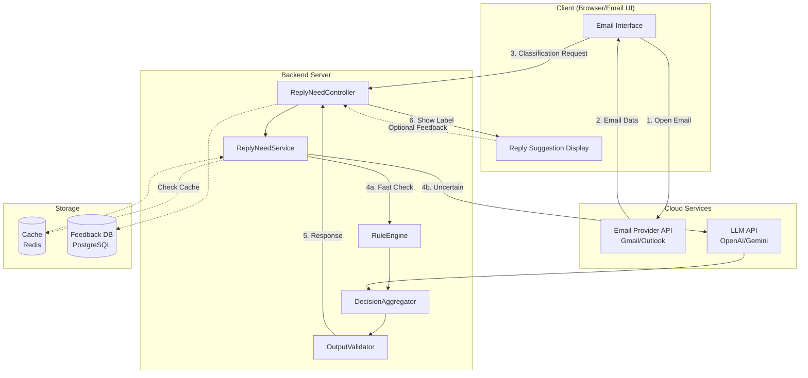
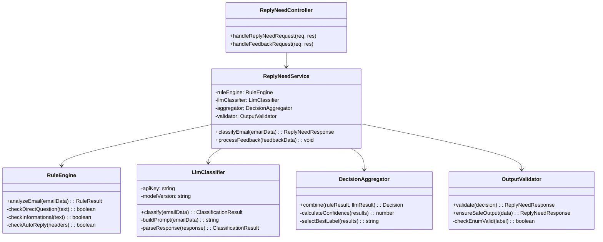
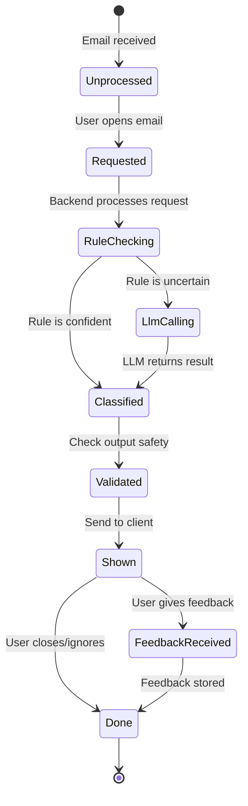
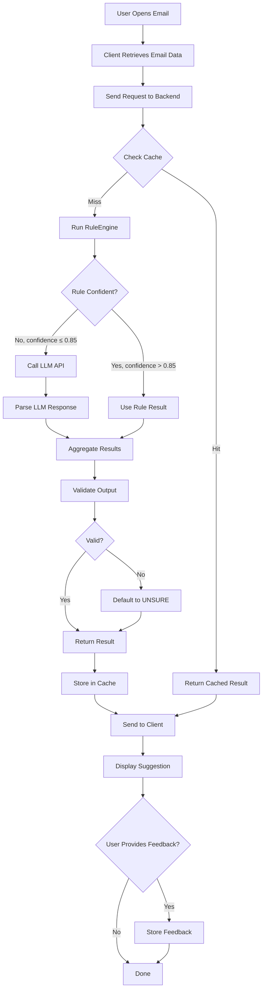

# Dev Spec — User Story 3: Reply Needed Suggestion

## User Story
As a user, I want the AI agent to suggest whether an email needs a reply so that I can avoid unnecessary responses.

Explanation: This helps users decide when no action is required.  
T-shirt size: Small  
Sprint fit: Works well as a lightweight classification task in one sprint

---

# Header

## Feature Name
Reply-Needed Suggestion

## Summary
The system classifies an email as NEEDS_REPLY, NO_REPLY_NEEDED, or UNSURE, helping users avoid unnecessary responses.

## Goals
- Provide a clear reply suggestion label for each email.
- Include a confidence score and 1–3 short reason tags.
- Fail safely by using UNSURE when confidence is low.

## Non-Goals (MVP)
- Automatically sending replies
- Personalized learning per user
- Deep multi-turn thread reasoning

## Assumptions
- The app can access email metadata and main body text (sanitized).
- Classification is triggered when the user opens an email.

## Rationale
A three-label system keeps the feature lightweight and safe. By including UNSURE as an option, we reduce the risk of giving users wrong advice. This builds trust because the system admits when it's not sure instead of guessing. The confidence score and reason tags help users understand why the system made its decision, which makes the feature more transparent and useful.

## Chat Log

**User:**
Hey, can you help me write a header section for a dev spec? The user story is: "As a user, I want the AI agent to suggest whether an email needs a reply so that I can avoid unnecessary responses." I need to include summary, goals, non-goals, assumptions, and rationale. Keep it simple since this is just an MVP for one sprint.

**Assistant:**
Sure! Here's a header section:

The system will classify emails into three categories: NEEDS_REPLY, NO_REPLY_NEEDED, or UNSURE. The main goals are to give users a clear label for each email, include a confidence score with 1-3 reason tags, and fail safely by using UNSURE when the system isn't confident. For the MVP, we won't do automatic replies, personalized learning, or analyze long email threads. We're assuming the app can access email metadata and body text, and that classification happens when a user opens an email. The three-label approach keeps things simple and safe - having UNSURE as an option means the system can admit when it's not sure instead of giving bad advice.

**User:**
Perfect! Can you make the rationale a bit longer? Like explain why the three-label system is better.

**Assistant:**
The three-label system keeps the feature lightweight and safe. By including UNSURE as an option, we reduce the risk of giving users wrong advice. This builds trust because the system admits when it's not sure instead of guessing. The confidence score and reason tags help users understand why the system made its decision, which makes the feature more transparent and useful.

---

# Architecture Diagram

## Components and Where They Run

**Client (Browser/Email UI):**
- Email interface where users read messages
- Display component for showing reply suggestions

**Server (Backend API):**
- ReplyNeedController: handles HTTP requests
- ReplyNeedService: main classification logic
- RuleEngine: quick heuristic checks
- DecisionAggregator: combines results
- OutputValidator: ensures safe outputs

**Cloud (External Services):**
- Email Provider API (Gmail/Outlook): provides email content
- LLM API (OpenAI/Gemini): handles complex classification

**Storage Layer:**
- Cache (Redis): stores recent results to avoid repeat calls
- Database (PostgreSQL): stores user feedback

## Data Flow

1. User opens an email in the UI
2. Client retrieves email metadata and body from Email Provider API
3. Client sends sanitized email data to Backend Controller
4. Backend runs RuleEngine for quick classification
5. If RuleEngine is confident → skip to step 7
6. If RuleEngine is uncertain → Backend calls LLM API
7. DecisionAggregator combines rule and/or LLM results
8. OutputValidator checks the output for safety
9. Backend returns label + confidence + reasons to Client
10. Client displays suggestion to user
11. (Optional) User provides feedback, sent back to Backend
12. Backend stores feedback in Database


## Rationale

Using rule-based checks first helps reduce cost and latency. Simple cases like "FYI" emails or newsletters can be classified quickly without calling the LLM. The LLM is only used when the rules aren't confident enough, which keeps API costs low. Having a cache layer means we don't re-classify the same email multiple times. Strict validation at the end ensures we never send invalid data to the user - if something goes wrong, we default to UNSURE instead of showing a wrong label.

## Chat Log

**User:**
I need to create an architecture diagram for this feature. Can you describe the main components and where they run? Like what's on the client, what's on the server, and what external services we need?

**Assistant:**
Here's a breakdown:

Client side: You'll have the email UI where users read emails, and a display component to show the reply suggestion.

Server side: You need a controller to handle requests, a service to coordinate everything, a rule engine for quick checks, an aggregator to combine results, and a validator to make sure outputs are safe.

External services: Email provider API (like Gmail or Outlook) to get the email content, and an LLM API (OpenAI or Gemini) for complex cases.

You should also have a cache (like Redis) to store recent results and a database (like PostgreSQL) for user feedback.

**User:**
Cool, and what's the data flow? Like step by step what happens when a user opens an email?

**Assistant:**
1. User opens email
2. Client gets email data from the email provider
3. Client sends request to your backend
4. Backend runs rule checks first
5. If rules are confident, skip the LLM
6. If not confident, call the LLM
7. Combine the results
8. Validate the output
9. Send back to client
10. Show the suggestion
11. Optionally, user can give feedback

**User:**
Why do we check rules first before using the LLM?

**Assistant:**
It's mainly about cost and speed. Simple emails like "FYI" or newsletters can be classified really quickly with just rules. The LLM is slower and costs money per API call, so we only use it when we really need it. Plus having a cache means we don't classify the same email twice.

---

# Class Diagram


## Rationale

The classes are organized by their responsibilities. The controller just handles HTTP stuff, the service coordinates everything, and each other class has one specific job. This makes the code easier to test and maintain. If we need to change how rules work, we only touch RuleEngine. If we want to switch LLM providers, we only change LlmClassifier. This separation of concerns is a standard software design pattern.

## Chat Log

**User:**
Now I need a class diagram. What classes should I have and what should each one do?

**Assistant:**
You'll want these classes:

1. ReplyNeedController - handles the HTTP requests
2. ReplyNeedService - coordinates the whole workflow
3. RuleEngine - runs the quick rule checks
4. LlmClassifier - calls the LLM API
5. DecisionAggregator - combines rule and LLM outputs
6. OutputValidator - makes sure the output is valid

The controller talks to the service, and the service uses all the other classes.

**User:**
What methods should each class have? Like give me specifics.

**Assistant:**
ReplyNeedController:
- handleReplyNeedRequest() - processes the classification request
- handleFeedbackRequest() - handles user feedback

ReplyNeedService:
- classifyEmail() - main function that coordinates everything
- processFeedback() - stores user feedback

RuleEngine:
- analyzeEmail() - runs all the rules
- checkDirectQuestion() - looks for question marks
- checkInformational() - detects newsletters
- checkAutoReply() - checks if it's an auto-reply

LlmClassifier:
- classify() - calls the LLM
- buildPrompt() - creates the prompt
- parseResponse() - parses what the LLM returns

DecisionAggregator:
- combine() - merges rule and LLM results
- calculateConfidence() - figures out how confident we are
- selectBestLabel() - picks the final label

OutputValidator:
- validate() - checks if output is valid
- ensureSafeOutput() - defaults to UNSURE if something's wrong
- checkEnumValid() - makes sure the label is one of our three options

---

# List of Classes

## ReplyNeedController
**Responsibility:** Handles incoming HTTP requests for reply-need prediction and feedback.

**Key Methods:**
- `handleReplyNeedRequest(req, res)`: Validates the incoming request, calls the service to classify the email, and returns the response to the client.
- `handleFeedbackRequest(req, res)`: Receives user feedback about whether the prediction was correct, validates it, and passes it to the service.

**Dependencies:** ReplyNeedService

**Why this exists:** We need a layer that deals with HTTP stuff like parsing request bodies, handling errors, and formatting responses. This keeps network concerns separate from business logic.

## ReplyNeedService
**Responsibility:** Orchestrates the entire classification workflow.

**Key Methods:**
- `classifyEmail(emailData)`: Main entry point. Calls the rule engine first, then the LLM if needed, aggregates results, validates output, and returns the final classification.
- `processFeedback(feedbackData)`: Stores user feedback in the database for future model improvements.

**Dependencies:** RuleEngine, LlmClassifier, DecisionAggregator, OutputValidator

**Why this exists:** This is the brain of the system. It decides when to use rules vs LLM, coordinates all the pieces, and makes sure everything happens in the right order.

## RuleEngine
**Responsibility:** Applies fast heuristic rules for common email patterns.

**Key Methods:**
- `analyzeEmail(emailData)`: Runs all rule checks and returns a result with label and confidence.
- `checkDirectQuestion(text)`: Looks for question marks, "what", "when", "how" at the end of sentences.
- `checkInformational(text)`: Detects "FYI", "for your information", newsletter patterns.
- `checkAutoReply(headers)`: Checks email headers for auto-reply indicators.

**Returns:** RuleResult with label (NEEDS_REPLY, NO_REPLY_NEEDED, or UNSURE) and confidence score (0-1).

**Why this exists:** Many emails have obvious patterns that don't need AI. Rules are fast and free, so we use them first to save on API costs.

## LlmClassifier
**Responsibility:** Calls external LLM API for complex classification cases.

**Key Methods:**
- `classify(emailData)`: Sends a prompt to the LLM, waits for response, parses it, and returns a classification result.
- `buildPrompt(emailData)`: Constructs a structured prompt with email subject, sender, and body text.
- `parseResponse(response)`: Extracts the label, confidence, and reasons from the LLM's response.

**Dependencies:** External LLM API (OpenAI GPT-4 or Google Gemini)

**Why this exists:** When rules aren't confident, we need smarter analysis. The LLM can understand context, tone, and nuanced situations that simple rules can't handle.

## DecisionAggregator
**Responsibility:** Combines rule-based and LLM outputs to make a final decision.

**Key Methods:**
- `combine(ruleResult, llmResult)`: Takes both results and decides which one to trust more.
- `calculateConfidence(results)`: Computes a final confidence score based on agreement between methods.
- `selectBestLabel(results)`: Picks the final label, preferring high-confidence results.

**Logic:** If rules are very confident (>0.9), use them. If rules return UNSURE or low confidence, use LLM result. If both agree, boost confidence. If they disagree, lower confidence.

**Why this exists:** Sometimes we have two opinions (rules and LLM) and need to decide which to trust. This class encodes our decision logic in one place.

## OutputValidator
**Responsibility:** Ensures all outputs are safe, valid, and follow the correct schema.

**Key Methods:**
- `validate(decision)`: Checks that the label is valid, confidence is 0-1, reasons array exists, etc.
- `ensureSafeOutput(data)`: If validation fails, returns a safe default (UNSURE with low confidence).
- `checkEnumValid(label)`: Verifies the label is exactly one of: NEEDS_REPLY, NO_REPLY_NEEDED, UNSURE.

**Safety:** Prevents invalid data from reaching the client. No matter what goes wrong (LLM returns garbage, rules crash, etc.), the user always gets a valid response.

**Why this exists:** LLMs can be unpredictable and return weird outputs. This is our safety net that makes sure we never show broken data to users.

## Rationale

Clear separation of concerns makes the code easier to understand, test, and modify. Each class has one job and one reason to change. If we want to add new rules, we only touch RuleEngine. If we want to switch from OpenAI to Anthropic, we only change LlmClassifier. Having separate validation means we can test safety independently. This design follows standard MVC patterns and makes the codebase maintainable for future developers.

## Chat Log

**User:**
Can you write detailed descriptions for each class? Like what they're responsible for and what methods they have?

**Assistant:**
Sure! Let me break down each class:

ReplyNeedController handles HTTP stuff - it takes requests, validates them, calls the service, and sends responses back.

ReplyNeedService is the coordinator. It decides whether to use rules or the LLM, calls the right classes in order, and makes sure everything works together.

RuleEngine does fast pattern matching. It checks for obvious things like "FYI" emails or emails with question marks.

LlmClassifier talks to the LLM API. It builds the prompt, sends it, and parses what comes back.

DecisionAggregator is like a referee when rules and LLM disagree. It decides which one to trust more.

OutputValidator is the safety check. It makes sure we never send broken data to users. If something's wrong, it defaults to UNSURE.

**User:**
Why separate all these? Couldn't we just put everything in one class?

**Assistant:**
You could, but it would be hard to maintain. With separate classes, each one has a single job. If you need to change how rules work, you only touch RuleEngine. If you want to switch LLM providers, you only change LlmClassifier. It also makes testing way easier - you can test the validator independently to make sure it catches all edge cases. This is called "separation of concerns" and it's a standard practice in software engineering.

---

# State Diagrams


## Rationale

This lifecycle tracks an email from arrival to completion. The main branch shows the normal flow: receive, request, check rules, maybe call LLM, validate, show. The feedback branch is optional - most users won't give feedback, they'll just close the email. This simple state machine helps us understand what data we need to store at each stage and what transitions are possible.

## Chat Log

**User:**
I need a state diagram for the email classification lifecycle. Like what states does an email go through?

**Assistant:**
Here's the flow:

1. Email starts as Unprocessed (just sitting in inbox)
2. Becomes Requested when user opens it
3. Goes to RuleChecking when backend starts processing
4. Either goes straight to Classified (if rule is confident) or to LlmCalling (if uncertain)
5. After LLM responds, goes to Classified
6. Then Validated to check safety
7. Then Shown to display to user
8. User can give Feedback or just close it (Done)

**User:**
Why have separate states for Classified and Validated? Aren't they the same?

**Assistant:**
Not really. Classified means we have a decision (from rules or LLM), but we haven't checked if it's safe yet. Validated means we've verified the output is correct and safe. This matters because if validation fails, we need to go back and fix it or default to UNSURE. Separating them makes it clear that validation is a distinct step.

---

# Flow Chart


## Rationale

The flow chart shows the complete request lifecycle with all decision points. Key optimizations: cache check happens first to avoid redundant work, rule check happens before LLM to save costs, and validation ensures we always return safe output. The feedback loop is optional but important for future improvements. This flow balances speed (caching, rules first), cost (avoid unnecessary LLM calls), and safety (validation, UNSURE fallback).

## Chat Log

**User:**
Can you make a detailed flow chart that shows everything that happens when classifying an email? Include all the decision points.

**Assistant:**
Sure! Here's the complete flow:

1. User opens email
2. Client gets the email data
3. Sends request to backend
4. Backend checks cache first - if we already classified this email, just return that
5. If not cached, run RuleEngine
6. Check if rule confidence is high (>0.85)
7. If yes, use the rule result
8. If no, call LLM API
9. Parse what the LLM returns
10. Aggregate the results
11. Validate the output
12. If invalid, default to UNSURE
13. If valid, return the result
14. Store it in cache for next time
15. Send to client
16. Display to user
17. Optionally, user gives feedback
18. If they do, store it

**User:**
Why is caching so important here?

**Assistant:**
Because the same email might be opened multiple times - user opens it, closes it, comes back later. Without caching, we'd call the LLM every single time, which costs money and is slow. With caching, we only classify each email once. It's a huge performance and cost saver.

**User:**
What happens if the LLM returns something completely wrong, like a random label?

**Assistant:**
That's what the validator is for. It checks that the label is exactly one of our three options (NEEDS_REPLY, NO_REPLY_NEEDED, UNSURE), the confidence is between 0 and 1, and all required fields exist. If anything's wrong, it throws out the bad result and defaults to UNSURE. This way we never show garbage to the user.

---

# Development Risks and Failures

## Risks

### 1. False NO_REPLY_NEEDED Classification
**Problem:** System might incorrectly label an urgent email as not needing a reply, causing users to miss important messages.

**Impact:** High - could damage relationships or miss deadlines.

**Likelihood:** Medium - happens when email is ambiguous or uses unconventional phrasing.

### 2. LLM Inconsistency
**Problem:** Same email might get different labels on repeated classifications due to LLM randomness.

**Impact:** Medium - confuses users and reduces trust.

**Likelihood:** Medium - LLMs have some inherent randomness even with low temperature.

### 3. High Latency
**Problem:** LLM API calls can take 2-5 seconds, making the UI feel slow.

**Impact:** Medium - hurts user experience.

**Likelihood:** High - external API calls always add latency.

### 4. Privacy Concerns
**Problem:** Sending email content to external LLM raises data privacy issues, especially for sensitive emails.

**Impact:** High - legal and trust issues.

**Likelihood:** Medium - depends on user's email content.

### 5. API Cost Escalation
**Problem:** LLM API calls cost money per request. High usage could get expensive.

**Impact:** Medium - budget concerns.

**Likelihood:** Medium - depends on adoption rate.

### 6. LLM API Downtime
**Problem:** If OpenAI/Gemini has an outage, the feature breaks.

**Impact:** Medium - feature stops working.

**Likelihood:** Low - major providers have good uptime, but outages happen.

## Mitigation Strategies

### For False Classifications:
- Use UNSURE as a fallback when confidence is below 0.85
- Show confidence score and reasons so users can make their own judgment
- Collect feedback to identify problematic patterns
- Make rules conservative (prefer UNSURE over wrong advice)

### For LLM Inconsistency:
- Set temperature to 0 or very low to reduce randomness
- Validate output against strict schema
- Cache results so same email always gets same label
- Use structured output format (JSON) instead of free text

### For High Latency:
- Cache results aggressively - never classify the same email twice
- Run rule checks first - most emails can be classified in <100ms
- Show loading state in UI so user knows something's happening
- Consider async classification (classify in background, update UI later)

### For Privacy:
- Don't store raw email content in logs or database
- Only send necessary fields to LLM (not full headers or metadata)
- Allow users to opt out of AI features
- Document clearly what data is sent where
- Consider on-premise LLM options for enterprise customers

### For Cost:
- Use rules first to filter out easy cases
- Implement aggressive caching
- Set per-user rate limits
- Monitor costs and set alerts
- Consider cheaper models for simple cases

### For API Downtime:
- Implement retry logic with exponential backoff
- Fall back to UNSURE if LLM is unreachable
- Show clear error message to user
- Have rules-only mode as backup

## Rationale

The most critical risk is false NO_REPLY_NEEDED because it could cause users to miss important emails. That's why we prioritize safety through the UNSURE option and showing reasons. Privacy is also crucial since we're handling potentially sensitive information, so we minimize data retention and logging. The other mitigations focus on making the system robust and cost-effective for production use.

## Chat Log

**User:**
What are the main risks with this system and how do we handle them?

**Assistant:**
Biggest risk is false negatives - telling someone they don't need to reply when they actually do. That could make them miss important emails. To handle it, we use UNSURE when we're not confident, show the confidence score, and let users give feedback.

Other risks:
- LLM might be inconsistent
- API calls are slow
- Privacy issues with sending email content
- Costs can add up
- What if the API goes down?

**User:**
How do we fix the consistency problem?

**Assistant:**
Set the LLM temperature to 0 so it's deterministic. Also validate the output against a strict schema so even if it returns something weird, we catch it. And most importantly, cache results - if we already classified an email, just return the cached result instead of calling the LLM again.

**User:**
What about privacy? Sending email content to OpenAI seems sketchy.

**Assistant:**
Yeah that's a real concern. We minimize what we send - only subject and body text, not full headers or metadata. We don't store raw email content anywhere, just the classification result. And we should document clearly what data goes where. For enterprise customers who can't send data to external APIs, we'd need to look into on-premise LLM options.

**User:**
And if OpenAI goes down, the whole feature breaks?

**Assistant:**
That's why we have rules as a fallback. If the LLM API is unreachable, we just use the rule engine result, or default to UNSURE. We'd show an error message to the user explaining the AI feature is temporarily unavailable. It's not ideal but at least the app doesn't completely break.

---

# Technology Stack

## Frontend
- **Framework:** React or Vue.js
- **Why:** Popular frameworks with good ecosystem, easy to build interactive UI components.

## Backend
- **Language:** Python with FastAPI or Node.js with Express
- **Why:** FastAPI has great async support for handling LLM calls without blocking. Node.js also works well for I/O heavy tasks. Both have simple syntax and fast development time.

## LLM Provider
- **Service:** OpenAI GPT-4 or Google Gemini
- **Why:** Both have good API docs, reasonable pricing, and handle classification tasks well. Can start with OpenAI and switch later if needed.

## Caching
- **Service:** Redis
- **Why:** Fast in-memory storage perfect for caching. Simple key-value store that works well for storing classification results temporarily.

## Database
- **Service:** PostgreSQL or SQLite
- **Why:** PostgreSQL for production (reliable, good JSON support for storing feedback). SQLite for local development (no setup needed).

## Hosting
- **Platform:** Vercel, Railway, or AWS Lambda
- **Why:** All support serverless or easy deployment. Vercel is great for frontend + backend combos. Railway is simple. AWS Lambda scales automatically.

## Development Tools
- **Testing:** pytest (Python) or Jest (Node.js)
- **API Testing:** Postman or curl
- **Version Control:** Git + GitHub

## Rationale

This stack balances rapid development with production readiness. FastAPI or Express let us build the backend quickly with good async support for handling LLM API calls. Using established LLM providers (OpenAI/Gemini) means we don't need to host or train models ourselves, which saves massive time and complexity for an MVP. Redis caching is essential for performance - it prevents redundant LLM calls and keeps costs down. PostgreSQL provides reliable storage for feedback without requiring complex data modeling. The hosting options (Vercel/Railway/Lambda) all support quick deployment with minimal DevOps work, which fits our one-sprint timeline. Everything in this stack has good documentation and community support, so we won't get stuck on obscure problems.

## Chat Log

**User:**
What technology stack should I use for this project? We only have one sprint so it needs to be fast to build.

**Assistant:**
For a one-sprint timeline, I'd go with:

Frontend: React - super popular, lots of examples
Backend: FastAPI with Python - has great async support for calling APIs
LLM: OpenAI or Gemini - just use their API, don't host your own model
Cache: Redis - fast and simple
Database: PostgreSQL for production, SQLite for local dev
Hosting: Vercel or Railway - really easy deployment

**User:**
Why FastAPI over something like Flask?

**Assistant:**
FastAPI has built-in async support which is perfect for this use case. When you call the LLM API, you don't want to block other requests. FastAPI handles that naturally. It also auto-generates API docs which is nice. Flask can do async too but it's more work to set up.

**User:**
Do we really need Redis? Can't we just use the database for caching?

**Assistant:**
You could, but Redis is way faster because it's in-memory. When you're trying to avoid slow LLM calls, you want the cache check to be as fast as possible - like under 10ms. A database query would be 50-100ms. For caching use cases, Redis is the standard choice.

**User:**
What about hosting? Is AWS too complicated for an MVP?

**Assistant:**
AWS Lambda could work but it's more setup. Vercel and Railway are designed for quick deployments - you literally just connect your GitHub repo and it deploys automatically. For an MVP in one sprint, I'd go with the simpler option. You can always migrate to AWS later if you need more control.

---

# APIs

## API 1: Predict Reply-Needed

**Endpoint:** `POST /api/reply-need`

**Description:** Classifies an email and returns whether it needs a reply.

### Request Body
```json
{
  "messageId": "string",
  "subject": "string",
  "from": "string",
  "to": ["string"],
  "cc": ["string"],
  "receivedAt": "ISO8601 datetime string",
  "bodyText": "string",
  "hasAttachments": false
}
```

**Field Descriptions:**
- `messageId`: Unique identifier for the email (required)
- `subject`: Email subject line (required)
- `from`: Sender email address (required)
- `to`: List of primary recipients (required, can be empty array)
- `cc`: List of CC'd recipients (optional, can be empty array)
- `receivedAt`: When email was received (optional, ISO8601 format)
- `bodyText`: Plain text email body, sanitized (required, max 10,000 chars)
- `hasAttachments`: Whether email has attachments (optional, default false)

### Response Body
```json
{
  "messageId": "string",
  "replyNeededLabel": "NEEDS_REPLY",
  "confidence": 0.92,
  "reasons": ["direct_question", "action_required"],
  "modelVersion": "rules+llm_v1",
  "cached": false
}
```

**Field Descriptions:**
- `messageId`: Same as request, for matching
- `replyNeededLabel`: One of: `NEEDS_REPLY`, `NO_REPLY_NEEDED`, `UNSURE`
- `confidence`: Float between 0.0 and 1.0
- `reasons`: Array of 1-3 short reason codes (e.g., "direct_question", "fyi_only")
- `modelVersion`: Which model/rules version was used
- `cached`: Boolean indicating if this was a cached result

### Error Response
```json
{
  "error": "Invalid request",
  "details": "Field 'subject' is required"
}
```

**Status Codes:**
- 200: Success
- 400: Bad request (missing fields, invalid format)
- 500: Server error (LLM API down, unexpected error)

---

## API 2: Submit Feedback

**Endpoint:** `POST /api/reply-need/feedback`

**Description:** Allows users to report if the classification was correct or incorrect.

### Request Body
```json
{
  "messageId": "string",
  "shownLabel": "NEEDS_REPLY",
  "userVerdict": "CORRECT",
  "userComment": "Optional text comment"
}
```

**Field Descriptions:**
- `messageId`: The email that was classified (required)
- `shownLabel`: What label we showed the user (required)
- `userVerdict`: One of: `CORRECT`, `INCORRECT` (required)
- `userComment`: Optional free-text feedback (max 500 chars)

### Response Body
```json
{
  "status": "recorded",
  "messageId": "string"
}
```

**Status Codes:**
- 200: Feedback recorded successfully
- 400: Invalid request
- 404: Message ID not found

---

## Rationale

Separating prediction and feedback into two endpoints keeps the core API simple and focused. The prediction endpoint has all the fields needed for classification but nothing extra. Returning `cached: true/false` helps with debugging and lets us track cache hit rates. The feedback endpoint is intentionally simple - just enough to record whether we got it right. We don't force users to explain why it's wrong; the optional comment field is there if they want to elaborate. Using enum values for labels ensures type safety and prevents typos. Including confidence and reasons in the response gives users transparency about how the system made its decision.

## Chat Log

**User:**
I need to define the API endpoints. What should the prediction endpoint look like?

**Assistant:**
For prediction, do a POST to /api/reply-need

Request should have:
- messageId
- subject
- from (sender)
- to (recipients)
- bodyText
- maybe receivedAt and hasAttachments

Response should return:
- messageId (same one)
- replyNeededLabel (one of your three options)
- confidence (0 to 1)
- reasons (array of short codes)
- modelVersion

**User:**
What about error handling? What if the request is missing fields?

**Assistant:**
Return a 400 with an error message explaining what's missing. Like "Field 'subject' is required". For server errors (like if the LLM API is down), return a 500. Normal successful response is 200.

**User:**
Should I include the email body in the response?

**Assistant:**
No, definitely not. You're just returning the classification result. The client already has the email body - they're the ones who sent it to you. Just return the label, confidence, and reasons.

**User:**
What about the feedback endpoint?

**Assistant:**
Keep it simple. POST to /api/reply-need/feedback with messageId, what label you showed, and whether the user said it was correct or incorrect. Optionally let them add a comment. Just return a 200 with a confirmation message. You're just storing this for future analysis, you don't need to do anything complex with it.

---

# Public Interfaces

## User-Facing Interfaces

### 1. Reply Suggestion Label
**Location:** Email detail view, next to subject line or in header area

**Visual Design:**
- Badge/pill component with icon
- Three states:
  - 🟢 "Reply needed" (green)
  - 🔵 "No reply needed" (blue)
  - ⚪ "Unsure" (gray)

**Behavior:**
- Appears after email is opened (slight delay while classifying)
- Clickable to show more details

### 2. Confidence & Reasons Tooltip
**Trigger:** Hover or click on the reply suggestion label

**Content:**
- Confidence score: "85% confident"
- 1-3 reason tags: "Direct question", "Action requested"
- Expandable explanation of what each reason means

**Example:**
```
Reply needed (85% confident)

Reasons:
- Direct question - Email asks a specific question
- Action requested - Sender expects you to do something

This is an AI suggestion. You decide whether to reply.
```

### 3. Feedback Buttons
**Location:** Below the tooltip or in the email header

**Options:**
- ✓ "This was helpful"
- ✗ "This was wrong"

**Behavior:**
- Click sends feedback to backend
- Shows brief confirmation: "Thanks for your feedback!"
- Disappears after confirmation

### 4. Settings Toggle
**Location:** App settings menu

**Control:**
- Toggle switch: "Show reply suggestions"
- Description: "Get AI-powered suggestions on whether emails need a reply"
- Default: ON

---

## API Interfaces

### 1. Classification Endpoint
`POST /api/reply-need`

**Access:** Authenticated requests only (requires user token)

**Rate Limit:** 100 requests per user per hour

**Documentation:** Available at `/api/docs` (auto-generated by FastAPI)

### 2. Feedback Endpoint
`POST /api/reply-need/feedback`

**Access:** Authenticated requests only

**Rate Limit:** 50 requests per user per hour

---

## Developer Interfaces (Internal)

### 1. RuleEngine Interface
```python
class RuleEngine:
    def analyze_email(self, email_data: EmailData) -> RuleResult:
        """Returns label, confidence, matched_rules"""
        pass
```

### 2. LlmClassifier Interface
```python
class LlmClassifier:
    def classify(self, email_data: EmailData) -> ClassificationResult:
        """Returns label, confidence, reasons"""
        pass
```

### 3. Cache Interface
```python
def get_cached_result(message_id: str) -> Optional[ReplyNeedResponse]:
    """Returns cached classification or None"""
    pass

def set_cached_result(message_id: str, result: ReplyNeedResponse, ttl: int = 3600):
    """Stores result in cache for ttl seconds"""
    pass
```

---

## Rationale

Minimal public interfaces reduce complexity and surface area for bugs. The user only sees: the label, the tooltip, and feedback buttons. This keeps the UI clean and doesn't overwhelm them with technical details. The confidence score and reasons provide transparency without being too verbose. Making feedback optional respects user time - most people won't give feedback and that's okay. The API is also minimal: just two endpoints. Having clear rate limits prevents abuse and controls costs. For developers, the internal interfaces are simple function signatures that each class must implement, which makes the code easy to understand and extend.

## Chat Log

**User:**
What should the user interface look like? Like how do we show the suggestion to users?

**Assistant:**
Keep it simple:

1. Show a small badge next to the email subject, like "Reply needed" or "No reply needed"
2. Make it color coded - green for needs reply, blue for no reply, gray for unsure
3. When they hover over it, show a tooltip with the confidence and reasons
4. Add small feedback buttons below the tooltip - checkmark for "this was helpful", X for "this was wrong"

**User:**
Should we show the confidence as a percentage?

**Assistant:**
Yeah, "85% confident" is easy to understand. And list the reasons as bullet points, like "• Direct question • Action requested". Keep it short and simple.

**User:**
What about the API documentation? Do I need to write that manually?

**Assistant:**
If you use FastAPI, it auto-generates docs at /api/docs. Super convenient. You just need to make sure your endpoint functions have good docstrings and type hints.

**User:**
Should users be able to turn this feature off?

**Assistant:**
Definitely. Add a toggle in settings: "Show reply suggestions". Some people won't want AI suggestions and that's fine. Make it easy to disable.

---

# Data Schemas

## 1. ReplyNeedRequest Schema
```json
{
  "type": "object",
  "required": ["messageId", "subject", "from", "bodyText"],
  "properties": {
    "messageId": {
      "type": "string",
      "description": "Unique identifier for the email"
    },
    "subject": {
      "type": "string",
      "maxLength": 500,
      "description": "Email subject line"
    },
    "from": {
      "type": "string",
      "format": "email",
      "description": "Sender email address"
    },
    "to": {
      "type": "array",
      "items": {"type": "string", "format": "email"},
      "description": "List of primary recipients"
    },
    "cc": {
      "type": "array",
      "items": {"type": "string", "format": "email"},
      "description": "List of CC recipients"
    },
    "receivedAt": {
      "type": "string",
      "format": "date-time",
      "description": "When email was received (ISO8601)"
    },
    "bodyText": {
      "type": "string",
      "maxLength": 10000,
      "description": "Plain text email body"
    },
    "hasAttachments": {
      "type": "boolean",
      "default": false,
      "description": "Whether email has attachments"
    }
  },
  "additionalProperties": false
}
```

---

## 2. ReplyNeedResponse Schema
```json
{
  "type": "object",
  "required": ["messageId", "replyNeededLabel", "confidence", "reasons", "modelVersion"],
  "properties": {
    "messageId": {
      "type": "string",
      "description": "Same as request messageId"
    },
    "replyNeededLabel": {
      "type": "string",
      "enum": ["NEEDS_REPLY", "NO_REPLY_NEEDED", "UNSURE"],
      "description": "Classification result"
    },
    "confidence": {
      "type": "number",
      "minimum": 0.0,
      "maximum": 1.0,
      "description": "Confidence score"
    },
    "reasons": {
      "type": "array",
      "items": {"type": "string"},
      "minItems": 1,
      "maxItems": 3,
      "description": "Short reason codes"
    },
    "modelVersion": {
      "type": "string",
      "description": "Model version used",
      "example": "rules+llm_v1"
    },
    "cached": {
      "type": "boolean",
      "description": "Whether result was cached"
    }
  },
  "additionalProperties": false
}
```

---

## 3. FeedbackRequest Schema
```json
{
  "type": "object",
  "required": ["messageId", "shownLabel", "userVerdict"],
  "properties": {
    "messageId": {
      "type": "string",
      "description": "Email that was classified"
    },
    "shownLabel": {
      "type": "string",
      "enum": ["NEEDS_REPLY", "NO_REPLY_NEEDED", "UNSURE"],
      "description": "Label shown to user"
    },
    "userVerdict": {
      "type": "string",
      "enum": ["CORRECT", "INCORRECT"],
      "description": "User's feedback"
    },
    "userComment": {
      "type": "string",
      "maxLength": 500,
      "description": "Optional user comment"
    }
  },
  "additionalProperties": false
}
```

---

## 4. RuleResult Schema (Internal)
```json
{
  "type": "object",
  "required": ["label", "confidence", "matchedRules"],
  "properties": {
    "label": {
      "type": "string",
      "enum": ["NEEDS_REPLY", "NO_REPLY_NEEDED", "UNSURE"]
    },
    "confidence": {
      "type": "number",
      "minimum": 0.0,
      "maximum": 1.0
    },
    "matchedRules": {
      "type": "array",
      "items": {"type": "string"},
      "description": "Which rules were triggered"
    }
  }
}
```

---

## 5. ClassificationResult Schema (Internal)
```json
{
  "type": "object",
  "required": ["label", "confidence", "reasons"],
  "properties": {
    "label": {
      "type": "string",
      "enum": ["NEEDS_REPLY", "NO_REPLY_NEEDED", "UNSURE"]
    },
    "confidence": {
      "type": "number",
      "minimum": 0.0,
      "maximum": 1.0
    },
    "reasons": {
      "type": "array",
      "items": {"type": "string"},
      "minItems": 1,
      "maxItems": 3
    },
    "rawResponse": {
      "type": "string",
      "description": "Raw LLM response for debugging"
    }
  }
}
```

---

## 6. CachedClassification Schema (Database)
```sql
CREATE TABLE cached_classifications (
  message_id VARCHAR(255) PRIMARY KEY,
  label VARCHAR(20) NOT NULL,
  confidence DECIMAL(3,2) NOT NULL,
  reasons JSON NOT NULL,
  model_version VARCHAR(50) NOT NULL,
  created_at TIMESTAMP DEFAULT CURRENT_TIMESTAMP,
  expires_at TIMESTAMP NOT NULL
);
```

---

## 7. UserFeedback Schema (Database)
```sql
CREATE TABLE user_feedback (
  id SERIAL PRIMARY KEY,
  message_id VARCHAR(255) NOT NULL,
  shown_label VARCHAR(20) NOT NULL,
  user_verdict VARCHAR(20) NOT NULL,
  user_comment TEXT,
  user_id VARCHAR(255),
  created_at TIMESTAMP DEFAULT CURRENT_TIMESTAMP
);
```

---

## Rationale

Strict schemas with validation prevent invalid data from entering the system. Setting `additionalProperties: false` means any extra fields in requests get rejected, which catches client bugs early. Using enums for labels ensures type safety - we can't accidentally create a typo label like "NEEDS_REPYL". Max length limits on strings prevent abuse and ensure data fits in our database. The confidence field has explicit min/max to prevent values like -0.5 or 1.5. For internal schemas, including fields like `rawResponse` and `matchedRules` helps with debugging when classifications go wrong. The database schemas use appropriate types and indexes for performance. Having all these schemas documented in one place makes it easy for new developers to understand the data flow.

## Chat Log

**User:**
Can you define all the data schemas we need? Like the request/response formats and also internal data structures?

**Assistant:**
Sure! You'll need:

1. ReplyNeedRequest - what the client sends
2. ReplyNeedResponse - what we send back
3. FeedbackRequest - for user feedback
4. RuleResult - internal format from rule engine
5. ClassificationResult - internal format from LLM
6. Cache schema for storing results
7. Database schema for feedback

For each one, use JSON schema with strict validation. Set additionalProperties to false so we reject unexpected fields.

**User:**
Why do we need separate internal schemas? Can't we just use the public ones?

**Assistant:**
The internal ones have extra fields for debugging. Like RuleResult includes which rules were matched, and ClassificationResult includes the raw LLM response. We don't want to send those to clients - they're just for our logs and debugging. It also gives us flexibility to change internal format without breaking the public API.

**User:**
What about the database? What should the cache table look like?

**Assistant:**
For cache, you need: message_id (primary key), label, confidence, reasons (as JSON), model_version, created_at, and expires_at. The expires_at is important so you can delete old entries. For feedback, you need: id, message_id, shown_label, user_verdict, optional user_comment, user_id, and created_at.

**User:**
Should I index anything for performance?

**Assistant:**
Yeah, index message_id in both tables since you'll be looking up by that. Also index expires_at in the cache table so you can efficiently delete expired entries. And maybe index created_at in feedback table if you want to query by time range.

---

# Security and Privacy

## Data Minimization

### What We Send to LLM API:
- Email subject (sanitized)
- Email body text (sanitized, max 10,000 chars)
- Sender address (email only, no names)
- Basic metadata (received time, has attachments)

### What We DO NOT Send:
- Email headers (except essentials)
- Recipient lists beyond what's needed
- User's personal information
- Other emails in the thread
- Attachment content

### What We DO NOT Store:
- Raw email body text
- Full email content
- LLM API responses (except classification result)

**Rationale:** Only send the minimum data needed for classification. This reduces privacy risk and limits exposure if there's a data breach.

---

## Authentication & Authorization

### API Security:
- All endpoints require authentication token (JWT or session cookie)
- User can only classify/access their own emails
- Rate limiting: 100 classifications per user per hour
- Invalid tokens get 401 Unauthorized

### Implementation:
```python
@app.post("/api/reply-need")
async def classify_email(
    request: ReplyNeedRequest,
    user: User = Depends(get_current_user)
):
    # Verify user owns this email
    if not user.owns_email(request.messageId):
        raise HTTPException(403, "Forbidden")
    # ... rest of logic
```

---

## Input Validation & Sanitization

### Request Validation:
- Validate all fields against strict JSON schemas
- Reject requests with extra fields
- Check string lengths (subject ≤ 500, body ≤ 10,000 chars)
- Validate email format for sender/recipient fields
- Escape HTML/special characters before processing

### LLM Output Validation:
- Verify output matches expected schema
- Check enum values are valid
- Ensure confidence is 0-1 range
- Reject outputs with unexpected fields
- Default to UNSURE if validation fails

---

## Logging & Monitoring

### What We Log:
- Request timestamps and user IDs (hashed)
- Classification results (label, confidence)
- API errors and exceptions
- Performance metrics (latency, cache hit rate)

### What We DO NOT Log:
- Email content
- Subject lines
- Sender/recipient addresses
- Raw LLM responses

### Log Retention:
- Performance logs: 30 days
- Error logs: 90 days
- User feedback: Indefinite (for model improvement)

---

## API Key Management

### LLM API Keys:
- Store in environment variables, never in code
- Use separate keys for dev/staging/production
- Rotate keys every 90 days
- Monitor usage for unusual spikes
- Set spending limits with LLM provider

### User Tokens:
- Use short-lived JWTs (1 hour expiry)
- Refresh tokens stored securely (HTTPOnly cookies)
- Implement logout to invalidate tokens

---

## Encryption

### In Transit:
- All API calls use HTTPS/TLS 1.3
- No plain HTTP allowed
- Certificate pinning for mobile apps

### At Rest:
- Database encryption enabled
- Feedback text encrypted (if contains PII)
- Cache (Redis) uses password authentication

---

## Privacy Compliance

### User Rights:
- Users can opt out of AI features (turns off classification)
- Users can request data deletion (delete cached results + feedback)
- Clear privacy policy explaining what data is sent to LLM

### Third-Party Data Sharing:
- Email content sent to LLM provider (OpenAI/Gemini)
- Document this clearly in privacy policy
- For enterprise: offer on-premise LLM option

---

## Rate Limiting & Abuse Prevention

### Per-User Limits:
- 100 classifications per hour
- 50 feedback submissions per hour
- Block users who exceed limits (429 Too Many Requests)

### System-Wide Limits:
- Max 1000 LLM API calls per minute
- Circuit breaker if LLM error rate > 50%
- Fallback to rules-only mode during incidents

---

## Error Handling

### Never Expose:
- Internal error details to users
- Stack traces in API responses
- Database connection strings
- LLM API keys

### Instead Return:
- Generic error messages: "An error occurred"
- Error codes for client debugging
- Log details internally for investigation

---

## Security Testing

### Before Launch:
- Penetration testing on API endpoints
- SQL injection testing (though we use ORMs)
- XSS testing on user input fields
- Rate limit testing
- Authentication bypass testing

---

## Rationale

Data minimization is the most important principle - we only send what's absolutely necessary to the LLM. This reduces privacy risk and limits damage if there's a breach. Not storing raw email content means even if our database is compromised, user emails aren't exposed. Input validation prevents injection attacks and ensures data integrity. Strict output validation from the LLM prevents malicious or malformed responses from reaching users. Authentication and rate limiting prevent abuse and control costs. Encryption protects data in transit and at rest. Clear logging (without sensitive data) helps us debug issues without creating privacy risks. All of this aligns with privacy-by-design principles and prepares us for regulations like GDPR.

## Chat Log

**User:**
What are the main security and privacy concerns for this feature?

**Assistant:**
Biggest one is that we're sending email content to an external LLM API. That's sensitive data, so we need to be really careful:

1. Only send what's necessary - just subject and body, not headers or attachments
2. Don't store the raw email content anywhere
3. Don't log email text
4. Let users opt out

Also need normal API security stuff - authentication, rate limiting, input validation.

**User:**
How do we validate that users can only classify their own emails?

**Assistant:**
In the API endpoint, check that the authenticated user owns the email they're trying to classify. If they don't, return 403 Forbidden. You'd have a function like `user.owns_email(messageId)` that checks against the email provider API.

**User:**
What if the LLM returns something malicious, like trying to do code injection?

**Assistant:**
That's why we have the OutputValidator. It checks that the response matches our schema exactly - the label must be one of our three enums, confidence must be 0-1, reasons must be an array of strings, etc. If anything's weird, we reject it and default to UNSURE. We never directly execute or interpret LLM output - we just parse it as structured data.

**User:**
Should we encrypt the database?

**Assistant:**
Yeah, enable database encryption at rest. It's usually a checkbox in your hosting provider settings. Also use HTTPS for all API calls - that's encryption in transit. For Redis cache, set a password so not anyone can access it.

**User:**
What about GDPR compliance?

**Assistant:**
Main things: let users delete their data (cached results and feedback), let them opt out of the feature entirely, and be transparent about sending data to the LLM provider. Have a clear privacy policy that explains what data goes where. For EU enterprise customers, you might need an on-premise LLM option so data doesn't leave their servers.

---

# Risks to Completion

## Technical Risks

### 1. LLM API Integration Issues
**Risk:** OpenAI or Gemini API might be harder to integrate than expected, with unclear documentation or unexpected rate limits.

**Impact:** High - the whole feature depends on this

**Likelihood:** Medium

**Mitigation:**
- Start with API integration on day 1
- Use official SDKs (openai-python or google-generativeai)
- Have a backup plan: if one provider doesn't work, switch to the other
- Test with a few manual API calls before building the full system

### 2. Email Provider Integration Complexity
**Risk:** Getting email content from Gmail/Outlook APIs might require complex OAuth flows or have unexpected permissions issues.

**Impact:** High - can't classify without email access

**Likelihood:** Medium

**Mitigation:**
- Research OAuth flow early
- Start with a simpler provider (Gmail API is well-documented)
- For MVP, could use test emails or mock data
- Worst case: have users paste email content manually (ugly but works)

### 3. Rule Engine Takes Longer Than Expected
**Risk:** Writing good heuristic rules is time-consuming and requires iteration.

**Impact:** Low - LLM can work without rules, they're just an optimization

**Likelihood:** High

**Mitigation:**
- Start with 3-5 simple rules (FYI detection, question mark detection)
- Don't try to be too clever with rules
- Rules are optional for MVP - can launch with LLM-only mode

---

## Resource Risks

### 4. LLM API Quota/Rate Limits
**Risk:** Free tier might run out quickly during testing, or we hit rate limits during demo.

**Impact:** Medium - blocks testing and demo

**Likelihood:** High

**Mitigation:**
- Budget $20-50 for API credits during development
- Use caching aggressively to minimize calls
- Set up rate limit alerts
- Have pre-cached demo examples ready

### 5. Time Constraints
**Risk:** One sprint (2 weeks) is tight for a feature with this many components.

**Impact:** High - might not finish on time

**Likelihood:** Medium

**Mitigation:**
- Cut scope aggressively: no feedback endpoint for MVP, just classification
- Use existing libraries/frameworks (FastAPI, official SDKs)
- Skip polish: basic UI is fine, make it pretty later
- Pair program on hard parts
- Have daily check-ins to catch delays early

---

## Scope Creep Risks

### 6. Feature Requests from Users/Stakeholders
**Risk:** During development, someone suggests "wouldn't it be cool if..." features that expand scope.

**Impact:** Medium - delays completion

**Likelihood:** High

**Mitigation:**
- Be firm about MVP scope: classification only, no extras
- Keep a "future features" doc for ideas
- Remind stakeholders we have one sprint
- Can add features in next iteration

---

## Quality Risks

### 7. Low Classification Accuracy
**Risk:** System makes too many mistakes, users don't trust it.

**Impact:** Medium - feature works but isn't useful

**Likelihood:** Medium

**Mitigation:**
- Use UNSURE liberally - better to admit uncertainty than be wrong
- Show confidence scores so users know when to doubt the system
- Collect feedback early to identify bad patterns
- Start with conservative rules that prefer UNSURE

### 8. UI Implementation Delays
**Risk:** Frontend takes longer than expected, especially tooltip and feedback interactions.

**Impact:** Low - backend works even if UI is basic

**Likelihood:** Medium

**Mitigation:**
- Start with simplest possible UI: just text labels
- Use component library (MUI, Ant Design) for tooltip
- Skip animations and polish for MVP
- Test API with Postman before UI is ready

---

## External Dependency Risks

### 9. LLM Provider Outage
**Risk:** OpenAI/Gemini has an outage during development or demo.

**Impact:** High during demo, low during dev

**Likelihood:** Low

**Mitigation:**
- Have fallback to rules-only mode
- Cache demo examples beforehand
- Monitor provider status pages
- Have pre-recorded demo video as backup

---

## Summary of Risk Priority

**Must Address Before Sprint Starts:**
1. Confirm LLM API access and test basic integration
2. Understand email provider OAuth requirements
3. Set clear MVP scope boundaries

**Monitor During Sprint:**
1. Time tracking - are we on schedule?
2. API quota usage - are we running out?
3. Code quality - are we building technical debt?

**Accept for MVP:**
1. Classification might not be perfect (use UNSURE)
2. UI will be basic (can improve later)
3. No feedback system (can add in v2)

---

## Rationale

The biggest risk to completion is time - one sprint is short for a feature with ML components, API integrations, and a full stack implementation. That's why aggressive scope cutting is essential: just do classification, skip feedback, keep UI minimal. The second biggest risk is external dependencies (LLM API, email provider API) being harder than expected, so we test those first. By starting with integration on day 1, we find blockers early when there's still time to pivot. LLM quota is a known issue, so budgeting for API costs upfront prevents surprises. Having fallback plans (rules-only mode, mock data, pre-cached demo) ensures we can still demo even if something breaks. The key insight is that a working but imperfect feature is better than an ambitious unfinished one.

## Chat Log

**User:**
What are the main risks that could prevent us from finishing this in one sprint?

**Assistant:**
Time is the biggest one. One sprint is only like 2 weeks and you have to build:
- API integration with LLM
- Email provider integration
- Rule engine
- Backend API
- Frontend UI
- Testing

That's a lot. Other risks:
- LLM API might be hard to integrate
- We might run out of API quota during testing
- Email OAuth might be complicated
- Classification accuracy might be bad

**User:**
How do we make sure we finish on time?

**Assistant:**
Cut scope aggressively. For MVP:
- Skip the feedback endpoint - just do classification
- Skip fancy UI - basic text labels are fine
- Start with 3 simple rules, not 20 perfect ones
- Use libraries and frameworks, don't build from scratch
- Test API integration on day 1 so we know it works

**User:**
What if the LLM API goes down during our demo?

**Assistant:**
Have a backup plan:
1. Cache some demo examples beforehand
2. Have a rules-only fallback mode
3. Record a demo video in advance just in case

**User:**
What if the classification accuracy is really bad?

**Assistant:**
Use UNSURE a lot. If the system isn't confident, just say "unsure" instead of guessing. Better to admit you don't know than to give wrong advice. Also show the confidence score so users know when to trust it. You can improve accuracy later, but for MVP, being safe is more important than being perfect.

**User:**
Should we worry about scope creep?

**Assistant:**
Yeah definitely. During development, people will suggest "cool" features like "what if it could auto-reply" or "what if it learned from user behavior". Just say "that's a great idea for v2, but for MVP we're just doing classification." Keep a list of future features but don't build them now. You only have one sprint.